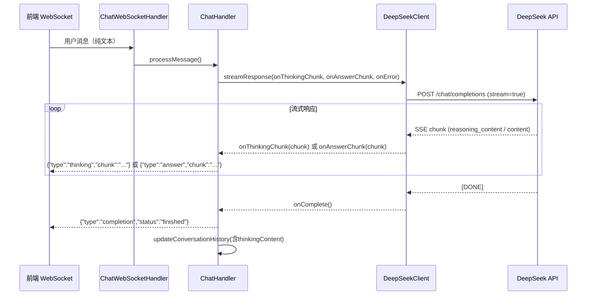

# 后端技术设计文档 - AI流式思考过程显示

## 概述

本文档描述后端需要配合前端"AI流式思考过程显示"功能所做的改造。核心改动是在 `DeepSeekClient` 中解析大模型返回的 `reasoning_content` 字段（思考过程），并通过 WebSocket 以 `type: 'thinking'` 类型推送给前端，同时在消息持久化中保存思考过程内容。

改动范围：
- `DeepSeekClient.processChunk()` - 解析 reasoning_content 字段
- `ChatHandler.sendResponseChunk()` - 区分 thinking/answer 类型推送
- `ChatHandler.processMessage()` - 累积思考过程内容
- `ChatHandler.updateConversationHistory()` - 持久化思考过程
- `MessageDTO` / `Message` - 新增 thinkingContent 字段
- `ConversationSessionServiceImpl` - 切换会话时返回思考过程

技术栈（保持不变）：
- Java 17 + Spring Boot 3.4.2
- Spring WebSocket（TextWebSocketHandler）
- Spring WebFlux WebClient（调用 DeepSeek API）
- Redis（消息历史存储）
- Jackson（JSON 序列化）

## 架构

### 改造后的数据流



### 关键设计决策

1. **DeepSeek API reasoning_content 字段**：DeepSeek 的 R1/思考模型在流式响应中通过 `delta.reasoning_content` 返回思考过程，`delta.content` 返回最终回答。两者是交替出现的：先输出所有 reasoning_content，再输出 content。
   - 理由：这是 DeepSeek API 的标准行为，不需要额外配置

2. **双回调模式**：将 `DeepSeekClient.streamResponse()` 的单个 `onChunk` 回调拆分为 `onThinkingChunk` 和 `onAnswerChunk` 两个回调
   - 理由：让 ChatHandler 能区分两种内容类型，分别累积和推送

3. **WebSocket 推送格式扩展**：在现有 `{"chunk": "..."}` 基础上增加 `type` 字段
   - 理由：前端需要区分 thinking 和 answer 类型，同时保持旧格式兼容

4. **思考过程持久化**：在 Redis 消息历史中新增 `thinkingContent` 字段
   - 理由：切换会话时需要恢复思考过程显示

## 组件改造详情

### 1. DeepSeekClient - 解析 reasoning_content

现有 `processChunk()` 只提取 `delta.content`，需要同时提取 `delta.reasoning_content`。

改造 `streamResponse()` 方法签名：

```java
// 改造前
public void streamResponse(String userMessage, 
                           String context,
                           List<Map<String, String>> history,
                           Consumer<String> onChunk,
                           Consumer<Throwable> onError)

// 改造后
public void streamResponse(String userMessage, 
                           String context,
                           List<Map<String, String>> history,
                           Consumer<String> onThinkingChunk,
                           Consumer<String> onAnswerChunk,
                           Runnable onComplete,
                           Consumer<Throwable> onError)
```

改造 `processChunk()` 方法（复用类级别 ObjectMapper，避免每次创建新实例）：

```java
// 类级别共享 ObjectMapper（线程安全）
private static final ObjectMapper MAPPER = new ObjectMapper();

private void processChunk(String chunk, 
                          Consumer<String> onThinkingChunk, 
                          Consumer<String> onAnswerChunk,
                          Runnable onComplete) {
    try {
        if ("[DONE]".equals(chunk)) {
            logger.debug("对话结束");
            onComplete.run();
            return;
        }
        
        JsonNode node = MAPPER.readTree(chunk);
        JsonNode delta = node.path("choices").path(0).path("delta");
        
        // 提取思考过程内容（DeepSeek R1 模型特有字段）
        String reasoningContent = delta.path("reasoning_content").asText("");
        if (!reasoningContent.isEmpty()) {
            onThinkingChunk.accept(reasoningContent);
        }
        
        // 提取回答内容
        String content = delta.path("content").asText("");
        if (!content.isEmpty()) {
            onAnswerChunk.accept(content);
        }
    } catch (Exception e) {
        logger.error("处理数据块时出错: {}", e.getMessage(), e);
    }
}
```

改造 `subscribe()` 调用（使用 `publishOn(Schedulers.boundedElastic())` 确保回调在合适的线程上执行 WebSocket I/O）：

```java
webClient.post()
    .uri("/chat/completions")
    .contentType(MediaType.APPLICATION_JSON)
    .bodyValue(request)
    .retrieve()
    .bodyToFlux(String.class)
    .publishOn(Schedulers.boundedElastic())  // 确保回调在弹性线程池执行，适合 WebSocket I/O
    .subscribe(
        chunk -> processChunk(chunk, onThinkingChunk, onAnswerChunk, onComplete),
        onError
    );
```

### 2. ChatHandler - 区分推送类型

#### WebSocket 并发安全（S1 修复）

Spring 的 `WebSocketSession.sendMessage()` 不是线程安全的。由于 Reactor 回调可能在不同线程上执行，并发调用 `sendMessage` 会导致 `IllegalStateException`。使用 `ConcurrentWebSocketSessionDecorator` 包装 session 解决此问题。

在 `ChatWebSocketHandler.afterConnectionEstablished()` 中包装 session：

```java
@Override
public void afterConnectionEstablished(WebSocketSession session) {
    String userId = extractUserId(session);
    // 使用 ConcurrentWebSocketSessionDecorator 包装，确保并发安全
    // 参数：sendTimeLimit=5000ms, bufferSizeLimit=65536 bytes
    WebSocketSession concurrentSession = new ConcurrentWebSocketSessionDecorator(session, 5000, 65536);
    sessions.put(userId, concurrentSession);
    logger.info("WebSocket连接已建立，用户ID: {}", userId);
}
```

#### sendResponseChunk 改造

拆分为两个方法（session 已通过 ConcurrentWebSocketSessionDecorator 保证并发安全）：

```java
private void sendThinkingChunk(WebSocketSession session, String chunk) {
    try {
        if (Boolean.TRUE.equals(stopFlags.get(session.getId()))) {
            return;
        }
        Map<String, String> chunkResponse = Map.of("type", "thinking", "chunk", chunk);
        String jsonChunk = objectMapper.writeValueAsString(chunkResponse);
        session.sendMessage(new TextMessage(jsonChunk));
    } catch (Exception e) {
        logger.error("发送思考块失败: {}", e.getMessage(), e);
    }
}

private void sendAnswerChunk(WebSocketSession session, String chunk) {
    try {
        if (Boolean.TRUE.equals(stopFlags.get(session.getId()))) {
            return;
        }
        Map<String, String> chunkResponse = Map.of("type", "answer", "chunk", chunk);
        String jsonChunk = objectMapper.writeValueAsString(chunkResponse);
        session.sendMessage(new TextMessage(jsonChunk));
    } catch (Exception e) {
        logger.error("发送回答块失败: {}", e.getMessage(), e);
    }
}
```

#### processMessage 改造

新增 `thinkingBuilders` 用于累积思考过程内容：

```java
// 新增成员变量
private final Map<String, StringBuilder> thinkingBuilders = new ConcurrentHashMap<>();
// 新增：存储每个 session 关联的 conversationId 和 userId，避免闭包变量作用域问题（S2 修复）
private final Map<String, String> sessionConversationIds = new ConcurrentHashMap<>();
private final Map<String, String> sessionUserIds = new ConcurrentHashMap<>();

// 在 processMessage 中：
final String sessionId = session.getId();
thinkingBuilders.put(sessionId, new StringBuilder());
responseBuilders.put(sessionId, new StringBuilder());
// 将 conversationId 和 userId 存入 Map，通过 sessionId 查找，避免闭包依赖局部变量（S2 修复）
sessionConversationIds.put(sessionId, conversationId);
sessionUserIds.put(sessionId, userId);

deepSeekClient.streamResponse(userMessage, context, history,
    // onThinkingChunk
    thinkingChunk -> {
        StringBuilder thinkingBuilder = thinkingBuilders.get(sessionId);
        if (thinkingBuilder != null) {
            thinkingBuilder.append(thinkingChunk);
        }
        sendThinkingChunk(session, thinkingChunk);
    },
    // onAnswerChunk
    answerChunk -> {
        StringBuilder responseBuilder = responseBuilders.get(sessionId);
        if (responseBuilder != null) {
            responseBuilder.append(answerChunk);
        }
        sendAnswerChunk(session, answerChunk);
    },
    // onComplete
    () -> {
        String completeResponse = responseBuilders.getOrDefault(sessionId, new StringBuilder()).toString();
        String thinkingContent = thinkingBuilders.getOrDefault(sessionId, new StringBuilder()).toString();
        // 从 Map 中获取 conversationId 和 userId，而非依赖闭包捕获的局部变量（S2 修复）
        String convId = sessionConversationIds.get(sessionId);
        String uid = sessionUserIds.get(sessionId);
        
        sendCompletionNotification(session);
        if (convId != null) {
            updateConversationHistory(convId, userMessage, completeResponse, thinkingContent);
        }
        
        // 刷新会话 TTL
        if (uid != null && convId != null) {
            try {
                conversationSessionService.refreshSessionTTL(uid, convId);
            } catch (Exception e) {
                logger.warn("刷新会话TTL失败: {}", e.getMessage());
            }
        }
        
        // 清理所有 session 关联的临时数据
        cleanupSession(sessionId);
        
        logger.info("消息处理完成，用户ID: {}", uid);
    },
    // onError
    error -> {
        handleError(session, error);
        sendCompletionNotification(session);
        cleanupSession(sessionId);
    }
);
```

新增 `cleanupSession` 方法，统一清理逻辑：

```java
private void cleanupSession(String sessionId) {
    responseBuilders.remove(sessionId);
    thinkingBuilders.remove(sessionId);
    responseFutures.remove(sessionId);
    sessionConversationIds.remove(sessionId);
    sessionUserIds.remove(sessionId);
}
```

注意：引入 `onComplete` 回调后，可以移除现有的后台线程轮询检测逻辑（`new Thread(() -> { ... }).start()`），改为在 `onComplete` 中直接处理完成逻辑。这是一个重要的改进，消除了轮询等待的不确定性。

#### updateConversationHistory 改造

新增 `thinkingContent` 参数：

```java
private void updateConversationHistory(String conversationId, String userMessage, 
                                       String response, String thinkingContent) {
    String key = "conversation:" + conversationId;
    List<Map<String, String>> history = getConversationHistory(conversationId);
    
    String currentTimestamp = java.time.LocalDateTime.now()
        .format(java.time.format.DateTimeFormatter.ofPattern("yyyy-MM-dd'T'HH:mm:ss"));
    
    // 用户消息
    Map<String, String> userMsgMap = new HashMap<>();
    userMsgMap.put("role", "user");
    userMsgMap.put("content", userMessage);
    userMsgMap.put("timestamp", currentTimestamp);
    history.add(userMsgMap);
    
    // 助手回复（新增 thinkingContent）
    Map<String, String> assistantMsgMap = new HashMap<>();
    assistantMsgMap.put("role", "assistant");
    assistantMsgMap.put("content", response);
    assistantMsgMap.put("timestamp", currentTimestamp);
    if (thinkingContent != null && !thinkingContent.isEmpty()) {
        assistantMsgMap.put("thinkingContent", thinkingContent);
    }
    history.add(assistantMsgMap);
    
    // 限制历史记录长度
    if (history.size() > 20) {
        history = history.subList(history.size() - 20, history.size());
    }
    
    try {
        String json = objectMapper.writeValueAsString(history);
        redisTemplate.opsForValue().set(key, json, Duration.ofDays(7));
    } catch (JsonProcessingException e) {
        logger.error("序列化对话历史出错: {}", e.getMessage(), e);
    }
}
```

### 3. 数据模型改造

#### MessageDTO

新增 `thinkingContent` 字段。注意：由于使用了 `@AllArgsConstructor`，新增字段会改变全参构造函数签名，需要排查所有 `new MessageDTO(role, content, timestamp)` 的调用点并同步修改。推荐使用 `@Builder` 模式降低后续字段变更的影响。

```java
@Data
@Builder
@AllArgsConstructor
@NoArgsConstructor
public class MessageDTO {
    private String role;
    private String content;
    private String thinkingContent;  // 新增
    private String timestamp;
}
```

调用方式从 `new MessageDTO(role, content, timestamp)` 改为：

```java
MessageDTO dto = MessageDTO.builder()
    .role(msg.get("role"))
    .content(msg.get("content"))
    .thinkingContent(msg.getOrDefault("thinkingContent", null))
    .timestamp(msg.get("timestamp"))
    .build();
```

#### Message 实体

```java
@Data
@AllArgsConstructor
@NoArgsConstructor
public class Message {
    private String role;
    private String content;
    private String thinkingContent;  // 新增
}
```

#### ConversationSessionServiceImpl

在 `switchSession()` 返回 `SessionDetailDTO` 时，需要从 Redis 历史消息中提取 `thinkingContent` 字段并映射到 `MessageDTO`：

```java
// 在构建 MessageDTO 列表时
MessageDTO dto = new MessageDTO();
dto.setRole(msg.get("role"));
dto.setContent(msg.get("content"));
dto.setThinkingContent(msg.getOrDefault("thinkingContent", null));  // 新增
dto.setTimestamp(msg.get("timestamp"));
```

### 4. WebSocket 推送消息格式（完整定义）

```
// 思考过程数据块（新增）
{"type":"thinking","chunk":"让我分析一下这个问题..."}

// 回答内容数据块（新增 type 字段）
{"type":"answer","chunk":"根据文档内容..."}

// 完成通知（保持不变）
{"type":"completion","status":"finished","message":"响应已完成","timestamp":1234567890,"date":"..."}

// 错误通知（保持不变）
{"error":"AI服务暂时不可用，请稍后重试"}

// 停止确认（保持不变）
{"type":"stop","message":"响应已停止","timestamp":1234567890,"date":"..."}
```

## 兼容性考虑

### 模型兼容

- 如果使用的 DeepSeek 模型不支持 reasoning_content（如 deepseek-chat 非 R1 版本），`delta.reasoning_content` 字段不存在或为空，`processChunk()` 会自动跳过，不影响正常的 content 输出
- 前端通过 `v-if="msg.thinkingContent"` 控制 ThinkingSection 显示，无思考内容时不显示

### 数据兼容

- Redis 中已有的历史消息没有 `thinkingContent` 字段，`getOrDefault("thinkingContent", null)` 返回 null，前端正常处理
- `MessageDTO` 新增字段为可选，JSON 序列化时 null 值不输出（Jackson 默认行为可配置）

### 后台线程移除

引入 `onComplete` 回调后，建议移除 `processMessage()` 中的后台线程轮询逻辑。现有的轮询方式（3秒等待 + 2秒检测 + 最多25秒循环）存在以下问题：
- 响应完成检测不精确（依赖内容长度不变来判断）
- 资源浪费（每次请求创建一个新线程）
- 竞态条件风险（多个线程操作同一个 StringBuilder）

`onComplete` 回调在 WebFlux Flux 的 `[DONE]` 信号时触发，时机精确且无额外线程开销。

## 错误处理

### 现有错误处理保持不变

- `handleError()` 发送 `{"error": "..."}` 格式的错误消息
- `onError` 回调处理 WebClient 异常
- `stopFlags` 机制处理用户停止请求

### 新增的错误场景

- `reasoning_content` 解析异常：在 `processChunk()` 的 try-catch 中已覆盖，记录日志后继续处理
- `thinkingBuilders` 内存泄漏防护（G1 修复）：
  1. 在 `onComplete` 和 `onError` 中通过 `cleanupSession()` 统一清理
  2. 在 `ChatWebSocketHandler.afterConnectionClosed()` 中增加清理逻辑
  3. 添加 `@Scheduled` 定时任务兜底清理

```java
// ChatWebSocketHandler.afterConnectionClosed 中增加清理
@Override
public void afterConnectionClosed(WebSocketSession session, CloseStatus status) {
    String userId = extractUserId(session);
    sessions.remove(userId);
    // 清理可能残留的 builder 数据
    chatHandler.cleanupSession(session.getId());
    logger.info("WebSocket连接已关闭，用户ID: {}", userId);
}

// ChatHandler 中增加定时清理（每 5 分钟执行）
@Scheduled(fixedRate = 300000)
public void cleanupStaleBuilders() {
    // sessionConversationIds 中有记录但超过 10 分钟未清理的条目
    // 实现方式：新增 Map<String, Long> sessionStartTimes 记录开始时间
    long now = System.currentTimeMillis();
    sessionStartTimes.entrySet().removeIf(entry -> {
        if (now - entry.getValue() > 600000) { // 10 分钟
            String sessionId = entry.getKey();
            cleanupSession(sessionId);
            logger.warn("定时清理残留 session 数据: {}", sessionId);
            return true;
        }
        return false;
    });
}
```

## 测试策略

### 单元测试

使用 JUnit 5 + Mockito：

1. `DeepSeekClient.processChunk()` - 验证 reasoning_content 和 content 的正确提取
2. `ChatHandler.sendThinkingChunk()` / `sendAnswerChunk()` - 验证 WebSocket 消息格式
3. `ChatHandler.updateConversationHistory()` - 验证 thinkingContent 持久化

### 属性测试

使用 jqwik（已在项目中配置 `.jqwik-database`）：

```java
@Property(tries = 100)
void processChunkShouldRouteCorrectly(
    @ForAll @StringLength(min = 1, max = 100) String reasoningContent,
    @ForAll @StringLength(min = 1, max = 100) String content
) {
    // 构造包含 reasoning_content 和 content 的 SSE chunk
    String chunk = buildMockChunk(reasoningContent, content);
    
    List<String> thinkingChunks = new ArrayList<>();
    List<String> answerChunks = new ArrayList<>();
    
    deepSeekClient.processChunk(chunk, 
        thinkingChunks::add, 
        answerChunks::add,
        () -> {});
    
    assertThat(thinkingChunks).containsExactly(reasoningContent);
    assertThat(answerChunks).containsExactly(content);
}

@Property(tries = 100)
void thinkingContentShouldPersistInHistory(
    @ForAll @StringLength(min = 0, max = 500) String thinkingContent,
    @ForAll @StringLength(min = 1, max = 500) String answerContent
) {
    // 验证 updateConversationHistory 正确保存 thinkingContent
    // 验证 getConversationHistory 正确读取 thinkingContent
}
```

## 配置变更

MVP 阶段新增 `ai.thinking.enabled` 配置项作为功能开关和应急预案：

```yaml
ai:
  thinking:
    enabled: true  # 是否推送思考过程到前端
    max-persist-length: 20000  # thinkingContent 持久化最大字符数，超出截断
```

在 `AiProperties` 中新增：

```java
@Data
public static class Thinking {
    private boolean enabled = true;
    private int maxPersistLength = 20000;  // 约 20KB，防止 Redis 大 Key
}
```

在 `ChatHandler.sendThinkingChunk()` 中检查开关：

```java
private void sendThinkingChunk(WebSocketSession session, String chunk) {
    if (!aiProperties.getThinking().isEnabled()) {
        return;  // 功能关闭时不推送 thinking 类型
    }
    // ... 原有逻辑
}
```

## 变更三板斧

### 可灰度

- 通过 `ai.thinking.enabled` 配置项控制功能开关，支持不重启服务动态切换（配合 Spring Cloud Config 或 Nacos）
- 灰度策略：先在测试环境验证 → 内部用户灰度 → 全量发布
- 回滚方案：将 `ai.thinking.enabled` 设为 `false`，前端自动降级（无 thinkingContent 时 ThinkingSection 不显示）

### 可观测

- 在 `sendThinkingChunk` 和 `sendAnswerChunk` 中增加计数器日志，监控推送频率
- 关键指标：thinking chunk 推送次数/秒、单次思考过程总长度、WebSocket 发送延迟
- 异常监控：`ConcurrentWebSocketSessionDecorator` 的 buffer overflow 异常、`cleanupStaleBuilders` 定时清理触发次数

### 可应急

- 应急预案：如果 reasoning_content 解析导致大量错误或性能问题，通过配置中心将 `ai.thinking.enabled` 设为 `false` 即可关闭
- 前端无需任何改动即可降级：`v-if="msg.thinkingContent"` 自动隐藏 ThinkingSection
- Redis 大 Key 应急：`ai.thinking.max-persist-length` 控制持久化长度，超出部分截断并追加 `\n\n[思考过程内容过长，已截断]`

## Redis 大 Key 风险评估

DeepSeek R1 的 reasoning 输出通常在 5KB-30KB 之间。20 条消息历史中如果每条 assistant 消息都包含 thinkingContent，单个 conversation key 的 value 可能达到 300KB-600KB。

防护措施：

1. `ai.thinking.max-persist-length` 配置项限制持久化长度（默认 20000 字符，约 20KB）
2. 在 `updateConversationHistory` 中截断超长内容：

```java
if (thinkingContent != null && !thinkingContent.isEmpty()) {
    int maxLen = aiProperties.getThinking().getMaxPersistLength();
    if (thinkingContent.length() > maxLen) {
        thinkingContent = thinkingContent.substring(0, maxLen) + "\n\n[思考过程内容过长，已截断]";
        logger.warn("思考过程内容超过 {} 字符，已截断", maxLen);
    }
    assistantMsgMap.put("thinkingContent", thinkingContent);
}
```

3. 监控 Redis key 大小，设置告警阈值（单 key > 500KB 告警）
