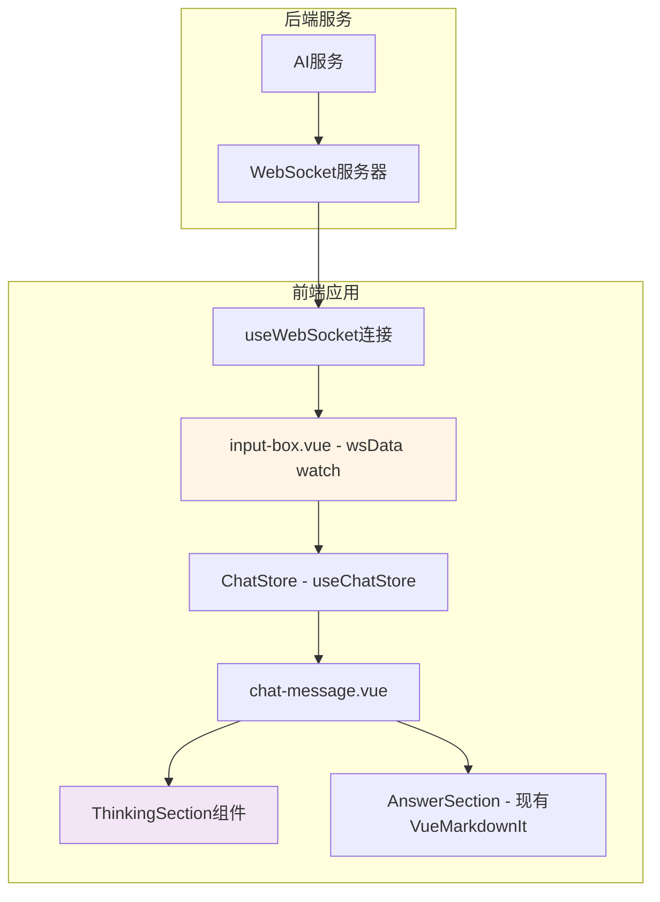

# 技术设计文档

## 概述

本设计文档描述了AI流式思考过程显示功能的技术实现方案。该功能旨在通过流式渲染技术实时展示大模型的思考过程和回答内容，提升用户体验和AI交互的透明度。

系统将扩展现有的WebSocket聊天架构，在 `input-box.vue` 的 `watch(wsData)` 处理逻辑中增加对思考过程流的解析能力，并在 `chat-message.vue` 中新增 `ThinkingSection` 组件展示思考过程。

核心设计原则：

- 最小改动：在现有组件结构上扩展，不引入不必要的抽象层
- 增量渲染：利用 Vue 响应式系统追加内容，配合 requestAnimationFrame 批量更新
- 用户控制：提供思考过程的展开/折叠功能
- 降级支持：在流式传输失败时保持已显示内容

技术栈基于现有项目架构：

- Vue 3.5 + TypeScript + Composition API
- Pinia 3.0 状态管理
- Naive UI 2.41 组件库
- @vueuse/core（useWebSocket）
- vue-markdown-shiki 2.0（Markdown渲染）
- markdown-it + highlight.js + katex（代码高亮和数学公式）

## 架构

### 系统架构图



### 数据流

1. 用户在 `input-box.vue` 发送消息 → `chatStore.wsSend(message)` （保持现有纯文本发送方式）
2. 后端推送 JSON 流式数据（新增 `type: 'thinking'` 类型）
3. `input-box.vue` 的 `watch(wsData)` 解析数据块，区分 thinking/answer 类型
4. ChatStore 的 `list` 中 assistant 消息更新 `content` 和 `thinkingContent`
5. `chat-message.vue` 响应式渲染 ThinkingSection 和 AnswerSection

### 关键设计决策

1. **解析逻辑位置**：保留在 `input-box.vue` 的 `watch(wsData)` 中，与现有架构一致
   - 理由：现有代码已在此处处理 wsData，新增 thinking 类型只需扩展 if-else 分支
   - 后续可重构到 ChatStore 中，但 MVP 阶段保持最小改动

2. **消息发送格式**：保持现有纯文本发送 `chatStore.wsSend(input.value.message)`
   - 理由：与现有后端协议一致，不需要后端同步改造发送接口

3. **组件层级**：直接在 `chat-message.vue` 的 assistant 分支中嵌入 ThinkingSection
   - 理由：避免引入 StreamRenderer 中间层，减少组件嵌套，现有 chat-message.vue 已区分 user/assistant

4. **内容追加方式**：直接通过 `assistant.thinkingContent += data.chunk` 追加
   - 理由：Vue 响应式系统已处理增量更新，不需要独立的 DisplayBuffer 服务

5. **渲染频率控制**：使用 requestAnimationFrame 批量合并高频 wsData 更新
   - 理由：避免每个 chunk 都触发 DOM 更新，保持流畅度

## 组件和接口

### 修改的现有组件

#### input-box.vue - wsData 处理扩展

在现有 `watch(wsData)` 中增加 thinking 类型处理：

```typescript
watch(wsData, val => {
  let data: ParsedStreamData | null = null;
  try {
    data = JSON.parse(val);
  } catch {
    console.warn('Failed to parse stream data:', val);
    return; // 跳过无效数据，继续处理后续数据
  }

  // G2 修复：先检查 error 字段（兼容旧格式 {"error": "..."}），再检查 type 字段
  if (!data) {
    console.warn('Parsed data is null');
    return;
  }

  const assistant = list.value[list.value.length - 1];

  // 优先处理 error（旧格式无 type 字段）
  if (data.error) {
    assistant.status = 'error';
    return;
  }

  // 无 type 且无 chunk 且无 error 的数据视为无效
  if (!data.type && !data.chunk) {
    console.warn('Missing type and chunk fields in stream data');
    return;
  }

  if (data.type === 'completion' && data.status === 'finished' && assistant.status !== 'error') {
    assistant.status = 'finished';
    stopTimeoutCheck();  // G5 修复：完成时清理超时检测
  } else if (data.type === 'error') {
    assistant.status = 'error';
    stopTimeoutCheck();
  } else if (data.type === 'thinking' && data.chunk) {
    // 新增：处理思考过程数据
    assistant.status = 'loading';
    assistant.thinkingContent = (assistant.thinkingContent || '') + data.chunk;
    lastDataTime = Date.now();  // 更新超时检测时间
  } else if (data.type === 'answer' && data.chunk) {
    // 原有逻辑重命名：处理回答内容数据
    assistant.status = 'loading';
    assistant.content += data.chunk;
    lastDataTime = Date.now();
  } else if (data.chunk) {
    // 兼容旧格式：没有 type 字段但有 chunk 的数据视为 answer
    assistant.status = 'loading';
    assistant.content += data.chunk;
    lastDataTime = Date.now();
  }
});
```

#### chat-message.vue - 新增思考过程展示

在 assistant 消息的模板中，`VueMarkdownIt` 之前插入 ThinkingSection：

```vue
<!-- AI 回复：靠左 -->
<div v-else class="flex flex-col items-start">
  <!-- 头像和名称（保持不变） -->
  <div class="ml-12 mt-2 max-w-[85%]">
    <NText v-if="msg.status === 'pending'">
      <icon-eos-icons:three-dots-loading class="text-8" />
    </NText>
    <NText v-else-if="msg.status === 'error'" class="italic color-red-500">服务器繁忙，请稍后再试</NText>
    <div v-else>
      <!-- 新增：思考过程区域 -->
      <ThinkingSection
        v-if="msg.thinkingContent"
        :content="msg.thinkingContent"
        :status="msg.status"
        :collapsed="thinkingCollapsed"
        @toggle="thinkingCollapsed = !thinkingCollapsed"
      />
      <!-- 原有：回答内容区域 -->
      <div class="rounded-2xl rounded-tl-sm bg-#f5f6f8 px-4 py-3 dark:bg-#1e1e1e" @click="handleContentClick">
        <VueMarkdownIt :content="content" />
      </div>
    </div>
  </div>
</div>
```

### 新增组件

#### ThinkingSection.vue

显示AI思考过程的可折叠区域。

```typescript
interface ThinkingSectionProps {
  content: string;
  collapsed: boolean;
  status?: 'pending' | 'loading' | 'finished' | 'error';
}

interface ThinkingSectionEmits {
  (e: 'toggle'): void;
}
```

组件实现要点：

- 使用 NCollapse/NCollapseItem 或自定义折叠动画（300ms transition）
- 折叠状态下显示"思考中..."或"已完成思考"的摘要文本
- 展开状态下使用 VueMarkdownIt 渲染思考内容
- 折叠状态下跳过 Markdown 渲染（B3 优化：避免不可见内容触发解析开销）
- 思考进行中显示加载动画（复用现有 eos-icons:three-dots-loading）
- 使用 `<section aria-label="AI思考过程">` 包裹，支持 ARIA

```vue
<template>
  <section
    class="mb-3 rounded-xl bg-#f0f0f5/60 dark:bg-#2a2a2e"
    aria-label="AI思考过程"
    role="region"
  >
    <button
      class="flex w-full cursor-pointer items-center gap-2 border-none bg-transparent px-4 py-2.5 text-13px color-gray-500"
      :aria-expanded="!collapsed"
      @click="$emit('toggle')"
      @keydown.enter="$emit('toggle')"
      @keydown.space.prevent="$emit('toggle')"
    >
      <icon-eos-icons:loading v-if="status === 'loading'" class="text-14px" />
      <icon-material-symbols:check-circle-outline v-else class="text-14px color-green" />
      <span>{{ status === 'loading' ? '思考中...' : '已完成思考' }}</span>
      <icon-material-symbols:expand-more
        class="ml-auto text-16px transition-transform duration-300"
        :class="{ 'rotate-180': !collapsed }"
      />
    </button>
    <!-- B3 优化：折叠时不渲染 Markdown，减少不可见内容的解析开销 -->
    <div
      v-if="!collapsed"
      class="overflow-hidden px-4 pb-3"
      aria-live="polite"
    >
      <VueMarkdownIt :content="content" class="text-13px color-gray-600 dark:color-gray-400" />
    </div>
  </section>
</template>
```

### 服务端推送数据格式

#### 新增 thinking 类型（需后端配合）

```typescript
// 思考过程数据块（新增）
{
  type: 'thinking',
  chunk: string
}

// 回答内容数据块（新增 type 字段，兼容旧格式）
{
  type: 'answer',
  chunk: string
}

// 旧格式兼容（无 type 字段）
{
  chunk: string
}

// 完成信号（保持不变）
{
  type: 'completion',
  status: 'finished'
}

// 错误信号（保持不变）
{
  error: string
}
```

#### 停止生成（保持不变）

```typescript
{
  type: 'stop',
  _internal_cmd_token: string
}
```

### 解析后的数据类型

```typescript
interface ParsedStreamData {
  type?: 'thinking' | 'answer' | 'completion' | 'error' | 'stop';
  chunk?: string;
  status?: 'pending' | 'loading' | 'finished' | 'error';
  error?: string;
}
```

## 数据模型

### 扩展的消息模型

在 `frontend/src/typings/api.d.ts` 的 `Api.Chat.Message` 中新增字段：

```typescript
namespace Chat {
  interface Message {
    role: 'user' | 'assistant';
    content: string;
    thinkingContent?: string;  // 新增：思考过程内容
    status?: 'pending' | 'loading' | 'finished' | 'error';
    timestamp?: string;
  }
}
```

注意：后端 `SessionDetailDTO` 返回的历史消息也需要包含 `thinkingContent` 字段，否则切换会话时思考过程内容会丢失。

### 用户偏好设置

通过 localStorage 存储，key 为 `stream-display-preferences`：

```typescript
interface StreamDisplayPreferences {
  autoCollapseThinking: boolean;  // 默认 false
}
```

使用 `@vueuse/core` 的 `useLocalStorage` 管理：

```typescript
const preferences = useLocalStorage<StreamDisplayPreferences>(
  'stream-display-preferences',
  { autoCollapseThinking: false }
);
```

### 推送消息的初始化

在 `input-box.vue` 的 `handleSend` 中，创建 assistant 消息时初始化 thinkingContent：

```typescript
list.value.push({
  content: '',
  thinkingContent: '',  // 新增
  role: 'assistant',
  status: 'pending'
});
```

## 正确性属性

属性是系统在所有有效执行中应该保持为真的特征或行为。

### 属性 1: 数据类型识别

对于任何包含 type 字段的流式数据块，解析逻辑应该正确识别其类型（thinking、answer、completion、error），并将 chunk 内容追加到对应字段（thinkingContent 或 content）。

验证需求: 1.4

### 属性 2: 旧格式兼容

对于任何不包含 type 字段但包含 chunk 字段的流式数据块，解析逻辑应该将其视为 answer 类型处理，保持与现有后端的向后兼容。

验证需求: 1.4

### 属性 3: 格式错误数据容错

对于任何格式错误或无法解析的数据块（无效 JSON、缺少必需字段），解析逻辑应该跳过该数据块并继续处理后续数据，不中断流式传输。

验证需求: 5.2

### 属性 4: 增量内容追加

对于任何新到达的 thinking 或 answer 类型数据块，对应字段（thinkingContent 或 content）的长度应该单调递增。

验证需求: 2.5

### 属性 5: 传输失败内容保留

对于任何导致流式传输失败的错误，已经追加到 thinkingContent 和 content 的内容不应被清空或重置。

验证需求: 5.3

### 属性 6: Markdown内容渲染

对于任何有效的 Markdown 格式内容（标题、列表、代码块、链接），VueMarkdownIt 应该正确渲染为 HTML。

验证需求: 2.4, 3.2

### 属性 7: 用户偏好持久化

对于任何用户的 autoCollapseThinking 偏好设置，通过 useLocalStorage 保存后读取应该得到相同的值（round-trip 属性）。

验证需求: 6.3

### 属性 8: 折叠状态切换

ThinkingSection 的折叠/展开状态应该在用户点击时正确切换，且切换不影响已渲染的内容。

验证需求: 6.1

### 属性 9: 自动滚动行为

当新内容追加到消息列表时，现有的 `scrollToBottom` 函数应该被触发，保持自动滚动到最新内容。

验证需求: 3.4

## 错误处理

### 错误分类和处理策略

#### 1. 数据解析错误

```typescript
// 在 watch(wsData) 中增加 try-catch（现有代码缺少）
watch(wsData, val => {
  let data: ParsedStreamData | null = null;
  try {
    data = JSON.parse(val);
  } catch {
    console.warn('Failed to parse stream data:', val);
    return; // 跳过该数据块，继续处理后续数据
  }

  if (!data) {
    console.warn('Parsed data is null');
    return;
  }

  // 优先检查 error 字段（兼容旧格式 {"error": "..."}）
  if (data.error) {
    const assistant = list.value[list.value.length - 1];
    assistant.status = 'error';
    return;
  }

  // 无 type 且无 chunk 的数据视为无效
  if (!data.type && !data.chunk) {
    console.warn('Invalid stream data format:', data);
    return;
  }
  // ... 正常处理逻辑
});
```

#### 2. WebSocket 连接错误

现有 `useWebSocket` 已配置 `autoReconnect: true`，保持不变。增加超时检测（G5 修复：在 `onUnmounted` 和会话切换时清理定时器）：

```typescript
// 在 ChatStore 或 input-box.vue 中增加超时检测
const TIMEOUT_MS = 30000;
let lastDataTime = 0;
let timeoutTimer: ReturnType<typeof setInterval> | null = null;

function startTimeoutCheck() {
  lastDataTime = Date.now();
  stopTimeoutCheck(); // 先清理已有定时器，防止重复
  timeoutTimer = setInterval(() => {
    if (Date.now() - lastDataTime > TIMEOUT_MS) {
      const assistant = list.value[list.value.length - 1];
      if (assistant?.status === 'loading') {
        assistant.status = 'error';
      }
      stopTimeoutCheck();
    }
  }, 5000);
}

function stopTimeoutCheck() {
  if (timeoutTimer) {
    clearInterval(timeoutTimer);
    timeoutTimer = null;
  }
}

// G5 修复：组件卸载时清理定时器
onUnmounted(() => {
  stopTimeoutCheck();
});
```

#### 3. Markdown 渲染错误

VueMarkdownIt 组件内部已有错误处理。增加 `onErrorCaptured` 作为兜底：

```typescript
onErrorCaptured((error) => {
  console.error('Render error in ThinkingSection:', error);
  return false; // 阻止错误传播，保留已渲染内容
});
```

### 降级策略

1. WebSocket 断开：依赖现有 `autoReconnect`，UI 显示连接状态（已有）
2. Markdown 渲染失败：降级为纯文本 `<pre>` 显示
3. 后端不返回 thinking 类型：ThinkingSection 不显示（`v-if="msg.thinkingContent"` 控制）

## 测试策略

### 单元测试

使用 vitest + @vue/test-utils，专注于：

1. 数据解析逻辑：有效数据、无效 JSON、缺少字段、旧格式兼容
2. ThinkingSection 组件：折叠/展开、内容渲染、状态显示
3. 用户偏好：localStorage 读写

### 基于属性的测试

使用 fast-check（已在 devDependencies 中）+ vitest。

配置要求：
- 每个属性测试最少运行 100 次迭代
- 标签格式：`Feature: ai-streaming-thinking-display, Property {number}: {property_text}`

```typescript
import fc from 'fast-check';
import { describe, it, expect } from 'vitest';

describe('Stream Data Parser Properties', () => {
  // Feature: ai-streaming-thinking-display, Property 1: 数据类型识别
  it('should correctly route data by type field', () => {
    fc.assert(
      fc.property(
        fc.record({
          type: fc.constantFrom('thinking', 'answer'),
          chunk: fc.string({ minLength: 1 }),
        }),
        (data) => {
          const message = { content: '', thinkingContent: '', status: 'loading' as const, role: 'assistant' as const };
          const jsonStr = JSON.stringify(data);
          const parsed = JSON.parse(jsonStr);

          if (parsed.type === 'thinking') {
            message.thinkingContent += parsed.chunk;
            expect(message.thinkingContent).toBe(parsed.chunk);
            expect(message.content).toBe('');
          } else {
            message.content += parsed.chunk;
            expect(message.content).toBe(parsed.chunk);
            expect(message.thinkingContent).toBe('');
          }
        }
      ),
      { numRuns: 100 }
    );
  });

  // Feature: ai-streaming-thinking-display, Property 2: 旧格式兼容
  it('should treat data without type field as answer', () => {
    fc.assert(
      fc.property(
        fc.string({ minLength: 1 }),
        (chunk) => {
          const data = { chunk };
          const message = { content: '', thinkingContent: '', role: 'assistant' as const };

          // 无 type 字段，应视为 answer
          if (!('type' in data) || !data.type) {
            message.content += data.chunk;
          }

          expect(message.content).toBe(chunk);
          expect(message.thinkingContent).toBe('');
        }
      ),
      { numRuns: 100 }
    );
  });

  // Feature: ai-streaming-thinking-display, Property 3: 格式错误数据容错
  it('should not throw on invalid data', () => {
    fc.assert(
      fc.property(
        fc.oneof(
          fc.string(),                              // 随机字符串（可能不是有效 JSON）
          fc.constant(''),                          // 空字符串
          fc.constant('null'),                      // null
          fc.constant('{"invalid": true}'),         // 缺少 type 和 chunk
        ),
        (rawData) => {
          let parsed: any = null;
          try {
            parsed = JSON.parse(rawData);
          } catch {
            // JSON 解析失败，应该被跳过
            expect(true).toBe(true);
            return;
          }

          // 即使解析成功，缺少必要字段也不应崩溃
          const hasValidData = parsed && (parsed.type || parsed.chunk || parsed.error);
          expect(typeof hasValidData).toBe('boolean');
        }
      ),
      { numRuns: 100 }
    );
  });

  // Feature: ai-streaming-thinking-display, Property 4: 增量内容追加
  it('should monotonically increase content length', () => {
    fc.assert(
      fc.property(
        fc.array(fc.string({ minLength: 1 }), { minLength: 1 }),
        (chunks) => {
          let content = '';
          let previousLength = 0;

          for (const chunk of chunks) {
            content += chunk;
            expect(content.length).toBeGreaterThan(previousLength);
            previousLength = content.length;
          }
        }
      ),
      { numRuns: 100 }
    );
  });

  // Feature: ai-streaming-thinking-display, Property 5: 传输失败内容保留
  it('should preserve content after simulated error', () => {
    fc.assert(
      fc.property(
        fc.array(fc.string(), { minLength: 1 }),
        (chunks) => {
          const message = { content: '', thinkingContent: '' };

          chunks.forEach(chunk => {
            message.content += chunk;
          });

          const contentBeforeError = message.content;
          const thinkingBeforeError = message.thinkingContent;

          // 模拟错误发生（不清空内容）
          // 验证内容未被修改
          expect(message.content).toBe(contentBeforeError);
          expect(message.thinkingContent).toBe(thinkingBeforeError);
        }
      ),
      { numRuns: 100 }
    );
  });

  // Feature: ai-streaming-thinking-display, Property 7: 用户偏好持久化
  it('should round-trip preferences through localStorage', () => {
    fc.assert(
      fc.property(
        fc.boolean(),
        (autoCollapse) => {
          const key = 'stream-display-preferences-test';
          const prefs = { autoCollapseThinking: autoCollapse };

          localStorage.setItem(key, JSON.stringify(prefs));
          const loaded = JSON.parse(localStorage.getItem(key) || '{}');

          expect(loaded.autoCollapseThinking).toBe(autoCollapse);
          localStorage.removeItem(key);
        }
      ),
      { numRuns: 100 }
    );
  });
});
```

### 测试覆盖目标

- 数据解析逻辑：覆盖所有分支（thinking/answer/completion/error/旧格式/无效数据）
- ThinkingSection 组件：折叠/展开交互、内容渲染、ARIA 属性
- 属性测试：覆盖 9 个正确性属性中的可自动化验证部分

## 后续优化（非 MVP）

以下功能标记为后续优化，不在首次实现范围内：

1. **渲染频率控制**：使用 requestAnimationFrame 批量合并高频更新
2. **虚拟滚动**：消息列表级别的虚拟滚动（当消息数量极多时）
3. **性能监控**：PerformanceMetrics 数据收集和展示
4. **高对比度模式**：专门的可访问性主题支持
