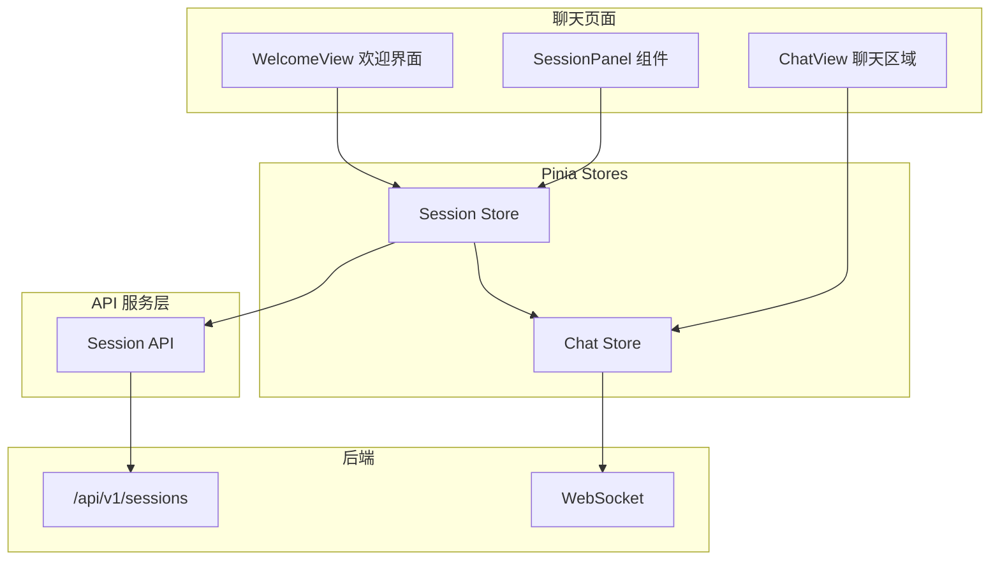
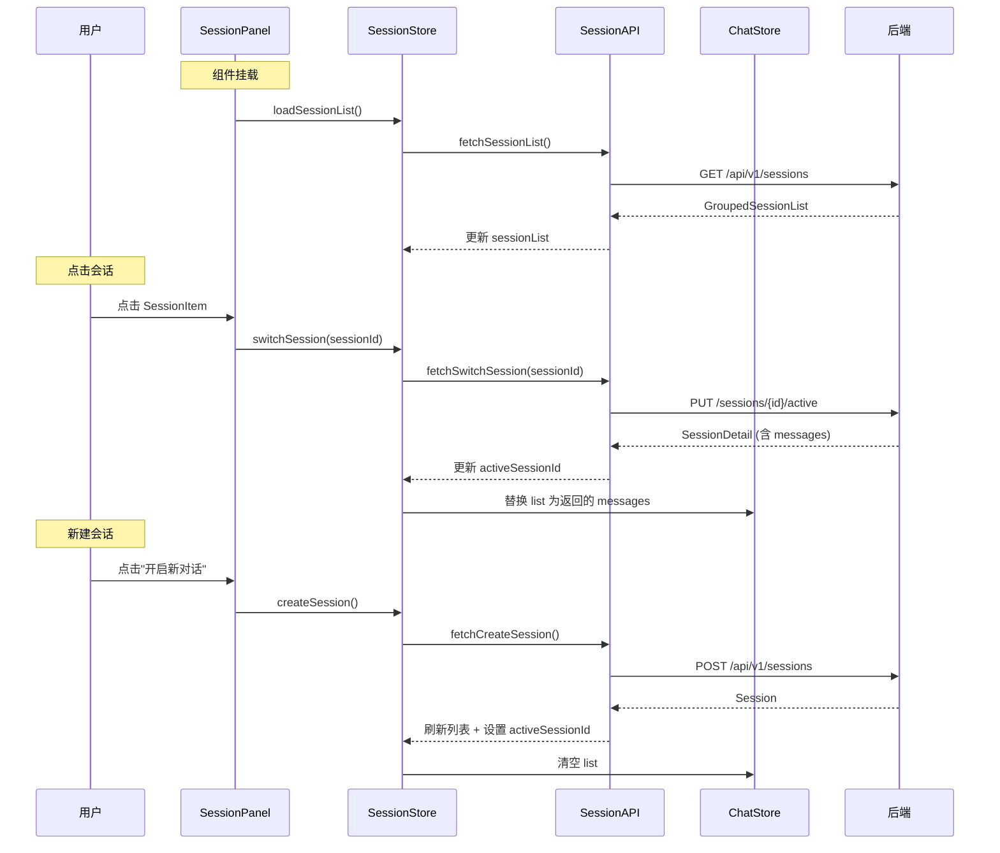

# 技术设计文档：前端多会话管理

## 概述

本设计为 ArchiveMind 前端聊天页面引入多会话管理功能。后端 REST API（`/api/v1/sessions`）已就绪，前端需要：

1. 新增 Session API 服务层，封装 5 个后端接口调用
2. 新增 Session Store（Pinia），管理会话列表和活跃会话状态
3. 新增 Session Panel 组件，在聊天页面左侧展示按时间分组的会话列表
4. 重构聊天页面为左右双栏布局
5. 集成 Chat Store 与 Session Store，确保消息与会话正确关联
6. 扩展 TypeScript 类型定义

当前聊天页面（`frontend/src/views/chat/index.vue`）仅有单一消息列表和输入框，无会话切换能力。Chat Store 只维护一个 `list` 和 WebSocket 连接。本设计将在不破坏现有 WebSocket 通信逻辑的前提下，叠加多会话管理层。

## 架构

### 整体架构



### 数据流



## 组件与接口

### 1. Session API 服务层（`frontend/src/service/api/session.ts`）

使用项目现有的 `request` 函数（来自 `@/service/request`），所有请求自动携带 JWT Token。

```typescript
// API 函数签名
fetchCreateSession(): Promise<Api.Chat.Session>
fetchSessionList(): Promise<Api.Chat.GroupedSessionList>
fetchSwitchSession(sessionId: string): Promise<Api.Chat.SessionDetail>
fetchDeleteSession(sessionId: string): Promise<void>
fetchUpdateSessionTitle(sessionId: string, title: string): Promise<void>
```

API 路径映射：
| 函数 | 方法 | 路径 |
|------|------|------|
| `fetchCreateSession` | POST | `/sessions` |
| `fetchSessionList` | GET | `/sessions` |
| `fetchSwitchSession` | PUT | `/sessions/{sessionId}/active` |
| `fetchDeleteSession` | DELETE | `/sessions/{sessionId}` |
| `fetchUpdateSessionTitle` | PUT | `/sessions/{sessionId}/title` |

注意：`request` 的 `baseURL` 使用默认值（`/proxy-default` 映射到 `/api/v1`），路径只需写相对部分。

### 2. Session Store（`frontend/src/store/modules/session/index.ts`）

在 `SetupStoreId` 枚举中注册 `Session = 'session-store'`，使用 Pinia setup 语法。

```typescript
// 响应式状态
sessionList: Ref<Api.Chat.GroupedSessionList>
activeSessionId: Ref<string>
loading: Ref<boolean>
creating: Ref<boolean>

// 方法
loadSessionList(): Promise<void>
createSession(): Promise<void>
switchSession(sessionId: string): Promise<void>
deleteSession(sessionId: string): Promise<void>
```

关键行为：
- `switchSession` 调用 API 后，将返回的 `messages` 同步到 Chat Store 的 `list`
- `createSession` 成功后刷新列表、设置 `activeSessionId`、清空 Chat Store 的 `list`
- `deleteSession` 删除当前活跃会话时，清空 `activeSessionId` 和 Chat Store 的 `list`

### 3. SessionPanel 组件（`frontend/src/views/chat/modules/session-panel.vue`）

职责：
- 顶部"开启新对话"按钮（带 loading/disabled 状态防抖）
- 按时间分组渲染会话列表（今天、7天内、30天内、更早按年月细分）
- 点击切换会话，高亮当前活跃会话
- 悬浮显示删除图标，点击弹出确认对话框
- 空状态提示、加载骨架屏、错误重试

### 4. WelcomeView 组件（`frontend/src/views/chat/modules/welcome-view.vue`）

当 `activeSessionId` 为空时显示，包含：
- 欢迎文案"今天有什么可以帮到你？"
- "开启新对话"按钮

### 5. 聊天页面重构（`frontend/src/views/chat/index.vue`）

从单栏改为左右双栏布局：
- 左侧 SessionPanel 固定宽度 260px
- 右侧根据 `activeSessionId` 条件渲染 WelcomeView 或 ChatList + InputBox

### 6. Chat Store 改造

Chat Store 新增方法供 Session Store 调用：
- `setMessages(messages: Api.Chat.Message[])`: 替换消息列表
- `clearMessages()`: 清空消息列表

现有 WebSocket 逻辑保持不变，后端根据活跃会话自动路由消息。

### 7. ChatList 组件改造（`frontend/src/views/chat/modules/chat-list.vue`）

移除组件内的 `getList()` 自动加载逻辑（日期范围查询），消息数据改为完全由 Session Store 切换会话时注入到 Chat Store。

## 数据模型

### TypeScript 类型定义（扩展 `Api.Chat` 命名空间）

```typescript
namespace Chat {
  // 已有类型保持不变: Input, Output, Conversation, Message, Token

  /** 会话基本信息，对应后端 SessionDTO */
  interface Session {
    sessionId: string;
    title: string;
    createdAt: string;
  }

  /** 会话详情（含消息历史），对应后端 SessionDetailDTO */
  interface SessionDetail {
    sessionId: string;
    title: string;
    createdAt: string;
    messages: Message[];
  }

  /** 按时间分组的会话列表，对应后端 GroupedSessionListDTO */
  interface GroupedSessionList {
    today: Session[];
    week: Session[];
    month: Session[];
    earlier: Record<string, Session[]>;
  }
}
```

与后端 DTO 字段映射：
| 前端类型 | 后端 DTO | 说明 |
|----------|----------|------|
| `Session` | `SessionDTO` | `createdAt` 后端为 `LocalDateTime`，前端接收为 string |
| `SessionDetail` | `SessionDetailDTO` | `messages` 数组中每项对应 `MessageDTO` |
| `GroupedSessionList` | `GroupedSessionListDTO` | `earlier` 为 `Record<string, Session[]>`，key 如 `"2025-06"` |
| `Message` | `MessageDTO` | 已有类型，字段 `role`、`content`、`timestamp` 一致 |

### Session Store 状态结构

```typescript
{
  sessionList: {
    today: Session[],
    week: Session[],
    month: Session[],
    earlier: Record<string, Session[]>  // key: "2025-06" 等
  },
  activeSessionId: string,  // 当前活跃会话 ID，空字符串表示无活跃会话
  loading: boolean,         // 列表加载中
  creating: boolean         // 创建会话中（用于按钮防抖）
}
```


## 正确性属性

*属性（Property）是指在系统所有合法执行中都应成立的特征或行为——本质上是对系统应做什么的形式化陈述。属性是人类可读规格说明与机器可验证正确性保证之间的桥梁。*

### 属性 1：加载会话列表同步到 Store 状态

*对于任意*后端返回的合法 `GroupedSessionList` 响应，调用 `loadSessionList()` 后，Session Store 的 `sessionList` 应与 API 返回的数据完全一致。

**验证需求：2.4**

### 属性 2：创建会话设置活跃 ID 并清空消息

*对于任意*成功创建的会话，调用 `createSession()` 后，`activeSessionId` 应等于新创建会话的 `sessionId`，且 Chat Store 的 `list` 应为空数组。

**验证需求：2.5, 5.2**

### 属性 3：切换会话同步活跃 ID 和消息历史

*对于任意*合法的 `sessionId`，调用 `switchSession(sessionId)` 后，`activeSessionId` 应等于该 `sessionId`，且 Chat Store 的 `list` 应与 API 返回的 `messages` 数组完全一致。

**验证需求：2.6, 5.1**

### 属性 4：删除会话后列表不再包含该会话；若删除活跃会话则清空状态

*对于任意*被删除的 `sessionId`，调用 `deleteSession(sessionId)` 后，`sessionList` 所有分组中不应再包含该 `sessionId`。若被删除的 `sessionId` 等于当前 `activeSessionId`，则 `activeSessionId` 应为空字符串，且 Chat Store 的 `list` 应为空数组。

**验证需求：2.7, 2.8, 5.3**

### 属性 5：会话列表渲染包含所有分组和标题

*对于任意* `GroupedSessionList` 数据，渲染结果应为每个非空分组显示对应的分组标签（"今天"、"7天内"、"30天内"、或年月标签），且每个会话条目应包含其 `title` 文本。

**验证需求：3.3, 3.4**

### 属性 6：活跃会话高亮唯一性

*对于任意*会话列表和任意 `activeSessionId`，有且仅有一个 Session_Item 具有高亮样式，且该 Item 的 `sessionId` 等于 `activeSessionId`。

**验证需求：3.6**

### 属性 7：右侧面板条件渲染

*对于任意*应用状态，当 `activeSessionId` 为空字符串时，右侧面板应渲染 WelcomeView；当 `activeSessionId` 非空时，右侧面板应渲染消息列表和输入框。两者互斥。

**验证需求：4.3, 4.4**

### 属性 8：创建按钮防抖状态

*对于任意*时刻，当 Session Store 的 `creating` 为 `true` 时，"开启新对话"按钮应同时处于 `disabled` 和 `loading` 状态。

**验证需求：7.1, 7.2**

### 属性 9：列表加载指示器

*对于任意*时刻，当 Session Store 的 `loading` 为 `true` 时，Session Panel 应显示加载指示器（骨架屏或 Spin）。

**验证需求：8.1**

## 错误处理

### API 层错误处理

| 场景 | 处理方式 |
|------|----------|
| 创建会话失败 | `window.$message?.error()` 显示错误提示，`creating` 重置为 `false`，按钮恢复可用 |
| 加载会话列表失败 | `loading` 重置为 `false`，显示错误提示和重试按钮 |
| 切换会话失败 | `window.$message?.error()` 显示错误提示，`activeSessionId` 保持不变 |
| 删除会话失败 | `window.$message?.error()` 显示错误提示，会话列表保持不变 |
| 更新标题失败 | `window.$message?.error()` 显示错误提示 |

### 网络异常

- 所有 API 调用通过 `request` 函数统一处理，已有 Token 过期自动刷新、403 自动登出等机制
- WebSocket 断连由 `useWebSocket` 的 `autoReconnect` 处理，不受会话管理影响

### 边界情况

- 会话列表为空：显示空状态提示文案
- 快速连续点击"开启新对话"：`creating` 标志位 + 按钮 `disabled` 防止重复请求
- 删除最后一个会话：删除后列表为空，显示空状态，右侧显示 WelcomeView

## 测试策略

### 测试框架

- 单元测试：Vitest
- 属性测试：fast-check（`@fast-check/vitest`）
- 组件测试：`@vue/test-utils` + Vitest

### 属性测试配置

- 每个属性测试最少运行 100 次迭代
- 每个测试用注释标注对应的设计属性
- 标注格式：`Feature: frontend-multi-session, Property {number}: {property_text}`

### 测试分层

#### 属性测试（Property-Based Tests）

针对 Session Store 的核心逻辑，使用 fast-check 生成随机会话数据：

- **属性 1**：生成随机 GroupedSessionList，mock API 返回，验证 store 状态同步
- **属性 2**：生成随机 Session，mock createSession API，验证 activeSessionId 和 ChatStore.list
- **属性 3**：生成随机 SessionDetail，mock switchSession API，验证状态同步
- **属性 4**：生成随机会话列表和待删除 sessionId，验证删除后列表和状态
- **属性 5**：生成随机 GroupedSessionList，验证渲染输出包含所有分组标签和标题
- **属性 6**：生成随机会话列表和 activeSessionId，验证高亮唯一性
- **属性 7**：生成随机 activeSessionId（空或非空），验证条件渲染
- **属性 8**：生成随机 creating 布尔值，验证按钮状态
- **属性 9**：生成随机 loading 布尔值，验证加载指示器

每个正确性属性由一个属性测试实现。

#### 单元测试（Unit Tests）

- Session API：验证各函数调用正确的 HTTP 方法和路径（mock request）
- Session Store：验证具体场景下的状态变更（如删除活跃会话的边界情况）
- 组件：验证挂载时自动加载、点击交互、确认对话框等

#### 集成测试

- 端到端流程：创建会话 → 切换会话 → 发送消息 → 删除会话
- Chat Store 与 Session Store 协同：验证消息列表在会话切换时正确替换
