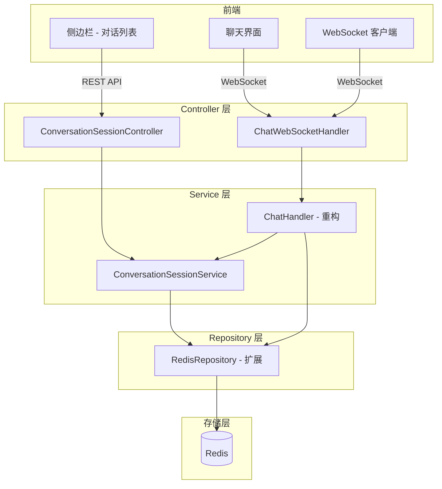
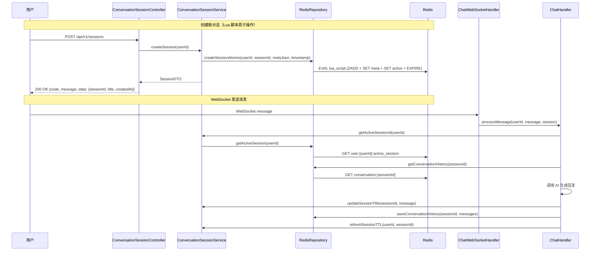

# 技术设计文档：开启新对话（new-conversation）

## 概述

本设计为 ArchiveMind 系统引入多会话管理能力。当前系统中每个用户在 Redis 中仅维护一个 `current_conversation`，所有消息共享同一上下文。本功能将引入 Conversation Session 概念，使用户能够创建、切换、管理多个独立的对话会话。

核心变更：
- 新增 `ConversationSessionService` 服务层，负责会话的 CRUD 和 Redis 数据管理
- 重构 `RedisRepository`，新增 Sorted Set 和 Hash 操作以支持多会话数据结构
- 重构 `ChatHandler`，使其基于 Active Session 处理消息
- 新增 REST API 端点用于会话管理（创建、列表、切换、重命名、删除）
- 保持与现有 WebSocket 通信机制的兼容

## 架构

### 整体架构

系统采用分层架构，新增的会话管理功能嵌入现有的 Controller → Service → Repository 分层结构中。



### 请求流程



## 组件与接口

### 1. ConversationSessionController（新增）

REST 控制器，提供会话管理 API。路径前缀：`/api/v1/sessions`

| 方法 | 路径 | 描述 | 请求体 | 响应 |
|------|------|------|--------|------|
| POST | `/` | 创建新会话 | 无 | `{code, message, data: {sessionId, title, createdAt}}` |
| GET | `/` | 获取会话列表（按时间分组） | 无 | `{code, message, data: {today:[], week:[], month:[], earlier:{}}}` |
| PUT | `/{sessionId}/active` | 切换活跃会话 | 无 | `{code, message, data: {sessionId, title, messages[]}}` |
| PUT | `/{sessionId}/title` | 更新会话标题 | `{title}` | `{code, message, data: null}` |
| DELETE | `/{sessionId}` | 删除会话 | 无 | `{code, message, data: null}` |

所有接口需要 JWT 认证（通过 `Authorization: Bearer {token}` 请求头）。

### 2. ConversationSessionService（新增）

核心业务逻辑服务。

```java
public interface ConversationSessionService {
    // 创建新会话，返回会话信息
    SessionDTO createSession(String userId);

    // 获取用户所有会话，按时间分组
    GroupedSessionListDTO listSessions(String userId);

    // 切换活跃会话，返回会话详情和消息历史
    SessionDetailDTO switchSession(String userId, String sessionId);

    // 获取用户当前活跃会话ID
    String getActiveSessionId(String userId);

    // 更新会话标题
    void updateTitle(String userId, String sessionId, String title);

    // 自动生成会话标题（基于第一条消息）
    void autoGenerateTitle(String sessionId, String firstMessage);

    // 删除会话
    void deleteSession(String userId, String sessionId);

    // 刷新会话所有相关键的 TTL
    void refreshSessionTTL(String userId, String sessionId);
}
```

### 3. RedisRepository（扩展）

在现有 `RedisRepository` 基础上新增方法：

```java
// === 会话原子创建（Lua 脚本）===
// 原子性创建会话：ZADD + SET meta + SET active_session + EXPIRE，任一步骤失败则全部不生效
void createSessionAtomic(String userId, String sessionId, String metaJson, double score, Duration ttl);

// === 会话列表管理（Sorted Set）===
// 将会话ID添加到用户的会话列表
void addSessionToUserList(String userId, String sessionId, double score);
// 获取用户所有会话ID（按分数降序）
Set<String> getUserSessionIds(String userId);
// 从用户会话列表中移除指定会话
void removeSessionFromUserList(String userId, String sessionId);

// === 会话元数据管理 ===
// 保存会话元数据（JSON）
void saveSessionMeta(String sessionId, String metaJson);
// 获取会话元数据
String getSessionMeta(String sessionId);
// 删除会话元数据
void deleteSessionMeta(String sessionId);

// === 活跃会话管理 ===
// 设置用户的活跃会话
void setActiveSession(String userId, String sessionId);
// 获取用户的活跃会话ID
String getActiveSession(String userId);
// 清除用户的活跃会话
void clearActiveSession(String userId);

// === TTL 管理 ===
// 刷新会话相关所有键的过期时间（包括 user:{userId}:sessions）
void refreshSessionKeys(String sessionId, String userId, Duration ttl);

// === 删除原子操作（Lua 脚本）===
// 原子性删除会话：ZREM + DEL meta + DEL conversation + 条件清除 active_session
void deleteSessionAtomic(String userId, String sessionId);
```

### 4. ChatHandler（重构）

主要变更点：
- `getOrCreateConversationId(userId)` 改为从 `ConversationSessionService.getActiveSessionId(userId)` 获取活跃会话
- 当用户没有活跃会话时，自动调用 `ConversationSessionService.createSession(userId)` 创建新会话
- 在用户发送第一条消息时，调用 `ConversationSessionService.autoGenerateTitle(sessionId, message)` 自动生成标题
- 每次消息处理后，调用 `ConversationSessionService.refreshSessionTTL(userId, sessionId)` 刷新 TTL
- 消息存储的 Redis 键保持 `conversation:{sessionId}` 格式不变，确保向后兼容

### 5. DTO 定义

```java
// 会话基本信息（使用 Lombok @Data 注解，兼容 Java 8+）
@Data
@AllArgsConstructor
@NoArgsConstructor
public class SessionDTO {
    private String sessionId;
    private String title;
    private LocalDateTime createdAt;
}

// 会话详情（含消息历史）
@Data
@AllArgsConstructor
@NoArgsConstructor
public class SessionDetailDTO {
    private String sessionId;
    private String title;
    private LocalDateTime createdAt;
    private List<MessageDTO> messages;
}

// 消息
@Data
@AllArgsConstructor
@NoArgsConstructor
public class MessageDTO {
    private String role;
    private String content;
    private String timestamp;
}

// 分组会话列表
@Data
@AllArgsConstructor
@NoArgsConstructor
public class GroupedSessionListDTO {
    private List<SessionDTO> today;
    private List<SessionDTO> week;
    private List<SessionDTO> month;
    private Map<String, List<SessionDTO>> earlier;  // key 为 "2026-03" 格式
}
```

## 数据模型

### Redis 数据结构

本功能完全基于 Redis 存储，不涉及 MySQL 数据库变更。

#### 1. 用户会话列表

- 键：`user:{userId}:sessions`
- 类型：Sorted Set
- 成员：sessionId（UUID 字符串）
- 分数：创建时间的 epoch milliseconds
- TTL：不设置过期时间（通过成员清理管理生命周期）
- 用途：按时间排序获取用户所有会话
- 容量限制：每用户最多 200 个会话，超出时自动清理最早的会话（ZREMRANGEBYRANK 移除最低分数成员，并同时删除对应的 meta 和 conversation 键）

#### 2. 会话元数据

- 键：`session:{sessionId}:meta`
- 类型：String（JSON）
- 值示例：
```json
{
  "sessionId": "550e8400-e29b-41d4-a716-446655440000",
  "userId": "admin",
  "title": "新对话",
  "createdAt": "2025-07-14T10:30:00"
}
```
- TTL：30 天

#### 3. 会话消息历史

- 键：`conversation:{sessionId}`
- 类型：String（JSON 数组）
- 值格式：与现有格式完全兼容
```json
[
  {"role": "user", "content": "你好", "timestamp": "2025-07-14T10:30:00"},
  {"role": "assistant", "content": "你好！有什么可以帮到你？", "timestamp": "2025-07-14T10:30:05"}
]
```
- TTL：30 天

#### 4. 用户活跃会话

- 键：`user:{userId}:active_session`
- 类型：String
- 值：当前活跃的 sessionId
- TTL：30 天
- 说明：替代原有的 `user:{userId}:current_conversation` 键

#### 数据迁移

原有的 `user:{userId}:current_conversation` 键将在 `ChatHandler` 重构后不再使用。为保证平滑过渡，`getActiveSessionId()` 方法执行以下迁移逻辑：

1. 先检查新键 `user:{userId}:active_session`，若存在则直接返回
2. 若不存在，回退检查旧键 `user:{userId}:current_conversation`
3. 若旧键存在，执行一次性迁移（Lua 脚本原子操作）：
   - 读取旧键中的 conversationId
   - 创建 `session:{conversationId}:meta`（JSON，包含 sessionId、userId、title="历史对话"、createdAt=当前时间）
   - 将 conversationId 加入 `user:{userId}:sessions` Sorted Set
   - 设置 `user:{userId}:active_session` 为该 conversationId
   - 为新创建的 meta 键和 active_session 键设置 30 天 TTL
   - 删除旧键 `user:{userId}:current_conversation`
4. 若旧键也不存在，返回 null

### 时间分组规则

会话列表按以下规则分组：

| 分组标签 | 规则 |
|----------|------|
| 今天 | `createdAt` 在当天 00:00:00 之后 |
| 7天内 | `createdAt` 在 7 天前 00:00:00 之后（不含今天） |
| 30天内 | `createdAt` 在 30 天前 00:00:00 之后（不含 7 天内） |
| 更早 | `createdAt` 在 30 天前之前，按年月分组（如 "2025-06"） |


## 正确性属性（Correctness Properties）

*属性（Property）是指在系统所有合法执行中都应成立的特征或行为——本质上是对系统应做什么的形式化陈述。属性是人类可读规格说明与机器可验证正确性保证之间的桥梁。*

### Property 1: 会话创建数据持久化往返

*For any* 用户ID，创建一个新会话后，从 Redis 中读取该会话的元数据（`session:{sessionId}:meta`）应返回等价的 sessionId、userId、title 和 createdAt；同时该 sessionId 应存在于用户的会话列表（`user:{userId}:sessions` Sorted Set）中，且消息历史键（`conversation:{sessionId}`）应可正常读写。

**Validates: Requirements 1.2, 7.1, 7.2, 7.3**

### Property 2: 创建会话后自动设置活跃会话

*For any* 用户，调用 `createSession` 后，`getActiveSessionId` 应返回新创建的会话ID。

**Validates: Requirements 1.3**

### Property 3: 会话列表按时间降序排列

*For any* 用户拥有的一组会话（创建时间各不相同），调用 `listSessions` 返回的每个分组内的会话列表应按 `createdAt` 降序排列。

**Validates: Requirements 2.1**

### Property 4: 会话时间分组正确性

*For any* 会话及其 `createdAt` 时间戳，该会话应被分配到正确的时间分组中：若在当天则归入"今天"，若在 1-7 天前则归入"7天内"，若在 7-30 天前则归入"30天内"，若超过 30 天则归入以年月为键的"更早"分组。且每个返回的会话对象都应包含 sessionId、title 和 createdAt 字段。

**Validates: Requirements 2.2, 2.3**

### Property 5: 切换会话设置活跃会话

*For any* 用户及其拥有的任意一个会话，调用 `switchSession` 后，`getActiveSessionId` 应返回被切换到的会话ID。

**Validates: Requirements 3.1**

### Property 6: 切换会话返回消息历史往返

*For any* 会话，先向其中存储一组消息，然后通过 `switchSession` 切换到该会话，返回的消息列表应与之前存储的消息在角色、内容和时间戳上完全一致。

**Validates: Requirements 3.2**

### Property 7: 消息始终存储在活跃会话下

*For any* 用户，无论其活跃会话如何变更（创建新会话或切换到历史会话），通过 WebSocket 发送的消息都应存储在当前活跃会话对应的 `conversation:{activeSessionId}` 键中，而非其他会话的键中。

**Validates: Requirements 3.3, 6.1, 6.2, 6.4**

### Property 8: 自动标题生成截断规则

*For any* 消息字符串，自动生成的会话标题应为该消息的前 `min(20, length)` 个字符；当消息长度超过 20 个字符时，标题末尾应追加 `"..."`；当消息长度不超过 20 个字符时，标题应等于原始消息。

**Validates: Requirements 4.1, 4.2**

### Property 9: 标题更新持久化往返

*For any* 会话和任意新标题字符串，调用 `updateTitle` 后，从 Redis 读取该会话的元数据应返回更新后的标题。

**Validates: Requirements 4.4**

### Property 10: 删除会话移除所有数据

*For any* 用户及其拥有的任意一个会话，调用 `deleteSession` 后，该会话的元数据键（`session:{sessionId}:meta`）、消息历史键（`conversation:{sessionId}`）应不存在，且该 sessionId 应不在用户的会话列表 Sorted Set 中。

**Validates: Requirements 5.1**

### Property 11: 删除活跃会话清除引用

*For any* 用户，若其活跃会话被删除，则 `getActiveSessionId` 应返回 null。

**Validates: Requirements 5.2**

### Property 12: 无活跃会话时自动创建

*For any* 用户，若其没有活跃会话（`getActiveSessionId` 返回 null），当通过 ChatHandler 处理消息时，系统应自动创建一个新会话并将其设置为活跃会话。

**Validates: Requirements 6.3**

### Property 13: TTL 管理

*For any* 新创建的会话，其所有相关 Redis 键的 TTL 应约为 30 天；当该会话中有新消息发送后，所有相关键的 TTL 应被刷新至约 30 天。

**Validates: Requirements 7.4, 7.5**

## 错误处理

### HTTP 错误响应格式

所有响应（包括成功和错误）统一使用以下 JSON 格式，保持结构一致：

```json
{
  "code": 200,
  "message": "操作描述",
  "data": null
}
```

成功时 `data` 为具体业务数据，错误时 `data` 为 `null`。

### 错误场景

| 场景 | HTTP 状态码 | 错误消息 |
|------|------------|----------|
| JWT Token 无效或过期 | 401 | "无效的token" |
| 创建会话时 Redis 不可用 | 500 | "创建对话失败，请稍后重试" |
| 切换到不存在/已过期的会话 | 404 | "对话不存在或已过期" |
| 切换不属于自己的会话 | 403 | "无权操作该对话" |
| 删除不属于自己的会话 | 403 | "无权删除该对话" |
| 删除不存在的会话 | 404 | "对话不存在" |
| Redis 读写异常 | 500 | "服务器内部错误" |

### 权限校验

- 所有会话操作前，先通过 JWT 提取 userId
- 删除和切换操作需验证目标会话属于当前用户（通过检查 `session:{sessionId}:meta` 中的 userId 字段）
- 权限校验失败返回 403

### Redis 异常处理

- 所有 Redis 操作使用 try-catch 包裹
- Redis 连接异常时记录错误日志并返回 500
- 数据反序列化失败时返回空默认值并记录警告日志

## 风险识别

| 风险项 | 描述 | 应对措施 |
|--------|------|----------|
| Redis 不可用 | Redis 宕机或网络中断导致所有会话操作失败 | 接口返回 500 并提示用户稍后重试；配置 Redis Sentinel 或 Cluster 保证高可用 |
| 数据迁移异常 | 旧键 `current_conversation` 迁移过程中失败，导致用户丢失历史对话引用 | 迁移使用 Lua 脚本原子操作；迁移失败时保留旧键不删除，下次访问重试 |
| 大 Key 风险 | 高频用户 Sorted Set 成员过多 | 限制每用户最多 200 个会话，超出自动清理最早会话 |
| 并发创建会话 | 用户快速连续点击"开启新对话"导致重复创建 | 前端按钮防抖；后端 Lua 脚本保证原子性 |

## 变更三板斧

### 可灰度

- 灰度策略：通过功能开关（Redis 键 `feature:multi_session:enabled`）控制是否启用多会话功能
- 灰度范围：按用户 ID 哈希取模，支持按百分比灰度放量（如先 1% → 10% → 50% → 100%）
- 回滚方案：关闭功能开关后，系统回退到单会话模式（`ChatHandler` 使用旧键 `current_conversation`）；已创建的多会话数据保留在 Redis 中，不影响回退后的功能

### 可观测

- 监控指标（通过 Micrometer + Prometheus）：
  - `session.create.count`：会话创建 QPS
  - `session.create.error.count`：会话创建失败次数
  - `session.switch.latency`：会话切换延迟（P99）
  - `redis.operation.latency`：Redis 操作延迟
  - `session.per_user.count`：每用户会话数分布
- 告警规则：会话创建错误率 > 5% 触发告警；Redis 操作 P99 延迟 > 200ms 触发告警

### 可应急

- 应急预案：若多会话功能导致 Redis 负载异常，通过功能开关一键关闭，回退到单会话模式
- 功能开关：`feature:multi_session:enabled`（Redis String，值为 "true"/"false"）
- 降级策略：Redis 不可用时，`ChatHandler` 降级为无状态模式（不保存历史消息，仅处理当前消息）

## 测试策略

### 双重测试方法

本功能采用单元测试 + 属性测试的双重测试策略，确保全面覆盖。

### 属性测试（Property-Based Testing）

使用 **jqwik**（Java 属性测试库）实现属性测试。

配置要求：
- 每个属性测试至少运行 100 次迭代
- 每个测试用注释标注对应的设计属性
- 标注格式：`Feature: new-conversation, Property {number}: {property_text}`
- 每个正确性属性由一个属性测试实现

属性测试覆盖范围：
- Property 1-13 的所有正确性属性
- 使用 `@ForAll` 注解生成随机输入
- 使用嵌入式 Redis（如 testcontainers-redis）或 Mock Redis 进行测试

### 单元测试

使用 JUnit 5 + Mockito 实现单元测试。

单元测试覆盖范围：
- 具体示例：新会话默认标题为"新对话"（Requirements 4.3）
- 边界情况：用户无历史对话时返回空列表（Requirements 2.4）
- 错误场景：认证失败返回 401（Requirements 2.5）、切换不存在会话返回 404（Requirements 3.4）、删除他人会话返回 403（Requirements 5.4）、删除不存在会话返回 404（Requirements 5.5）
- 创建会话失败返回 500（Requirements 1.5）
- Controller 层的请求路由和响应格式验证

### 测试依赖

```xml
<!-- jqwik - 属性测试 -->
<dependency>
    <groupId>net.jqwik</groupId>
    <artifactId>jqwik</artifactId>
    <version>1.8.5</version>
    <scope>test</scope>
</dependency>

<!-- Testcontainers Redis（可选，用于集成测试） -->
<dependency>
    <groupId>com.redis</groupId>
    <artifactId>testcontainers-redis</artifactId>
    <version>2.2.2</version>
    <scope>test</scope>
</dependency>
```
