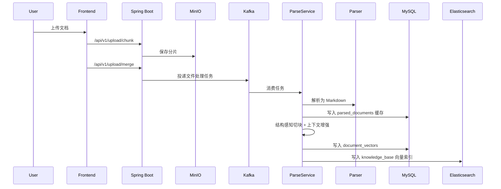

# ArchiveMind

ArchiveMind 是一个基于 RAG 架构的企业级智能知识问答系统，支持多格式文档上传、解析、结构感知切块、向量化入库、混合检索、重排序和自然语言问答。项目重点解决企业内部文档分散、检索效率低、知识复用成本高的问题，提供私有知识库构建、权限隔离、流式问答、Agent 工具编排和离线质量评测能力。

> 当前仓库包含 Spring Boot 后端、Vue 前端和 RAG 离线评测模块。提交到 GitHub 前，请确认本地密钥只存在于被忽略的本地配置文件或环境变量中。

## 核心能力

| 能力 | 说明 |
| --- | --- |
| 多格式文档入库 | 支持 PDF、Word、Excel、PowerPoint、Markdown、TXT、HTML、JSON、CSV、EPUB 等文档类型上传与解析 |
| 解析缓存 | 使用 `parsed_documents` 缓存解析结果，避免同一文件重复调用云端解析服务 |
| 结构感知 Chunk | 基于 Markdown 标题、章节、段落、表格、代码块等结构切割文档，并保留 `docTitle`、`headingPath`、`blockType`、offset 等元数据 |
| Contextual Retrieval | 为 chunk 增加文档画像、章节路径和局部上下文，提升脱离原文时的语义完整性 |
| 混合检索 | 融合 Elasticsearch KNN 向量检索、BM25 关键词检索、RRF 排名融合和 BGE Reranker 精排 |
| 权限过滤 | 按 `userId`、`orgTag`、`isPublic` 控制知识库检索可见范围 |
| ReAct Agent | 支持推理、工具调用、观察和再决策循环，提供知识库搜索、摘要生成、Web 搜索等工具能力 |
| 流式问答 | 基于 WebSocket 推送 AI 回答、工具状态和 Trace 事件 |
| 质量治理 | 提供 Java 检索指标、RAGAS 生成质量指标、权限校验、DB/ES 一致性检查和 BadCase 自动归因 |

## 架构总览

```mermaid
flowchart LR
    User["用户 / 前端"] --> Upload["分片上传"]
    Upload --> MinIO["MinIO 对象存储"]
    Upload --> Kafka["Kafka 文件处理任务"]
    Kafka --> Parse["解析管道"]
    Parse --> Parser["LlamaParse / 本地 Parser"]
    Parser --> ParsedCache["parsed_documents 解析缓存"]
    ParsedCache --> Chunk["结构感知 Chunk"]
    Chunk --> Context["Contextual Retrieval 增强"]
    Context --> MySQL["MySQL: document_vectors"]
    MySQL --> Embed["Embedding 生成 + Redis 缓存"]
    Embed --> ES["Elasticsearch knowledge_base"]

    User --> Chat["WebSocket 问答"]
    Chat --> Rewrite["Query Rewrite / Intent / Clarify"]
    Rewrite --> Retrieval["KNN + BM25 + RRF"]
    ES --> Retrieval
    Retrieval --> Rerank["BGE Reranker"]
    Rerank --> Agent["ReAct Agent / Tool Calling"]
    Agent --> LLM["LLM Provider"]
    LLM --> Answer["流式回答 + Trace"]
```



## 入库流程



## 技术栈

| 层级 | 技术 |
| --- | --- |
| 后端 | Java 17, Spring Boot 3.4.2, Spring Security, Spring WebFlux, Spring WebSocket, Spring Data JPA |
| 数据库 | MySQL, Redis |
| 消息队列 | Kafka |
| 对象存储 | MinIO |
| 检索引擎 | Elasticsearch, dense_vector, BM25, KNN, RRF |
| 文档解析 | LlamaParse API, 本地 Parser Router |
| Embedding | OpenAI-compatible Embedding API, 默认 2048 维 |
| Reranker | BGE Reranker, `/rerank` 兼容接口 |
| 前端 | Vue 3, Vite, TypeScript, Pinia, Vue Router, Naive UI |
| 评测 | Java EvalRunner, RAGAS, Python |

## 目录结构

```text
ArchiveMind/
  src/main/java/com/zyh/archivemind/
    client/                 # LLM、Embedding 等外部 API 客户端
    config/                 # Spring、ES、AI、Trace 等配置
    controller/             # REST API 与 WebSocket 入口
    service/                # 文档解析、检索、Agent、Trace 等核心业务
    chunk/                  # 结构感知 Chunk 切割
    parser/                 # Parser Router 与解析请求模型
    model/                  # JPA 实体
    repository/             # 数据访问层
    eval/                   # Java 离线评测入口
  src/main/resources/
    application.yaml        # 可提交的环境变量模板配置
    application.yml         # 本地真实配置，已被 .gitignore 忽略
    es-mappings/            # Elasticsearch mapping
    sql/                    # 辅助 SQL
  frontend/                 # Vue 前端工程
  eval/                     # RAG 离线测评脚本、case、输出
```

## 环境要求

| 组件 | 建议版本 / 要求 |
| --- | --- |
| JDK | 17 |
| Maven | 使用仓库内置 `mvnw` / `mvnw.cmd` |
| Node.js | >= 18.20.0 |
| pnpm | >= 8.7.0 |
| MySQL | 8.x |
| Redis | 6.x 或 7.x |
| Kafka | 3.x |
| MinIO | 兼容 S3 API |
| Elasticsearch | 建议 8.11+，需要支持 2048 维 `dense_vector`，并安装 IK 分词插件 |
| Reranker | 提供 OpenAI / Jina / TEI 风格的 `/rerank` 接口 |

## 快速开始

### 1. 克隆项目

```powershell
git clone <your-repo-url>
cd ArchiveMind
```

### 2. 准备中间件

启动或准备以下服务：

- MySQL：创建数据库 `archivemind`
- Redis：用于缓存、Token、组织标签和 Embedding 缓存
- Kafka：用于异步文件处理任务
- MinIO：用于保存上传文件
- Elasticsearch：用于 BM25、KNN 和结构化元数据检索
- Reranker 服务：用于 Cross-Encoder 精排

本仓库暂未内置 `docker-compose.yml`，可使用本机服务、Docker 或已有开发环境。

### 3. 配置后端环境变量

后端默认读取 `src/main/resources/application.yaml`，其中所有敏感配置都支持环境变量。也可以在项目根目录创建 `.env`，Spring Boot 会通过 `spring.config.import=optional:file:./.env[.properties]` 自动读取。

示例 `.env`：

```properties
SERVER_PORT=8080

MYSQL_URL=jdbc:mysql://localhost:3306/archivemind?useUnicode=true&characterEncoding=UTF-8&useSSL=false&serverTimezone=Asia/Shanghai&allowPublicKeyRetrieval=true
MYSQL_USERNAME=archivemind
MYSQL_PASSWORD=<your-mysql-password>

REDIS_HOST=localhost
REDIS_PORT=6379
REDIS_PASSWORD=

KAFKA_BOOTSTRAP_SERVERS=localhost:9092
KAFKA_TOPIC_FILE_PROCESSING=file-processing

MINIO_ENDPOINT=http://localhost:9000
MINIO_ACCESS_KEY=<your-minio-access-key>
MINIO_SECRET_KEY=<your-minio-secret-key>
MINIO_BUCKET=uploads
MINIO_PUBLIC_URL=http://localhost:9000

ES_HOST=localhost
ES_PORT=9200
ES_SCHEME=http
ES_USERNAME=
ES_PASSWORD=

JWT_SECRET_KEY=<your-jwt-secret>

LLAMAPARSE_API_KEY=<your-llamaparse-key>
LLAMAPARSE_API_URL=https://api.cloud.llamaindex.ai/api/v2

LLM_DEFAULT_PROVIDER=deepseek
LLM_DEEPSEEK_API_URL=https://api.deepseek.com/v1
LLM_DEEPSEEK_API_KEY=<your-llm-key>
LLM_DEEPSEEK_MODEL=deepseek-chat

EMBEDDING_API_URL=https://dashscope.aliyuncs.com/compatible-mode/v1
EMBEDDING_API_KEY=<your-embedding-key>
EMBEDDING_MODEL=text-embedding-v3
EMBEDDING_DIMENSION=2048

RERANKER_URL=http://localhost:8088
RERANKER_MODEL=BAAI/bge-reranker-base
RERANKER_MAX_CANDIDATES=20
```

> 不要把真实 `.env`、`application.yml`、API Key 或数据库密码提交到 GitHub。

### 4. 启动后端

```powershell
.\mvnw.cmd spring-boot:run
```

Linux / macOS：

```bash
./mvnw spring-boot:run
```

启动时会自动检查并创建 Elasticsearch 索引 `knowledge_base`。如果已有索引的向量维度与 `EMBEDDING_DIMENSION` 不一致，应用会报错，需重建索引或调整 Embedding 维度。

### 5. 启动前端

```powershell
cd frontend
pnpm install
pnpm dev
```

构建前端：

```powershell
cd frontend
pnpm build
```

## 常用后端命令

```powershell
# 编译后端
.\mvnw.cmd -DskipTests compile

# 打包后端
.\mvnw.cmd -DskipTests package

# 运行测试
.\mvnw.cmd test
```

## API 概览

| 模块 | 接口 |
| --- | --- |
| 用户认证 | `POST /api/v1/users/register`, `POST /api/v1/users/login`, `GET /api/v1/users/me` |
| Token | `POST /api/v1/auth/refreshToken` |
| 文件上传 | `POST /api/v1/upload/chunk`, `GET /api/v1/upload/status`, `POST /api/v1/upload/merge` |
| 文档管理 | `GET /api/v1/documents/uploads`, `GET /api/v1/documents/download`, `GET /api/v1/documents/preview`, `DELETE /api/v1/documents/{fileMd5}` |
| 检索 | `GET /api/v1/search/hybrid` |
| 问答 | `GET /api/v1/chat/websocket-token`, WebSocket 流式聊天 |
| 会话 | `POST /api/v1/sessions`, `GET /api/v1/sessions`, `PUT /api/v1/sessions/{sessionId}/title` |
| LLM Provider | `GET /api/v1/llm/providers`, `POST /api/v1/llm/providers/preference` |
| Trace | `GET /api/v1/traces/list`, `GET /api/v1/traces/{traceId}` |
| 管理后台 | `/api/v1/admin/**` |

## RAG 检索链路

1. 用户问题经过意图识别、必要澄清和 Query Rewrite，形成更适合检索的独立查询。
2. 查询文本生成 Embedding，进入 Elasticsearch KNN 向量检索。
3. 同一查询分别进入 BM25 关键词检索，匹配 `contextualizedContent`、`headingPath`、`docTitle` 和 `textContent`。
4. KNN 与 BM25 的候选结果使用 RRF 融合，降低不同检索分数尺度不一致的问题。
5. 结果按用户、组织标签和公开范围过滤。
6. 候选结果送入 BGE Reranker 做 Cross-Encoder 精排。
7. 最终返回原始 `textContent` 给 LLM，避免把过长上下文增强文本直接塞入回答上下文。

## 离线评测

评测模块位于 `eval/`，推荐入口见 [eval/README.md](eval/README.md)。

一键运行第三期评测：

```powershell
.\eval\scripts\run_third_phase_eval.ps1
```

评测会依次生成：

- `eval/outputs/eval_result.json`：Java EvalRunner 明细
- `eval/outputs/eval_report.md`：检索指标报告
- `eval/outputs/ragas_input.json`：RAGAS 输入
- `eval/outputs/ragas_scores.json`：RAGAS 原始指标
- `eval/outputs/ragas_summary.json`：RAGAS 汇总
- `eval/outputs/eval_summary_merged.json`：Java 指标 + RAGAS 指标 + 门禁合并报告
- `eval/outputs/badcase_analysis.md`：BadCase 自动归因
- `eval/outputs/eval_manifest.json`：运行版本、配置 hash 和输出文件路径

当前小规模离线基线：

| 指标 | 当前值 |
| --- | ---: |
| Case 数 | 30 |
| Hit@5 | 1.0000 |
| Recall@10 | 1.0000 |
| MRR | 0.9583 |
| Permission Leak | 0 |
| DB/ES Inconsistent | 0 |
| RAGAS Faithfulness | 0.7782 |
| RAGAS Answer Relevancy | 0.9339 |
| RAGAS Context Precision | 0.9269 |
| RAGAS Context Recall | 0.9500 |

> 以上数据是当前小规模离线 case 的基线结果，只用于回归对照，不代表生产全量效果。

## 配置与安全说明

- `src/main/resources/application.yaml` 是可提交的模板配置。
- `src/main/resources/application.yml` 是本地真实配置，已被 `.gitignore` 忽略。
- `eval/config/ragas.env` 是 RAGAS 本地裁判模型配置，已被 `.gitignore` 忽略。
- 提交前请检查 Git 暂存区，确认没有 API Key、数据库密码、MinIO 密钥、JWT 密钥等敏感信息。
- 生产环境建议使用正式 migration 管理数据库表结构，不长期依赖 `spring.jpa.hibernate.ddl-auto=update`。
- 如果更换 Embedding 模型或维度，需要同步更新 `EMBEDDING_DIMENSION`、ES mapping 和已有索引数据。

## 后续规划

- 增加标准化 `docker-compose.yml`，降低本地启动成本。
- 扩充离线评测 case 到 100 条以上，覆盖概念、步骤、对比、权限、无答案和多跳问题。
- 将 KNN 与 BM25 检索执行改为真正并行，进一步降低检索延迟。
- 增加线上 P50/P95/P99、首 Token 延迟、Reranker 耗时、LLM 成本等可观测指标。
- 完善数据库 migration、CI 编译检查和端到端回归测试。

## License

当前仓库根目录尚未声明开源协议。公开发布前建议补充 `LICENSE` 文件。
