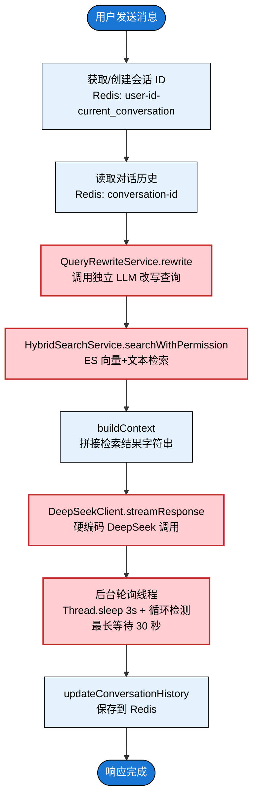
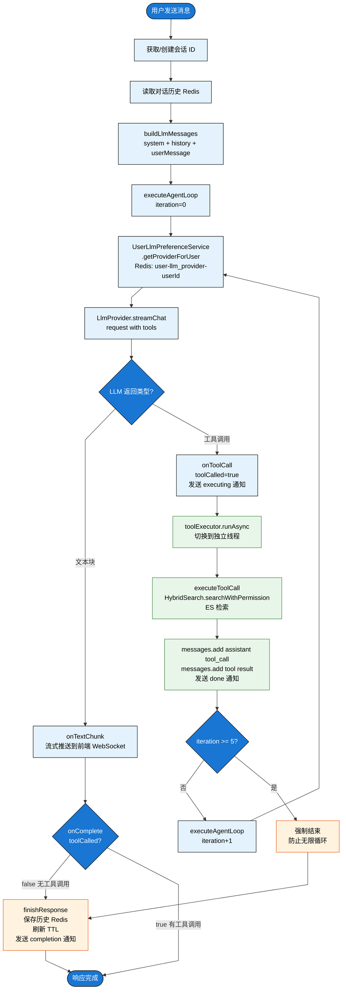
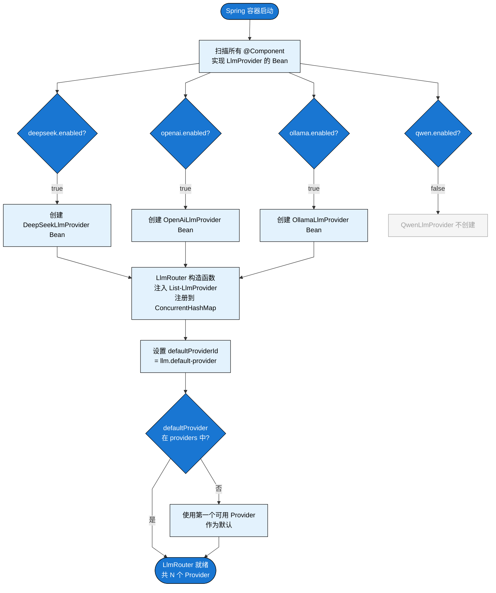
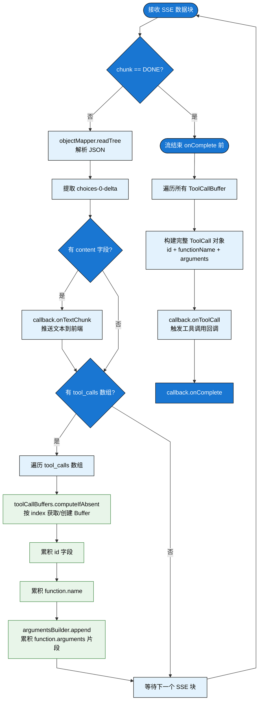
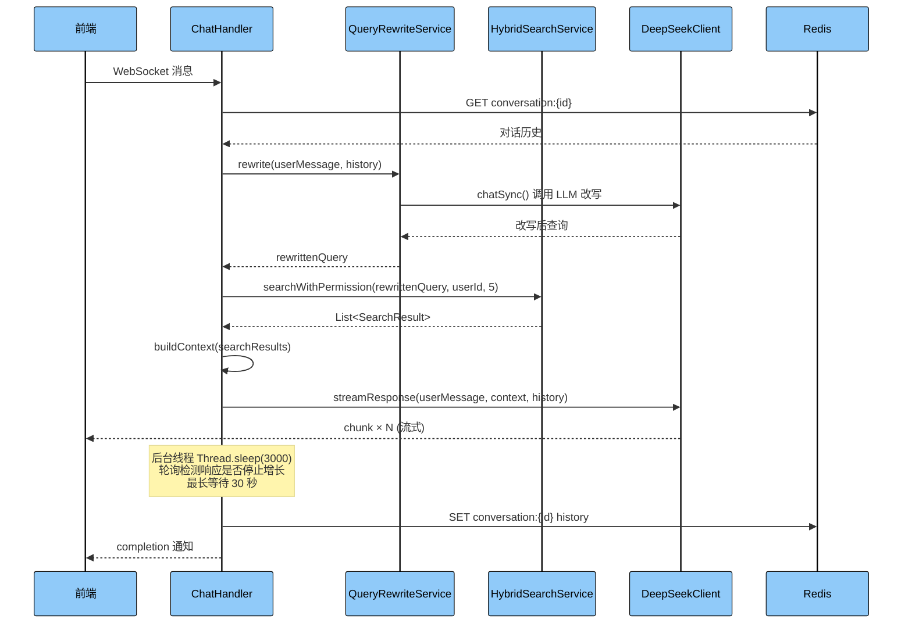
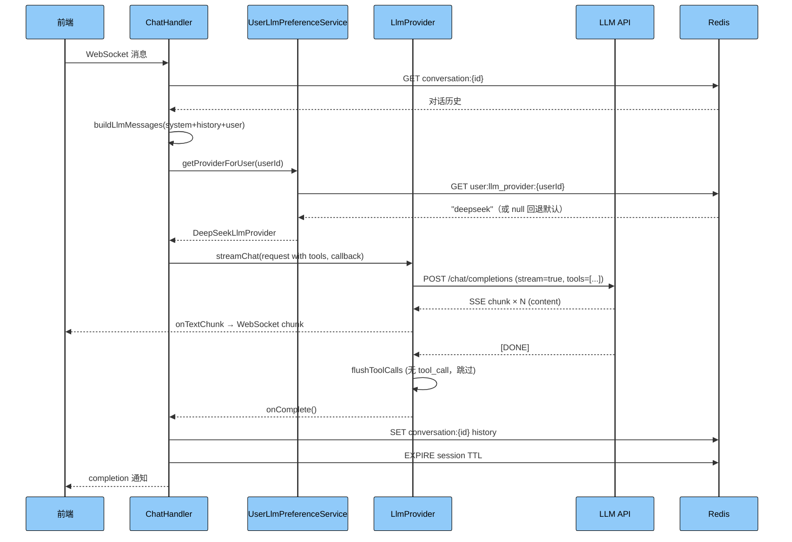
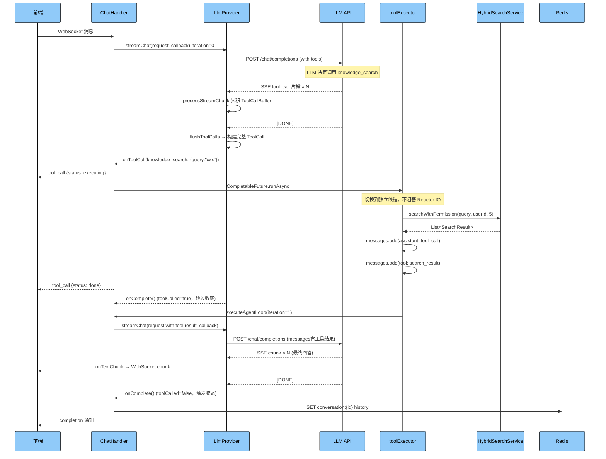
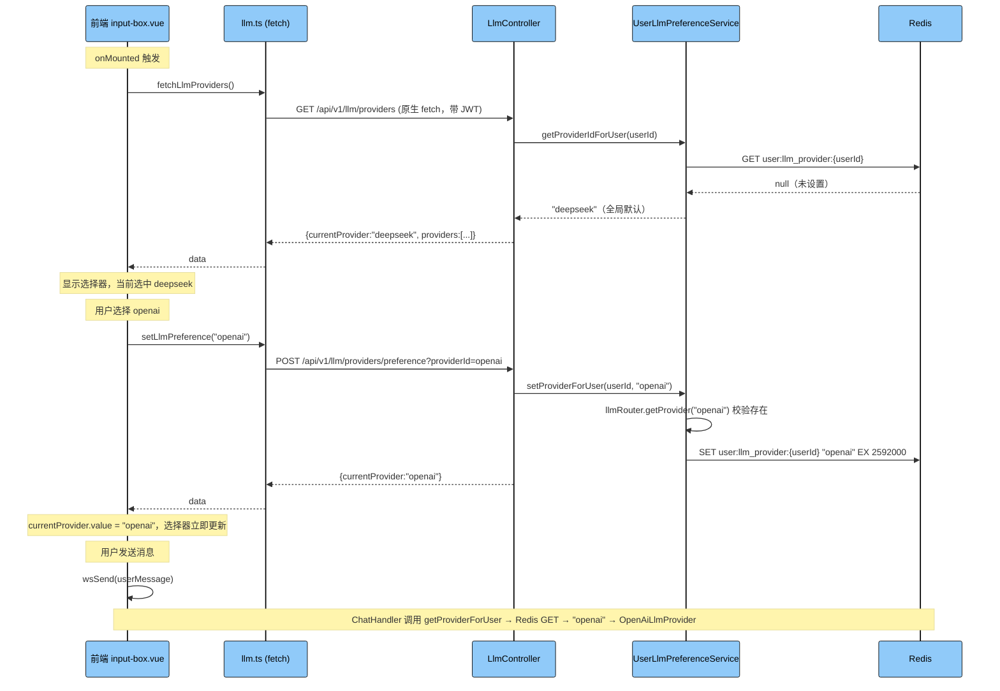
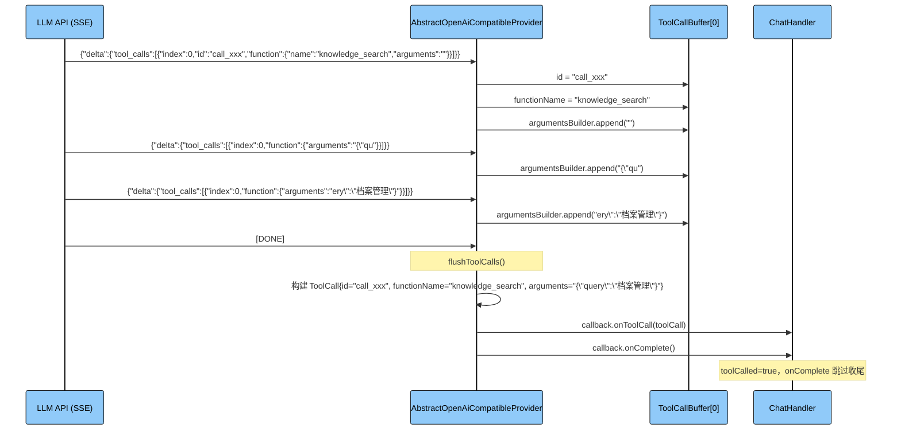

# Phase 1：多 LLM 抽象层 + Function Calling 技术方案文档

## 目录

1. 改造背景与目标
2. 改造前架构分析
3. 改造后架构设计
4. 核心设计模式
5. 流程图
6. 时序图
7. Agent 循环详解
8. 关键组件设计
9. 前端改动
10. 难点问题与解决方案
11. 文件清单
12. 配置说明

---

## 1. 改造背景与目标

### 1.1 背景

ArchiveMind 是一个基于 RAG（检索增强生成）的知识库问答系统。Phase 1 之前，系统 AI 调用链路完全硬编码，存在四个核心缺陷：

| 缺陷 | 描述 |
|------|------|
| 模型锁定 | `ChatHandler` 直接依赖 `DeepSeekClient`，无法切换模型，无法支持多用户使用不同模型 |
| 强制搜索 | 每次对话都无条件执行 QueryRewrite → HybridSearch，即使用户只是打招呼也触发 ES 检索 |
| 无 Function Calling | LLM 无法自主判断是否需要检索，只能被动接收系统预先拼接的上下文 |
| 轮询检测完成 | 用后台线程 `Thread.sleep` 轮询检测响应是否停止增长，最长等待 30 秒，逻辑复杂且不可靠 |

### 1.2 改造目标

| 目标 | 具体要求 |
|------|---------|
| 可插拔 LLM | 支持 DeepSeek、OpenAI、Ollama、通义千问，新增 Provider 无需修改业务代码 |
| 用户级模型选择 | 每个用户可独立选择 Provider，互不影响，偏好持久化到 Redis |
| Function Calling | LLM 自主决策是否调用 knowledge_search 工具，按需检索 |
| Agent 循环 | 支持多轮工具调用（最多 5 轮），直到 LLM 给出最终文本回答 |
| 响应式安全 | 工具调用不阻塞 Reactor IO 线程，使用独立线程池 |

---

## 2. 改造前架构分析

### 2.1 改造前项目结构（AI 相关部分）

```
src/main/java/com/zyh/archivemind/
├── client/
│   └── DeepSeekClient.java          ← 唯一的 LLM 客户端，硬编码 DeepSeek
├── config/
│   └── AiProperties.java            ← Prompt / Generation / Rewrite 三个配置块
├── service/
│   ├── ChatHandler.java             ← 硬编码调用链：改写→搜索→拼接→调用
│   └── QueryRewriteService.java     ← 每次都执行的查询改写
└── resources/
    └── application.yml              ← deepseek.api.* 配置
```

### 2.2 改造前依赖关系

```
ChatHandler
    ├── DeepSeekClient
    │       ├── @Value("${deepseek.api.url}")
    │       ├── @Value("${deepseek.api.key}")
    │       ├── @Value("${deepseek.api.model}")
    │       └── AiProperties
    │               ├── Prompt (rules/refStart/refEnd/noResultText)
    │               └── Generation (temperature/maxTokens/topP)
    ├── HybridSearchService
    ├── QueryRewriteService
    │       └── RewriteLlmClient
    └── ConversationSessionService
```

---

## 3. 改造后架构设计

### 3.1 改造后项目结构（AI 相关部分）

```
src/main/java/com/zyh/archivemind/
├── Llm/
│   ├── LlmProvider.java                      ← 接口：统一 LLM 契约
│   ├── LlmRequest.java                       ← DTO：请求参数
│   ├── LlmMessage.java                       ← DTO：消息体（含工具调用）
│   ├── LlmStreamCallback.java                ← 接口：流式回调（4种事件）
│   ├── LlmRouter.java                        ← 组件：Provider 注册与路由
│   ├── LlmProperties.java                    ← 配置：多 Provider 配置绑定
│   ├── GenerationParams.java                 ← DTO：生成参数
│   ├── ToolDefinition.java                   ← DTO：工具定义（JSON Schema）
│   ├── ToolCall.java                         ← DTO：工具调用指令
│   ├── ToolCallParser.java                   ← 组件：参数解析与结果序列化
│   ├── UserLlmPreferenceService.java         ← 服务：用户级 Provider 偏好
│   └── provider/
│       ├── AbstractOpenAiCompatibleProvider.java  ← 抽象类：OpenAI 兼容基类
│       ├── DeepSeekLlmProvider.java
│       ├── OpenAiLlmProvider.java
│       ├── OllamaLlmProvider.java
│       └── QwenLlmProvider.java
├── controller/
│   └── LlmController.java                    ← 新增：Provider 管理 API
└── service/
    └── ChatHandler.java                      ← 重构：Agent 循环
```

### 3.2 改造后依赖关系

```
ChatHandler
    ├── LlmRouter
    │       └── Map<String, LlmProvider>
    │               ├── DeepSeekLlmProvider  ──┐
    │               ├── OpenAiLlmProvider    ──┤── AbstractOpenAiCompatibleProvider
    │               ├── OllamaLlmProvider    ──┤       ├── WebClient (响应式 HTTP)
    │               └── QwenLlmProvider      ──┘       └── LlmProperties
    ├── UserLlmPreferenceService
    │       ├── RedisTemplate
    │       └── LlmRouter
    ├── ToolCallParser
    ├── HybridSearchService
    └── ConversationSessionService
```

---

## 4. 核心设计模式

### 4.1 策略模式（Strategy Pattern）

**应用位置：** `LlmProvider` 接口 + 各 Provider 实现类

将不同 LLM 的调用逻辑封装为独立策略，`ChatHandler` 通过 `UserLlmPreferenceService` 在运行时动态选择策略，与具体 LLM 实现完全解耦。

```
LlmProvider（策略接口）
    ├── DeepSeekLlmProvider（具体策略 A）
    ├── OpenAiLlmProvider  （具体策略 B）
    ├── OllamaLlmProvider  （具体策略 C）
    └── QwenLlmProvider    （具体策略 D）

ChatHandler（Context，通过 UserLlmPreferenceService 动态选择策略）
```

**效果：** 新增 Provider 只需实现接口，无需修改 `ChatHandler` 任何代码，完全符合开闭原则。

### 4.2 模板方法模式（Template Method Pattern）

**应用位置：** `AbstractOpenAiCompatibleProvider` + 各具体 Provider

将 OpenAI 兼容接口的通用流程定义在抽象基类，子类只需提供 `getProviderId()`。

```
AbstractOpenAiCompatibleProvider（定义算法骨架）
    ├── streamChat()           ← 模板方法
    │       ├── buildApiRequest()       ← 基类实现
    │       ├── processStreamChunk()    ← 基类实现
    │       └── flushToolCalls()        ← 基类实现
    └── getProviderId()        ← 抽象步骤（子类实现）
```

**效果：** 4 个 Provider 共用同一套 HTTP 调用逻辑，消除大量重复代码。

### 4.3 注册表模式（Registry Pattern）

**应用位置：** `LlmRouter`

Spring 自动收集所有 `LlmProvider` Bean 注入 `List<LlmProvider>`，`LlmRouter` 构造时注册到 `ConcurrentHashMap`，提供按 ID 查找能力。

**效果：** 新增 Provider 只需加 `@Component`，`LlmRouter` 自动发现注册，无需手动维护列表。

### 4.4 观察者模式（Observer Pattern）

**应用位置：** `LlmStreamCallback` 接口

将流式响应的不同事件抽象为回调接口，`AbstractOpenAiCompatibleProvider` 作为事件源，`ChatHandler` 匿名内部类作为观察者。

```
LlmStreamCallback（观察者接口）
    ├── onTextChunk(String chunk)    ← 文本事件
    ├── onToolCall(ToolCall call)    ← 工具调用事件
    ├── onComplete()                 ← 完成事件
    └── onError(Throwable error)     ← 错误事件
```

### 4.5 命令模式（Command Pattern）

**应用位置：** `ToolDefinition` + `ToolCall` + `ToolCallParser`

`ToolDefinition` 声明命令能力，`ToolCall` 携带执行参数，`ToolCallParser` 负责解析执行。

### 4.6 条件装配（Conditional Bean）

**应用位置：** 各 Provider 的 `@ConditionalOnProperty`

```java
@ConditionalOnProperty(prefix = "llm.providers.openai", name = "enabled", havingValue = "true")
public class OpenAiLlmProvider extends AbstractOpenAiCompatibleProvider { ... }
```

`enabled=false` 时 Bean 不创建，不占用任何资源，前端选择器也不会显示该 Provider。

---

## 5. 流程图

### 5.1 改造前：硬编码调用流程



### 5.2 改造后：Agent 决策主流程



### 5.3 Provider 注册与路由流程



### 5.4 用户切换模型流程

```mermaid
%%{init: {'flowchart': {'curve': 'linear'}}}%%
flowchart TB
    classDef startEnd fill:#1976d2,stroke:#000000,stroke-width:1px,color:#ffffff
    classDef process fill:#e3f2fd,stroke:#000000,stroke-width:1px,color:#000000
    classDef decision fill:#1976d2,stroke:#000000,stroke-width:1px,color:#ffffff
    classDef frontend fill:#f3e5f5,stroke:#6a1b9a,stroke-width:1px,color:#000000
    classDef redis fill:#fff8e1,stroke:#f57f17,stroke-width:1px,color:#000000

    PageLoad([页面加载 onMounted]):::startEnd
    FetchProviders[llmFetch GET /llm/providers\n原生 fetch 绕开 axios 拦截器]:::frontend
    ShowSelector[显示模型选择器\nproviders.length > 1]:::frontend
    UserSelect[用户选择 openai]:::frontend
    PostPref[llmFetch POST /llm/providers/preference\nproviderId=openai]:::frontend
    Controller[LlmController.setPreference\n@AuthenticationPrincipal 获取当前用户]:::process
    Validate[llmRouter.getProvider 校验 Provider 存在]:::process
    SaveRedis[Redis SET\nuser:llm_provider:userId = openai\nEX 2592000 30天]:::redis
    UpdateUI[currentProvider.value = openai\n选择器立即更新]:::frontend

    SendMsg[用户发送消息]:::startEnd
    GetPref[UserLlmPreferenceService\n.getProviderForUser]:::process
    ReadRedis[Redis GET\nuser:llm_provider:userId]:::redis
    CheckPref{有偏好设置?}:::decision
    UsePreferred[使用 OpenAiLlmProvider]:::process
    UseDefault[使用全局默认 Provider]:::process
    CallLLM[调用对应 LLM API]:::process

    PageLoad --> FetchProviders --> ShowSelector --> UserSelect --> PostPref
    PostPref --> Controller --> Validate --> SaveRedis --> UpdateUI
    UpdateUI --> SendMsg --> GetPref --> ReadRedis --> CheckPref
    CheckPref -->|是| UsePreferred --> CallLLM
    CheckPref -->|否| UseDefault --> CallLLM
```

### 5.5 流式 tool_call 解析流程



---

## 6. 时序图

### 6.1 改造前：普通对话时序图



### 6.2 改造后：LLM 直接回答时序图



### 6.3 改造后：LLM 调用工具时序图



### 6.4 用户切换模型时序图



### 6.5 流式 tool_call 解析时序图



---

## 7. Agent 循环详解

### 7.1 消息列表演变过程

**iteration=0 初始状态：**
```json
[
  { "role": "system",    "content": "你是ArchiveMind知识助手，须遵守：..." },
  { "role": "user",      "content": "档案管理有什么规范？" }
]
```

**LLM 返回 tool_call，iteration=1 开始前：**
```json
[
  { "role": "system",    "content": "..." },
  { "role": "user",      "content": "档案管理有什么规范？" },
  { "role": "assistant", "tool_calls": [{ "id": "call_xxx", "function": { "name": "knowledge_search", "arguments": "{\"query\":\"档案管理规范\"}" } }] },
  { "role": "tool",      "tool_call_id": "call_xxx", "content": "[{\"index\":1,\"file\":\"档案法.pdf\",\"content\":\"...\"}]" }
]
```

**LLM 基于工具结果给出最终回答：**
```json
[
  { "role": "system",    "content": "..." },
  { "role": "user",      "content": "档案管理有什么规范？" },
  { "role": "assistant", "tool_calls": [...] },
  { "role": "tool",      "content": "[搜索结果]" },
  { "role": "assistant", "content": "根据档案法第X条规定..." }
]
```

### 7.2 循环终止条件

| 条件 | 处理方式 |
|------|---------|
| LLM 输出文本（无 tool_call） | `onComplete` 触发 `finishResponse()`，正常结束 |
| 工具调用次数达到 `MAX_TOOL_ITERATIONS=5` | 强制调用 `finishResponse()`，防止无限循环 |
| LLM 返回错误 | `onError` 触发，发送错误通知，结束 |
| 用户主动停止 | `stopFlags` 标记，`onTextChunk` 跳过推送，2秒后清理标记 |

### 7.3 工具调用线程模型

```
Reactor IO 线程（有限数量，不可阻塞）
    ├── processStreamChunk()  ← 解析 SSE，纯 CPU，安全
    ├── onTextChunk()         ← 推送 WebSocket，快速，安全
    └── onToolCall()          ← 触发 runAsync，立即返回，安全
                │
                └── toolExecutor（独立线程池，4线程，命名 tool-executor）
                        ├── executeToolCall()          ← 阻塞 ES 查询，在此执行
                        ├── messages.add(tool_call)    ← 串行，无并发问题
                        ├── messages.add(tool_result)  ← 串行，无并发问题
                        └── executeAgentLoop(iter+1)   ← 递归，在此线程发起下一轮
```

---

## 8. 关键组件设计

### 8.1 LlmStreamCallback 接口

```java
public interface LlmStreamCallback {
    void onTextChunk(String chunk);      // 文本片段，直接推送前端
    void onToolCall(ToolCall toolCall);  // 工具调用指令，触发工具执行
    void onComplete();                   // 流结束，触发收尾逻辑
    void onError(Throwable error);       // 错误处理
}
```

**关键设计：** `flushToolCalls` 在 `onComplete` 回调之前调用，确保 `onToolCall` 先于 `onComplete` 触发。`toolCalled[0]` 标志位防止 `onComplete` 在工具调用后重复触发收尾。

### 8.2 UserLlmPreferenceService Redis 数据结构

```
Key:   user:llm_provider:{userId}
Value: "deepseek" | "openai" | "ollama" | "qwen"
TTL:   30 天

容错机制：
  Provider 被禁用时（IllegalArgumentException）
    → 删除 Key
    → 回退到全局默认 Provider
```

### 8.3 工具定义 JSON Schema

```json
{
  "type": "function",
  "function": {
    "name": "knowledge_search",
    "description": "搜索用户的私有知识库，返回相关文档片段。当需要查阅资料、回答具体问题时调用。",
    "parameters": {
      "type": "object",
      "properties": {
        "query": {
          "type": "string",
          "description": "搜索关键词或问题"
        }
      },
      "required": ["query"]
    }
  }
}
```

`TOOL_DEFINITIONS` 为静态常量，类加载时构建一次，所有请求复用，避免重复创建对象。

---

## 9. 前端改动

### 9.1 WebSocket 消息协议扩展

**改造前，后端只发送两种消息：**
```json
{ "chunk": "文本片段" }
{ "type": "completion", "status": "finished", "timestamp": 1234567890 }
```

**改造后，新增 tool_call 消息类型：**
```json
{ "type": "tool_call", "function": "knowledge_search", "status": "executing" }
{ "type": "tool_call", "function": "knowledge_search", "status": "done" }
```

### 9.2 前端 wsData 处理逻辑对比

**改造前：**
```typescript
watch(wsData, val => {
  const data = JSON.parse(val);
  const assistant = list.value[list.value.length - 1];
  if (data.type === 'completion' && data.status === 'finished') assistant.status = 'finished';
  if (data.error) assistant.status = 'error';
  else if (data.chunk) { assistant.status = 'loading'; assistant.content += data.chunk; }
});
```

**改造后（新增 tool_call 分支）：**
```typescript
watch(wsData, val => {
  const data = JSON.parse(val);
  const assistant = list.value[list.value.length - 1];
  if (data.type === 'completion' && data.status === 'finished') {
    assistant.status = 'finished';
  } else if (data.type === 'tool_call') {
    // 新增：记录工具调用状态
    if (!assistant.toolCalls) assistant.toolCalls = [];
    const existing = assistant.toolCalls.find(t => t.function === data.function);
    if (existing) {
      existing.status = data.status;  // executing → done
    } else {
      assistant.toolCalls.push({ function: data.function, status: data.status });
    }
  } else if (data.error) {
    assistant.status = 'error';
  } else if (data.chunk) {
    assistant.status = 'loading';
    assistant.content += data.chunk;
  }
});
```

### 9.3 为什么使用原生 fetch 而非 axios

项目 axios 全局拦截器 `onError` 中：
```typescript
if (error.response?.status === 403) {
  authStore.resetStore();  // 直接登出！
}
```

LLM 接口在某些边界情况返回 403 会触发登出（"秒退"问题）。使用原生 `fetch` 完全绕开拦截器，失败时静默忽略：

```typescript
function llmFetch(path: string, options: RequestInit = {}) {
  const token = localStg.get('token');
  const headers = new Headers(options.headers);
  if (token) headers.set('Authorization', `Bearer ${token}`);
  return fetch(`/proxy-api${path}`, { ...options, headers })
    .then(res => res.ok ? res.json() : null)
    .catch(() => null);  // 失败静默忽略，不触发登出
}
```

---

## 10. 难点问题与解决方案

### 难点 1：ThreadLocal 在响应式上下文中失效

**问题：** `ThreadLocal<Map<Integer, ToolCallBuffer>>` 在 Reactor IO 线程上 `get()` 返回 `null`，tool_call 片段全部丢失。

**原因：** `bodyToFlux` 回调运行在 Reactor 调度线程，与 `streamChat` 调用方不是同一个线程，`ThreadLocal` 绑定失效。

**解决：** 改为方法内局部变量，通过 Java 闭包传递：
```java
// 修复后
public void streamChat(LlmRequest request, LlmStreamCallback callback) {
    Map<Integer, ToolCallBuffer> toolCallBuffers = new HashMap<>();  // 局部变量，闭包捕获
    webClient.post()...subscribe(
        chunk -> processStreamChunk(chunk, callback, toolCallBuffers),
        error -> callback.onError(error),
        () -> { flushToolCalls(callback, toolCallBuffers); callback.onComplete(); }
    );
}
```

### 难点 2：onToolCall 在 Reactor IO 线程上阻塞

**问题：** `executeToolCall` 内部调用 ES 查询（同步阻塞），在 Reactor IO 线程执行会阻塞整个响应式管道。

**解决：** 引入 `ScheduledExecutorService toolExecutor`（4线程），用 `CompletableFuture.runAsync` 切换线程：
```java
CompletableFuture.runAsync(() -> {
    String toolResult = executeToolCall(userId, toolCall);  // 阻塞操作在独立线程
    ...
    executeAgentLoop(..., iteration + 1);
}, toolExecutor).exceptionally(ex -> { handleError(session, ex); return null; });
```

### 难点 3：onComplete 与 onToolCall 的竞态

**问题：** `onToolCall` 触发后异步执行，`onComplete` 紧接着也会被调用，如果不加保护会提前触发 `finishResponse()`。

**解决：** 用 `final boolean[] toolCalled = {false}` 标志位（数组包装允许 lambda 修改）：
```java
final boolean[] toolCalled = {false};
// onToolCall 里
toolCalled[0] = true;
// onComplete 里
if (!toolCalled[0]) { finishResponse(...); }  // 有工具调用时跳过
```

### 难点 4：前端 403 导致秒退出

**问题链路：**
```
input-box onMounted → fetchLlmProviders (axios)
→ LlmController 路径 /api/llm 与 vite proxy 目标 /api/v1 不匹配
→ Spring 当静态资源处理 → 404 → /error 路由 → 403
→ axios onError: status===403 → authStore.resetStore() → 跳转登录页
```

**解决（两步）：**
1. 修正 Controller 路径：`@RequestMapping("/api/v1/llm")`
2. 改用原生 `fetch` 绕开 axios 拦截器，失败静默忽略

### 难点 5：setLlmPreference 走 axios 导致 error 提示

**问题：** 后端返回 `{ message, currentProvider }` 无统一响应包装，axios `isBackendSuccess` 判断失败，触发全局错误提示。

**解决：** 同样改用原生 `fetch`，直接解析 JSON，不经过 axios 响应转换。

---

## 11. 文件清单

### 新增文件（后端）

| 文件 | 说明 |
|------|------|
| `Llm/LlmProvider.java` | 统一接口，3 个方法 |
| `Llm/LlmRequest.java` | 请求 DTO |
| `Llm/LlmMessage.java` | 消息 DTO，4 个静态工厂方法 |
| `Llm/LlmStreamCallback.java` | 流式回调接口，4 种事件 |
| `Llm/LlmRouter.java` | Provider 注册表 |
| `Llm/LlmProperties.java` | `@ConfigurationProperties(prefix = "llm")` |
| `Llm/GenerationParams.java` | 生成参数 DTO |
| `Llm/ToolDefinition.java` | 工具定义 DTO |
| `Llm/ToolCall.java` | 工具调用 DTO |
| `Llm/ToolCallParser.java` | 参数解析 + 结果序列化 |
| `Llm/UserLlmPreferenceService.java` | 用户级 Provider 偏好，Redis 存储 |
| `Llm/provider/AbstractOpenAiCompatibleProvider.java` | OpenAI 兼容接口公共基类 |
| `Llm/provider/DeepSeekLlmProvider.java` | DeepSeek 实现 |
| `Llm/provider/OpenAiLlmProvider.java` | OpenAI 实现 |
| `Llm/provider/OllamaLlmProvider.java` | Ollama 实现 |
| `Llm/provider/QwenLlmProvider.java` | 通义千问实现 |
| `controller/LlmController.java` | Provider 管理 API |

### 新增文件（前端）

| 文件 | 说明 |
|------|------|
| `src/service/api/llm.ts` | LLM API 封装，原生 fetch |

### 修改文件

| 文件 | 改动说明 |
|------|---------|
| `service/ChatHandler.java` | 完全重构为 Agent 循环，移除硬编码搜索和轮询线程 |
| `config/AiProperties.java` | 删除 `Prompt` 和 `Generation` 内部类 |
| `resources/application.yml` | 新增 `llm.*`，删除 `deepseek.api.*`、`ai.prompt.*`、`ai.generation.*` |
| `src/service/api/index.ts` | 导出 llm.ts |
| `src/typings/api.d.ts` | 新增 `Api.Llm.*` 类型，`Message` 新增 `toolCalls` 字段 |
| `src/views/chat/modules/input-box.vue` | 新增模型选择器 + tool_call 消息处理 |
| `src/views/chat/modules/chat-message.vue` | 新增工具调用状态展示 |

### 删除文件

| 文件 | 原因 |
|------|------|
| `client/DeepSeekClient.java` | 被 `DeepSeekLlmProvider` 完全替代，无任何调用方 |

---

## 12. 配置说明

### 12.1 完整 llm 配置

```yaml
llm:
  default-provider: deepseek
  providers:
    deepseek:
      enabled: true
      api-url: https://api.deepseek.com/v1
      api-key: sk-xxx
      model: deepseek-chat
      supports-tool-calling: true
    openai:
      enabled: false
      api-url: https://api.openai.com/v1
      api-key: ${OPENAI_API_KEY:}
      model: gpt-4o
      supports-tool-calling: true
    ollama:
      enabled: false
      api-url: http://localhost:11434/v1
      api-key: ""
      model: deepseek-r1:7b
      supports-tool-calling: false
    qwen:
      enabled: false
      api-url: https://dashscope.aliyuncs.com/compatible-mode/v1
      api-key: ${QWEN_API_KEY:}
      model: qwen-plus
      supports-tool-calling: true
  generation:
    temperature: 0.3
    max-tokens: 2000
    top-p: 0.9
```

### 12.2 新增 Provider 步骤（3步）

**第一步：** 在 `yml` 添加配置块
```yaml
llm:
  providers:
    claude:
      enabled: true
      api-url: https://api.anthropic.com/v1
      api-key: ${CLAUDE_API_KEY:}
      model: claude-3-5-sonnet-20241022
      supports-tool-calling: true
```

**第二步：** 创建 Provider 类（OpenAI 兼容格式直接继承基类）
```java
@Component
@ConditionalOnProperty(prefix = "llm.providers.claude", name = "enabled", havingValue = "true")
public class ClaudeLlmProvider extends AbstractOpenAiCompatibleProvider {
    public ClaudeLlmProvider(LlmProperties llmProperties) {
        super("claude", llmProperties);
    }
    @Override
    public String getProviderId() { return "claude"; }
}
```

**第三步：** 重启服务。`LlmRouter` 自动发现注册，前端选择器自动出现新选项。**无需修改任何业务代码。**

### 12.3 Redis 数据结构汇总

| Key 格式 | Value | TTL | 说明 |
|---------|-------|-----|------|
| `user:llm_provider:{userId}` | `"deepseek"` | 30天 | 用户 Provider 偏好 |
| `conversation:{conversationId}` | JSON 数组 | 7天 | 对话历史 |
