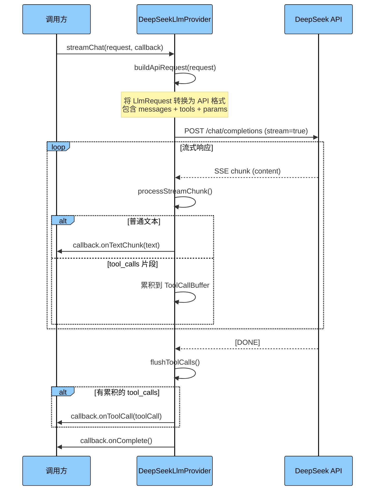
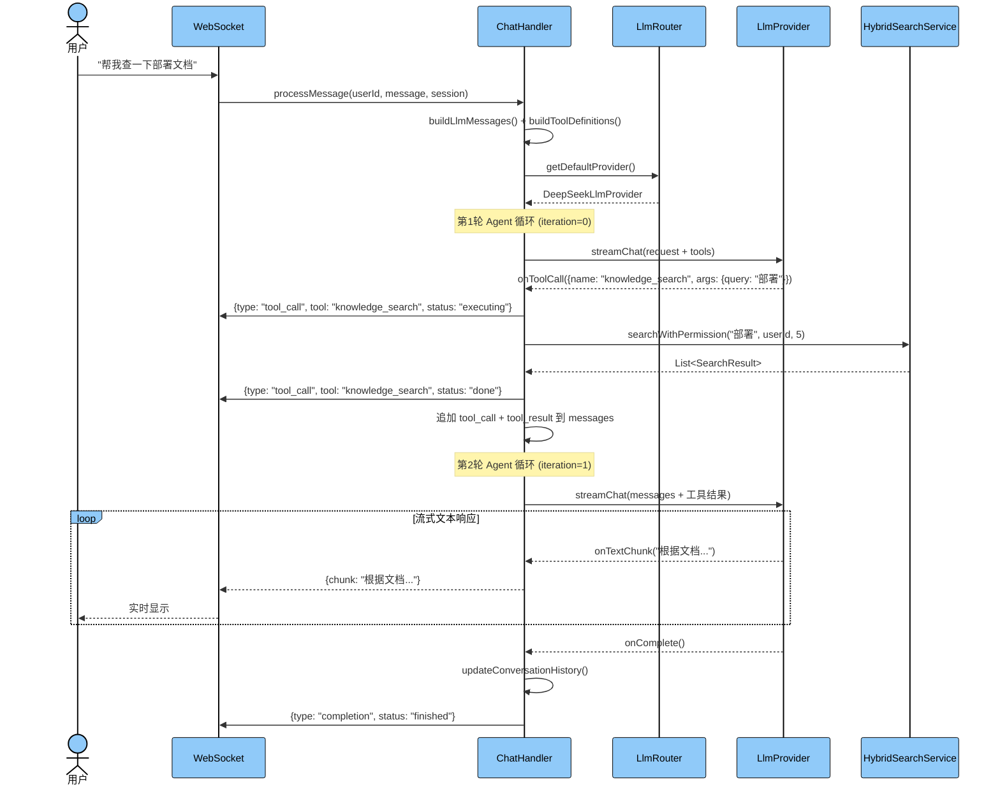

## 文档概述
本文档是 Phase 1 的详细实施指南，将现有硬编码的 `DeepSeekClient` 重构为可插拔的多 LLM Provider 架构，并引入 Function Calling 机制。本阶段是整个 AI 能力扩展的基石，后续所有阶段都依赖于此。

---

## 1. 改造总览
### 1.1 改造范围
| 改造类型 | 涉及文件 | 说明 |
| --- | --- | --- |
| 新增 | `llm/` 包下所有文件 | LLM 抽象层核心代码 |
| 重构 | `DeepSeekClient.java` | 重构为 `DeepSeekLlmProvider` |
| 修改 | `ChatHandler.java` | 接入 LlmRouter + 工具调用循环 |
| 修改 | `AiProperties.java` | 扩展配置结构 |
| 修改 | `application.yml` | 新增多 LLM 配置 |
| 新增 | `LlmController.java` | LLM 管理 API |


### 1.2 改造前后对比
```plain
改造前（硬编码路径）：
  ChatHandler → DeepSeekClient.streamResponse()
  - 每次都执行搜索，即使问题不需要
  - 无法切换模型
  - 无法处理工具调用

改造后（可插拔路径）：
  ChatHandler → LlmRouter → LlmProvider(接口)
                    │              ├── DeepSeekLlmProvider
                    │              ├── OpenAiLlmProvider
                    │              ├── OllamaLlmProvider
                    │              └── QwenLlmProvider
                    │
                    └── 解析 LLM 响应 → 普通文本 / tool_call 指令
```

---

## 2. 任务拆分与详细实施步骤
### 任务 1.1：定义 LlmProvider 接口和相关 DTO（0.5天）
#### 目标
定义 LLM 提供商的统一接口和请求/响应数据结构。

#### 依赖
无

#### 新增文件清单
| 文件路径 | 说明 |
| --- | --- |
| `src/main/java/com/yizhaoqi/smartpai/llm/LlmProvider.java` | LLM 提供商接口 |
| `src/main/java/com/yizhaoqi/smartpai/llm/LlmRequest.java` | 请求 DTO |
| `src/main/java/com/yizhaoqi/smartpai/llm/LlmMessage.java` | 消息 DTO |
| `src/main/java/com/yizhaoqi/smartpai/llm/GenerationParams.java` | 生成参数 DTO |


#### 详细代码
**LlmProvider.java** - LLM 提供商接口：

```java
package com.yizhaoqi.smartpai.llm;

/**
 * LLM 提供商统一接口
 * 所有 LLM 实现（DeepSeek、OpenAI、Ollama、通义千问等）都必须实现此接口
 */
public interface LlmProvider {

    /**
     * 获取提供商唯一标识
     * @return 提供商ID，如 "deepseek"、"openai"、"ollama"
     */
    String getProviderId();

    /**
     * 是否支持 Function Calling / Tool Use
     * @return true 表示支持工具调用
     */
    boolean supportsToolCalling();

    /**
     * 流式聊天调用
     * @param request LLM 请求参数（包含消息列表、工具定义等）
     * @param callback 流式回调接口（处理文本块、工具调用等事件）
     */
    void streamChat(LlmRequest request, LlmStreamCallback callback);
}
```

**LlmRequest.java** - 请求 DTO：

```java
package com.yizhaoqi.smartpai.llm;

import lombok.Builder;
import lombok.Data;
import java.util.List;

/**
 * LLM 请求参数
 */
@Data
@Builder
public class LlmRequest {

    /** 模型名称（可选，为空时使用 Provider 默认模型） */
    private String model;

    /** 消息列表（system + history + user） */
    private List<LlmMessage> messages;

    /** 工具定义列表（可选，为空时不启用 Function Calling） */
    private List<ToolDefinition> tools;

    /** 生成参数（temperature、maxTokens 等） */
    private GenerationParams params;
}
```

**LlmMessage.java** - 消息 DTO：

```java
package com.yizhaoqi.smartpai.llm;

import lombok.AllArgsConstructor;
import lombok.Builder;
import lombok.Data;
import lombok.NoArgsConstructor;

/**
 * LLM 消息体
 * 支持普通文本消息和工具调用消息
 */
@Data
@Builder
@NoArgsConstructor
@AllArgsConstructor
public class LlmMessage {

    /** 角色：system / user / assistant / tool */
    private String role;

    /** 文本内容（普通消息时使用） */
    private String content;

    /** 工具调用信息（assistant 角色返回工具调用时使用） */
    private ToolCall toolCall;

    /** 工具调用ID（tool 角色返回工具结果时使用，关联到对应的 toolCall） */
    private String toolCallId;

    /**
     * 创建 system 消息
     */
    public static LlmMessage system(String content) {
        return LlmMessage.builder().role("system").content(content).build();
    }

    /**
     * 创建 user 消息
     */
    public static LlmMessage user(String content) {
        return LlmMessage.builder().role("user").content(content).build();
    }

    /**
     * 创建 assistant 消息
     */
    public static LlmMessage assistant(String content) {
        return LlmMessage.builder().role("assistant").content(content).build();
    }

    /**
     * 创建 tool 结果消息
     */
    public static LlmMessage toolResult(String toolCallId, String content) {
        return LlmMessage.builder()
                .role("tool")
                .toolCallId(toolCallId)
                .content(content)
                .build();
    }
}
```

**GenerationParams.java** - 生成参数 DTO：

```java
package com.yizhaoqi.smartpai.llm;

import lombok.AllArgsConstructor;
import lombok.Builder;
import lombok.Data;
import lombok.NoArgsConstructor;

/**
 * LLM 生成参数
 */
@Data
@Builder
@NoArgsConstructor
@AllArgsConstructor
public class GenerationParams {

    /** 采样温度，范围 0-2，默认 0.3 */
    @Builder.Default
    private Double temperature = 0.3;

    /** 最大输出 tokens，默认 2000 */
    @Builder.Default
    private Integer maxTokens = 2000;

    /** nucleus top-p，默认 0.9 */
    @Builder.Default
    private Double topP = 0.9;
}
```

#### 验收标准
- [ ] 所有 DTO 类编译通过，Lombok 注解正常工作
- [ ] `LlmProvider` 接口定义清晰，方法签名合理
- [ ] `LlmMessage` 的静态工厂方法可正常创建各类型消息

---

### 任务 1.2：定义 LlmStreamCallback 接口（0.5天）
#### 目标
定义流式响应的回调接口，支持文本块、工具调用、完成和错误四种事件。

#### 依赖
任务 1.1

#### 新增文件
| 文件路径 | 说明 |
| --- | --- |
| `src/main/java/com/yizhaoqi/smartpai/llm/LlmStreamCallback.java` | 流式回调接口 |


#### 详细代码
```java
package com.yizhaoqi.smartpai.llm;

/**
 * LLM 流式响应回调接口
 * 用于处理 LLM 返回的各种事件类型
 */
public interface LlmStreamCallback {

    /**
     * 收到文本块时回调
     * @param chunk 文本片段
     */
    void onTextChunk(String chunk);

    /**
     * 收到工具调用指令时回调
     * @param toolCall 工具调用信息（包含函数名和参数）
     */
    void onToolCall(ToolCall toolCall);

    /**
     * 流式响应完成时回调
     */
    void onComplete();

    /**
     * 发生错误时回调
     * @param error 异常信息
     */
    void onError(Throwable error);
}
```

#### 验收标准
- [ ] 接口定义四种回调方法
- [ ] 与 `ToolCall` DTO 正确关联

---

### 任务 1.3：实现 LlmRouter（Provider 注册与路由）（1天）
#### 目标
实现 LLM Provider 的注册中心和路由器，支持按 ID 获取 Provider、获取默认 Provider、列出所有可用 Provider。

#### 依赖
任务 1.1

#### 新增文件
| 文件路径 | 说明 |
| --- | --- |
| `src/main/java/com/yizhaoqi/smartpai/llm/LlmRouter.java` | Provider 路由器 |


#### 实现流程图
<!-- 这是一个文本绘图，源码为：%%{init: {'flowchart': {'curve': 'linear'}}}%%
flowchart TB
    classDef startEnd fill:#1976d2,stroke:#000000,stroke-width:1px,color:#ffffff
    classDef process fill:#e3f2fd,stroke:#000000,stroke-width:1px,color:#000000
    classDef decision fill:#1976d2,stroke:#000000,stroke-width:1px,color:#ffffff

    Start([Spring 容器启动]):::startEnd
    Scan[扫描所有 LlmProvider Bean]:::process
    Register[注册到 providers Map]:::process
    SetDefault[根据配置设置 defaultProviderId]:::process
    Ready([LlmRouter 就绪]):::startEnd

    GetProvider[getProvider 被调用]:::process
    CheckId{providerId 存在?}:::decision
    ReturnProvider[返回对应 Provider]:::process
    ThrowError[抛出 IllegalArgumentException]:::process

    Start --> Scan --> Register --> SetDefault --> Ready
    GetProvider --> CheckId
    CheckId -->|是| ReturnProvider
    CheckId -->|否| ThrowError -->


#### 详细代码
```java
package com.yizhaoqi.smartpai.llm;

import org.slf4j.Logger;
import org.slf4j.LoggerFactory;
import org.springframework.stereotype.Component;

import java.util.Collections;
import java.util.List;
import java.util.Map;
import java.util.concurrent.ConcurrentHashMap;

/**
 * LLM Provider 路由器
 * 负责管理所有已注册的 LLM Provider，并根据 ID 或默认配置进行路由
 */
@Component
public class LlmRouter {

    private static final Logger logger = LoggerFactory.getLogger(LlmRouter.class);

    /** 已注册的 Provider 映射：providerId -> LlmProvider */
    private final Map<String, LlmProvider> providers = new ConcurrentHashMap<>();

    /** 默认 Provider ID */
    private String defaultProviderId;

    /**
     * 构造函数：自动注入所有 LlmProvider Bean 并注册
     * Spring 会自动收集容器中所有实现了 LlmProvider 接口的 Bean
     */
    public LlmRouter(List<LlmProvider> providerList, LlmProperties llmProperties) {
        // 注册所有 Provider
        for (LlmProvider provider : providerList) {
            providers.put(provider.getProviderId(), provider);
            logger.info("注册 LLM Provider: {}, 支持工具调用: {}",
                    provider.getProviderId(), provider.supportsToolCalling());
        }

        // 设置默认 Provider
        this.defaultProviderId = llmProperties.getDefaultProvider();
        if (this.defaultProviderId == null || !providers.containsKey(this.defaultProviderId)) {
            // 如果配置的默认 Provider 不存在，使用第一个可用的
            if (!providers.isEmpty()) {
                this.defaultProviderId = providers.keySet().iterator().next();
                logger.warn("配置的默认 Provider 不可用，使用: {}", this.defaultProviderId);
            }
        }
        logger.info("LlmRouter 初始化完成，共 {} 个 Provider，默认: {}",
                providers.size(), this.defaultProviderId);
    }

    /**
     * 根据 ID 获取 Provider
     * @param providerId Provider 唯一标识
     * @return 对应的 LlmProvider 实例
     * @throws IllegalArgumentException 如果 Provider 不存在
     */
    public LlmProvider getProvider(String providerId) {
        LlmProvider provider = providers.get(providerId);
        if (provider == null) {
            throw new IllegalArgumentException(
                    "未找到 LLM Provider: " + providerId + "，可用: " + providers.keySet());
        }
        return provider;
    }

    /**
     * 获取默认 Provider
     * @return 默认的 LlmProvider 实例
     */
    public LlmProvider getDefaultProvider() {
        return getProvider(defaultProviderId);
    }

    /**
     * 列出所有已注册的 Provider ID
     */
    public List<String> listProviders() {
        return List.copyOf(providers.keySet());
    }

    /**
     * 获取默认 Provider ID
     */
    public String getDefaultProviderId() {
        return defaultProviderId;
    }

    /**
     * 运行时切换默认 Provider
     * @param providerId 新的默认 Provider ID
     */
    public void setDefaultProviderId(String providerId) {
        if (!providers.containsKey(providerId)) {
            throw new IllegalArgumentException("Provider 不存在: " + providerId);
        }
        this.defaultProviderId = providerId;
        logger.info("默认 LLM Provider 已切换为: {}", providerId);
    }

    /**
     * 获取所有 Provider 的详细信息
     */
    public Map<String, LlmProvider> getAllProviders() {
        return Collections.unmodifiableMap(providers);
    }
}
```

#### 验收标准
- [ ] Spring 启动时自动扫描并注册所有 `LlmProvider` Bean
- [ ] `getProvider()` 能正确返回指定 Provider
- [ ] `getDefaultProvider()` 返回配置的默认 Provider
- [ ] Provider 不存在时抛出明确的异常信息

---

### 任务 1.4：实现 LlmProperties 配置类（0.5天）
#### 目标
创建多 LLM 配置属性类，支持从 `application.yml` 读取多个 Provider 的配置。

#### 依赖
无

#### 新增文件
| 文件路径 | 说明 |
| --- | --- |
| `src/main/java/com/yizhaoqi/smartpai/llm/LlmProperties.java` | LLM 配置属性类 |


#### 详细代码
```java
package com.yizhaoqi.smartpai.llm;

import lombok.Data;
import org.springframework.boot.context.properties.ConfigurationProperties;
import org.springframework.stereotype.Component;

import java.util.HashMap;
import java.util.Map;

/**
 * 多 LLM 配置属性
 * 对应 application.yml 中的 llm.* 配置
 */
@Component
@ConfigurationProperties(prefix = "llm")
@Data
public class LlmProperties {

    /** 默认使用的 LLM 提供商 ID */
    private String defaultProvider = "deepseek";

    /** 各 Provider 的配置映射 */
    private Map<String, ProviderConfig> providers = new HashMap<>();

    /** 全局生成参数（各 Provider 可覆盖） */
    private GenerationConfig generation = new GenerationConfig();

    @Data
    public static class ProviderConfig {
        /** 是否启用 */
        private boolean enabled = true;
        /** API 地址 */
        private String apiUrl;
        /** API Key */
        private String apiKey;
        /** 默认模型 */
        private String model;
        /** 是否支持工具调用 */
        private boolean supportsToolCalling = false;
    }

    @Data
    public static class GenerationConfig {
        private Double temperature = 0.3;
        private Integer maxTokens = 2000;
        private Double topP = 0.9;
    }
}
```

#### application.yml 新增配置
```yaml
# 新增：多 LLM 配置（与现有 deepseek.* 配置并存，逐步迁移）
llm:
  default-provider: deepseek
  providers:
    deepseek:
      enabled: true
      api-url: ${deepseek.api.url:https://api.deepseek.com/v1}
      api-key: ${deepseek.api.key:}
      model: ${deepseek.api.model:deepseek-chat}
      supports-tool-calling: true
    openai:
      enabled: false
      api-url: https://api.openai.com/v1
      api-key: ${OPENAI_API_KEY:}
      model: gpt-4o
      supports-tool-calling: true
    ollama:
      enabled: false
      api-url: http://localhost:11434/v1
      api-key: ""
      model: deepseek-r1:7b
      supports-tool-calling: false
    qwen:
      enabled: false
      api-url: https://dashscope.aliyuncs.com/compatible-mode/v1
      api-key: ${QWEN_API_KEY:}
      model: qwen-plus
      supports-tool-calling: true
  generation:
    temperature: 0.3
    max-tokens: 2000
    top-p: 0.9
```

#### 验收标准
- [ ] 配置类能正确绑定 `application.yml` 中的 `llm.*` 配置
- [ ] 支持多个 Provider 的独立配置
- [ ] 与现有 `deepseek.*` 配置兼容（通过 `${}` 引用）

---

### 任务 1.5：将 DeepSeekClient 重构为 DeepSeekLlmProvider（1天）
#### 目标
将现有的 `DeepSeekClient` 重构为实现 `LlmProvider` 接口的 `DeepSeekLlmProvider`，保留核心逻辑，增加 Function Calling 支持。

#### 依赖
任务 1.1, 1.2

#### 改造策略
+ 保留 `DeepSeekClient.java` 不删除（标记 `@Deprecated`），确保向后兼容
+ 新建 `DeepSeekLlmProvider.java` 实现 `LlmProvider` 接口
+ 核心的 WebClient 调用逻辑从 `DeepSeekClient` 迁移过来

#### 改造前后对比
```plain
改造前 DeepSeekClient:
  - streamResponse(userMessage, context, history, onChunk, onError)
  - buildRequest() → 不支持 tools 参数
  - processChunk() → 只解析 content 字段

改造后 DeepSeekLlmProvider:
  - streamChat(LlmRequest, LlmStreamCallback) ← 实现 LlmProvider 接口
  - buildApiRequest() → 支持 tools 参数
  - processStreamChunk() → 解析 content + tool_calls 字段
```

#### 新增文件
| 文件路径 | 说明 |
| --- | --- |
| `src/main/java/com/yizhaoqi/smartpai/llm/provider/DeepSeekLlmProvider.java` | DeepSeek LLM 实现 |


#### 详细代码
```java
package com.yizhaoqi.smartpai.llm.provider;

import com.fasterxml.jackson.databind.JsonNode;
import com.fasterxml.jackson.databind.ObjectMapper;
import com.yizhaoqi.smartpai.llm.*;
import org.slf4j.Logger;
import org.slf4j.LoggerFactory;
import org.springframework.boot.autoconfigure.condition.ConditionalOnProperty;
import org.springframework.http.HttpHeaders;
import org.springframework.http.MediaType;
import org.springframework.stereotype.Component;
import org.springframework.web.reactive.function.client.WebClient;

import java.util.*;

/**
 * DeepSeek LLM Provider 实现
 * 基于现有 DeepSeekClient 重构，增加 Function Calling 支持
 */
@Component
@ConditionalOnProperty(prefix = "llm.providers.deepseek", name = "enabled", havingValue = "true", matchIfMissing = true)
public class DeepSeekLlmProvider implements LlmProvider {

    private static final Logger logger = LoggerFactory.getLogger(DeepSeekLlmProvider.class);
    private static final String PROVIDER_ID = "deepseek";

    private final WebClient webClient;
    private final LlmProperties llmProperties;
    private final ObjectMapper objectMapper = new ObjectMapper();

    /** 用于累积流式 tool_calls 的缓冲区 */
    private final ThreadLocal<Map<Integer, ToolCallBuffer>> toolCallBuffers = new ThreadLocal<>();

    public DeepSeekLlmProvider(LlmProperties llmProperties) {
        this.llmProperties = llmProperties;
        LlmProperties.ProviderConfig config = llmProperties.getProviders().get(PROVIDER_ID);

        WebClient.Builder builder = WebClient.builder().baseUrl(config.getApiUrl());
        String apiKey = config.getApiKey();
        if (apiKey != null && !apiKey.trim().isEmpty()) {
            builder.defaultHeader(HttpHeaders.AUTHORIZATION, "Bearer " + apiKey);
        }
        this.webClient = builder.build();
        logger.info("DeepSeekLlmProvider 初始化完成，API URL: {}, 模型: {}",
                config.getApiUrl(), config.getModel());
    }

    @Override
    public String getProviderId() {
        return PROVIDER_ID;
    }

    @Override
    public boolean supportsToolCalling() {
        LlmProperties.ProviderConfig config = llmProperties.getProviders().get(PROVIDER_ID);
        return config != null && config.isSupportsToolCalling();
    }

    @Override
    public void streamChat(LlmRequest request, LlmStreamCallback callback) {
        try {
            // 初始化 tool_call 缓冲区
            toolCallBuffers.set(new HashMap<>());

            Map<String, Object> apiRequest = buildApiRequest(request);

            webClient.post()
                    .uri("/chat/completions")
                    .contentType(MediaType.APPLICATION_JSON)
                    .bodyValue(apiRequest)
                    .retrieve()
                    .bodyToFlux(String.class)
                    .subscribe(
                            chunk -> processStreamChunk(chunk, callback),
                            error -> {
                                logger.error("DeepSeek API 调用失败: {}", error.getMessage(), error);
                                toolCallBuffers.remove();
                                callback.onError(error);
                            },
                            () -> {
                                // 流结束时，检查是否有累积的 tool_calls
                                flushToolCalls(callback);
                                toolCallBuffers.remove();
                                callback.onComplete();
                            }
                    );
        } catch (Exception e) {
            logger.error("构建 DeepSeek 请求失败: {}", e.getMessage(), e);
            callback.onError(e);
        }
    }

    /**
     * 构建 API 请求体
     * 相比原 DeepSeekClient.buildRequest()，增加了 tools 参数支持
     */
    private Map<String, Object> buildApiRequest(LlmRequest request) {
        Map<String, Object> apiRequest = new HashMap<>();

        // 模型
        LlmProperties.ProviderConfig config = llmProperties.getProviders().get(PROVIDER_ID);
        String model = request.getModel() != null ? request.getModel() : config.getModel();
        apiRequest.put("model", model);

        // 消息列表：将 LlmMessage 转换为 API 格式
        List<Map<String, Object>> messages = new ArrayList<>();
        for (LlmMessage msg : request.getMessages()) {
            Map<String, Object> msgMap = new HashMap<>();
            msgMap.put("role", msg.getRole());

            if (msg.getContent() != null) {
                msgMap.put("content", msg.getContent());
            }

            // tool 角色的消息需要 tool_call_id
            if ("tool".equals(msg.getRole()) && msg.getToolCallId() != null) {
                msgMap.put("tool_call_id", msg.getToolCallId());
            }

            // assistant 角色的工具调用
            if (msg.getToolCall() != null) {
                ToolCall tc = msg.getToolCall();
                Map<String, Object> toolCallMap = new HashMap<>();
                toolCallMap.put("id", tc.getId());
                toolCallMap.put("type", "function");
                toolCallMap.put("function", Map.of(
                        "name", tc.getFunctionName(),
                        "arguments", tc.getArguments()
                ));
                msgMap.put("tool_calls", List.of(toolCallMap));
            }

            messages.add(msgMap);
        }
        apiRequest.put("messages", messages);

        // 流式
        apiRequest.put("stream", true);

        // 工具定义
        if (request.getTools() != null && !request.getTools().isEmpty()) {
            List<Map<String, Object>> tools = new ArrayList<>();
            for (ToolDefinition tool : request.getTools()) {
                tools.add(Map.of(
                        "type", "function",
                        "function", Map.of(
                                "name", tool.getName(),
                                "description", tool.getDescription(),
                                "parameters", tool.getParameters()
                        )
                ));
            }
            apiRequest.put("tools", tools);
        }

        // 生成参数
        GenerationParams params = request.getParams();
        if (params == null) {
            LlmProperties.GenerationConfig genConfig = llmProperties.getGeneration();
            apiRequest.put("temperature", genConfig.getTemperature());
            apiRequest.put("max_tokens", genConfig.getMaxTokens());
            apiRequest.put("top_p", genConfig.getTopP());
        } else {
            if (params.getTemperature() != null) {
                apiRequest.put("temperature", params.getTemperature());
            }
            if (params.getMaxTokens() != null) {
                apiRequest.put("max_tokens", params.getMaxTokens());
            }
            if (params.getTopP() != null) {
                apiRequest.put("top_p", params.getTopP());
            }
        }

        return apiRequest;
    }

    /**
     * 处理流式响应块
     * 相比原 DeepSeekClient.processChunk()，增加了 tool_calls 字段解析
     *
     * DeepSeek 流式 tool_call 格式：
     * {"choices":[{"delta":{"tool_calls":[{"index":0,"id":"call_xxx","function":{"name":"search","arguments":""}}]}}]}
     * {"choices":[{"delta":{"tool_calls":[{"index":0,"function":{"arguments":"{\"qu"}}]}}]}
     * {"choices":[{"delta":{"tool_calls":[{"index":0,"function":{"arguments":"ery\":"}}]}}]}
     */
    private void processStreamChunk(String chunk, LlmStreamCallback callback) {
        try {
            if ("[DONE]".equals(chunk.trim())) {
                return;
            }

            JsonNode node = objectMapper.readTree(chunk);
            JsonNode delta = node.path("choices").path(0).path("delta");

            // 1. 处理普通文本内容
            String content = delta.path("content").asText("");
            if (!content.isEmpty()) {
                callback.onTextChunk(content);
            }

            // 2. 处理 tool_calls（流式累积）
            JsonNode toolCalls = delta.path("tool_calls");
            if (toolCalls.isArray()) {
                for (JsonNode tc : toolCalls) {
                    int index = tc.path("index").asInt(0);
                    Map<Integer, ToolCallBuffer> buffers = toolCallBuffers.get();
                    if (buffers == null) {
                        return;
                    }

                    ToolCallBuffer buffer = buffers.computeIfAbsent(index, k -> new ToolCallBuffer());

                    // 累积 id
                    String id = tc.path("id").asText(null);
                    if (id != null) {
                        buffer.id = id;
                    }

                    // 累积 function name
                    String funcName = tc.path("function").path("name").asText(null);
                    if (funcName != null) {
                        buffer.functionName = funcName;
                    }

                    // 累积 arguments（流式拼接）
                    String args = tc.path("function").path("arguments").asText("");
                    buffer.argumentsBuilder.append(args);
                }
            }
        } catch (Exception e) {
            logger.error("处理 DeepSeek 流式数据块时出错: {}", e.getMessage(), e);
        }
    }

    /**
     * 流结束时，将累积的 tool_calls 发送给回调
     */
    private void flushToolCalls(LlmStreamCallback callback) {
        Map<Integer, ToolCallBuffer> buffers = toolCallBuffers.get();
        if (buffers == null || buffers.isEmpty()) {
            return;
        }

        for (Map.Entry<Integer, ToolCallBuffer> entry : buffers.entrySet()) {
            ToolCallBuffer buffer = entry.getValue();
            if (buffer.functionName != null) {
                ToolCall toolCall = ToolCall.builder()
                        .id(buffer.id)
                        .functionName(buffer.functionName)
                        .arguments(buffer.argumentsBuilder.toString())
                        .build();
                logger.info("检测到工具调用: id={}, function={}, arguments={}",
                        toolCall.getId(), toolCall.getFunctionName(), toolCall.getArguments());
                callback.onToolCall(toolCall);
            }
        }
    }

    /**
     * 工具调用缓冲区（用于累积流式 tool_call 数据）
     */
    private static class ToolCallBuffer {
        String id;
        String functionName;
        final StringBuilder argumentsBuilder = new StringBuilder();
    }
}
```

#### 改造时序图


#### 验收标准
- [ ] `DeepSeekLlmProvider` 实现 `LlmProvider` 接口
- [ ] 普通文本流式响应正常工作（与原 `DeepSeekClient` 行为一致）
- [ ] 能正确解析和累积流式 `tool_calls` 数据
- [ ] 原 `DeepSeekClient` 标记 `@Deprecated` 但仍可用

---

### 任务 1.6：实现 OpenAiLlmProvider（1天）
#### 目标
实现 OpenAI 兼容的 LLM Provider，支持 GPT-4o 等模型。

#### 依赖
任务 1.1, 1.2

#### 新增文件
| 文件路径 | 说明 |
| --- | --- |
| `src/main/java/com/yizhaoqi/smartpai/llm/provider/OpenAiLlmProvider.java` | OpenAI LLM 实现 |


#### 实现要点
+ OpenAI 的 API 格式与 DeepSeek 高度兼容（DeepSeek 本身就是 OpenAI 兼容接口）
+ 主要差异在于 `api-url` 和 `api-key` 不同
+ 可以复用 `DeepSeekLlmProvider` 的大部分逻辑，通过抽取公共基类实现

#### 详细代码
```java
package com.yizhaoqi.smartpai.llm.provider;

import com.yizhaoqi.smartpai.llm.*;
import org.slf4j.Logger;
import org.slf4j.LoggerFactory;
import org.springframework.boot.autoconfigure.condition.ConditionalOnProperty;
import org.springframework.stereotype.Component;

/**
 * OpenAI LLM Provider 实现
 * 支持 GPT-4o、GPT-4-turbo 等模型
 * 由于 OpenAI API 格式与 DeepSeek 兼容，继承 OpenAI 兼容基类
 */
@Component
@ConditionalOnProperty(prefix = "llm.providers.openai", name = "enabled", havingValue = "true")
public class OpenAiLlmProvider extends AbstractOpenAiCompatibleProvider {

    private static final Logger logger = LoggerFactory.getLogger(OpenAiLlmProvider.class);
    private static final String PROVIDER_ID = "openai";

    public OpenAiLlmProvider(LlmProperties llmProperties) {
        super(PROVIDER_ID, llmProperties);
        logger.info("OpenAiLlmProvider 初始化完成");
    }

    @Override
    public String getProviderId() {
        return PROVIDER_ID;
    }
}
```

#### 抽取公共基类
由于 DeepSeek、OpenAI、通义千问都使用 OpenAI 兼容接口，建议抽取公共基类：

```java
package com.yizhaoqi.smartpai.llm.provider;

import com.fasterxml.jackson.databind.JsonNode;
import com.fasterxml.jackson.databind.ObjectMapper;
import com.yizhaoqi.smartpai.llm.*;
import org.slf4j.Logger;
import org.slf4j.LoggerFactory;
import org.springframework.http.HttpHeaders;
import org.springframework.http.MediaType;
import org.springframework.web.reactive.function.client.WebClient;

import java.util.*;

/**
 * OpenAI 兼容接口的公共基类
 * DeepSeek、OpenAI、通义千问等都使用此格式
 */
public abstract class AbstractOpenAiCompatibleProvider implements LlmProvider {

    private static final Logger logger = LoggerFactory.getLogger(AbstractOpenAiCompatibleProvider.class);

    protected final String providerId;
    protected final WebClient webClient;
    protected final LlmProperties llmProperties;
    protected final ObjectMapper objectMapper = new ObjectMapper();

    protected AbstractOpenAiCompatibleProvider(String providerId, LlmProperties llmProperties) {
        this.providerId = providerId;
        this.llmProperties = llmProperties;

        LlmProperties.ProviderConfig config = llmProperties.getProviders().get(providerId);
        WebClient.Builder builder = WebClient.builder().baseUrl(config.getApiUrl());
        String apiKey = config.getApiKey();
        if (apiKey != null && !apiKey.trim().isEmpty()) {
            builder.defaultHeader(HttpHeaders.AUTHORIZATION, "Bearer " + apiKey);
        }
        this.webClient = builder.build();
    }

    @Override
    public boolean supportsToolCalling() {
        LlmProperties.ProviderConfig config = llmProperties.getProviders().get(providerId);
        return config != null && config.isSupportsToolCalling();
    }

    @Override
    public void streamChat(LlmRequest request, LlmStreamCallback callback) {
        // 与 DeepSeekLlmProvider 相同的逻辑
        // 此处省略，实际实现时从 DeepSeekLlmProvider 迁移
        // 包括：buildApiRequest、processStreamChunk、flushToolCalls
    }
}
```

#### 验收标准
- [ ] OpenAI Provider 在 `llm.providers.openai.enabled=true` 时自动注册
- [ ] 能正确调用 OpenAI API 并处理流式响应
- [ ] 公共基类抽取完成，减少代码重复

---

### 任务 1.7：实现 OllamaLlmProvider（0.5天）
#### 目标
实现 Ollama 本地模型的 LLM Provider。

#### 依赖
任务 1.1, 1.2

#### 实现要点
+ Ollama 也使用 OpenAI 兼容接口格式
+ 主要差异：API Key 通常为空，不支持 Function Calling（大部分本地模型）
+ 继承 `AbstractOpenAiCompatibleProvider` 即可

#### 详细代码
```java
package com.yizhaoqi.smartpai.llm.provider;

import com.yizhaoqi.smartpai.llm.*;
import org.slf4j.Logger;
import org.slf4j.LoggerFactory;
import org.springframework.boot.autoconfigure.condition.ConditionalOnProperty;
import org.springframework.stereotype.Component;

/**
 * Ollama 本地模型 LLM Provider 实现
 * 支持 deepseek-r1:7b、llama3 等本地模型
 */
@Component
@ConditionalOnProperty(prefix = "llm.providers.ollama", name = "enabled", havingValue = "true")
public class OllamaLlmProvider extends AbstractOpenAiCompatibleProvider {

    private static final Logger logger = LoggerFactory.getLogger(OllamaLlmProvider.class);
    private static final String PROVIDER_ID = "ollama";

    public OllamaLlmProvider(LlmProperties llmProperties) {
        super(PROVIDER_ID, llmProperties);
        logger.info("OllamaLlmProvider 初始化完成，模型: {}",
                llmProperties.getProviders().get(PROVIDER_ID).getModel());
    }

    @Override
    public String getProviderId() {
        return PROVIDER_ID;
    }
}
```

#### 验收标准
- [ ] Ollama Provider 在 `llm.providers.ollama.enabled=true` 时自动注册
- [ ] 能正确调用本地 Ollama 服务
- [ ] `supportsToolCalling()` 返回 `false`（根据配置）

---

### 任务 1.8：定义 ToolDefinition 和 ToolCall 数据结构（0.5天）
#### 目标
定义工具调用相关的数据结构。

#### 依赖
无

#### 新增文件
| 文件路径 | 说明 |
| --- | --- |
| `src/main/java/com/yizhaoqi/smartpai/llm/ToolDefinition.java` | 工具定义 DTO |
| `src/main/java/com/yizhaoqi/smartpai/llm/ToolCall.java` | 工具调用 DTO |


#### 详细代码
```java
package com.yizhaoqi.smartpai.llm;

import lombok.AllArgsConstructor;
import lombok.Builder;
import lombok.Data;
import lombok.NoArgsConstructor;
import java.util.Map;

/**
 * 工具定义
 * 描述一个可被 LLM 调用的工具（Function）
 */
@Data
@Builder
@NoArgsConstructor
@AllArgsConstructor
public class ToolDefinition {

    /** 工具名称（唯一标识） */
    private String name;

    /** 工具描述（LLM 根据此描述决定是否调用） */
    private String description;

    /** 参数 JSON Schema（定义工具接受的参数结构） */
    private Map<String, Object> parameters;
}
```

```java
package com.yizhaoqi.smartpai.llm;

import lombok.AllArgsConstructor;
import lombok.Builder;
import lombok.Data;
import lombok.NoArgsConstructor;

/**
 * 工具调用信息
 * LLM 返回的工具调用指令
 */
@Data
@Builder
@NoArgsConstructor
@AllArgsConstructor
public class ToolCall {

    /** 调用 ID（用于关联工具结果） */
    private String id;

    /** 函数名称 */
    private String functionName;

    /** 函数参数（JSON 字符串） */
    private String arguments;
}
```

#### 验收标准
- [ ] `ToolDefinition` 能正确描述工具的名称、描述和参数 Schema
- [ ] `ToolCall` 能正确承载 LLM 返回的工具调用信息

---

### 任务 1.9：实现 ToolCallParser（1天）
#### 目标
实现工具调用解析器，将 LLM 返回的 `tool_call` JSON 参数解析为可执行的结构。

#### 依赖
任务 1.8

#### 新增文件
| 文件路径 | 说明 |
| --- | --- |
| `src/main/java/com/yizhaoqi/smartpai/llm/ToolCallParser.java` | 工具调用解析器 |


#### 详细代码
```java
package com.yizhaoqi.smartpai.llm;

import com.fasterxml.jackson.core.type.TypeReference;
import com.fasterxml.jackson.databind.ObjectMapper;
import org.slf4j.Logger;
import org.slf4j.LoggerFactory;
import org.springframework.stereotype.Component;

import java.util.Collections;
import java.util.Map;

/**
 * 工具调用解析器
 * 负责将 LLM 返回的 tool_call 中的 arguments（JSON 字符串）解析为 Map
 */
@Component
public class ToolCallParser {

    private static final Logger logger = LoggerFactory.getLogger(ToolCallParser.class);
    private final ObjectMapper objectMapper = new ObjectMapper();

    /**
     * 解析工具调用参数
     * @param toolCall 工具调用信息
     * @return 解析后的参数 Map
     */
    public Map<String, Object> parseArguments(ToolCall toolCall) {
        if (toolCall == null || toolCall.getArguments() == null) {
            return Collections.emptyMap();
        }

        try {
            String args = toolCall.getArguments().trim();
            if (args.isEmpty() || "{}".equals(args)) {
                return Collections.emptyMap();
            }
            return objectMapper.readValue(args, new TypeReference<Map<String, Object>>() {});
        } catch (Exception e) {
            logger.error("解析工具调用参数失败: toolCall={}, error={}",
                    toolCall.getFunctionName(), e.getMessage(), e);
            return Collections.emptyMap();
        }
    }

    /**
     * 将工具执行结果序列化为 JSON 字符串
     * @param result 工具执行结果
     * @return JSON 字符串
     */
    public String serializeResult(Object result) {
        try {
            return objectMapper.writeValueAsString(result);
        } catch (Exception e) {
            logger.error("序列化工具结果失败: {}", e.getMessage(), e);
            return "{\"error\": \"序列化失败\"}";
        }
    }
}
```

#### 验收标准
- [ ] 能正确解析 JSON 格式的工具参数
- [ ] 空参数、无效 JSON 等边界情况处理正确
- [ ] 结果序列化功能正常

---

### 任务 1.10：改造 ChatHandler.processMessage() 支持工具调用循环（2天）
#### 目标
这是 Phase 1 最核心的改造任务。将 `ChatHandler.processMessage()` 从硬编码的"搜索→生成"路径改造为支持 LLM 自主决策的工具调用循环。

#### 依赖
任务 1.3, 1.9

#### 改造前后流程对比
<!-- 这是一个文本绘图，源码为：%%{init: {'flowchart': {'curve': 'linear'}}}%%
flowchart TB
    classDef startEnd fill:#1976d2,stroke:#000000,stroke-width:1px,color:#ffffff
    classDef process fill:#e3f2fd,stroke:#000000,stroke-width:1px,color:#000000
    classDef decision fill:#1976d2,stroke:#000000,stroke-width:1px,color:#ffffff
    classDef changedProcess fill:#c8e6c9,stroke:#000000,stroke-width:1px,color:#000000
    classDef changedDecision fill:#388e3c,stroke:#000000,stroke-width:1px,color:#ffffff

    subgraph Before["改造前：硬编码路径"]
        B_Start([用户消息]):::startEnd
        B_History[获取对话历史]:::process
        B_Search[执行混合搜索<br/>每次都搜索]:::process
        B_Context[构建上下文]:::process
        B_Call[调用 DeepSeekClient]:::process
        B_Stream[流式推送]:::process
        B_End([完成]):::startEnd

        B_Start --> B_History --> B_Search --> B_Context --> B_Call --> B_Stream --> B_End
    end

    subgraph After["改造后：Agent 决策路径"]
        A_Start([用户消息]):::startEnd
        A_History[获取对话历史]:::changedProcess
        A_BuildReq[构建 LlmRequest<br/>包含 tools 定义]:::changedProcess
        A_CallLLM[调用 LlmRouter<br/>获取 Provider 并调用]:::changedProcess
        A_Parse{LLM 返回类型?}:::changedDecision
        A_ToolExec[执行工具<br/>如 knowledge_search]:::changedProcess
        A_AppendResult[将工具结果追加到 messages]:::changedProcess
        A_CheckLimit{超过最大循环?}:::changedDecision
        A_Stream[流式推送文本]:::process
        A_ForceEnd[强制结束]:::changedProcess
        A_End([完成]):::startEnd

        A_Start --> A_History --> A_BuildReq --> A_CallLLM --> A_Parse
        A_Parse -->|tool_call| A_ToolExec --> A_AppendResult --> A_CheckLimit
        A_CheckLimit -->|否| A_CallLLM
        A_CheckLimit -->|是| A_ForceEnd --> A_End
        A_Parse -->|文本| A_Stream --> A_End
    end -->


#### 改造后的 ChatHandler 核心代码
```java
// ChatHandler.java 改造后的 processMessage 方法

/** 最大工具调用循环次数 */
private static final int MAX_TOOL_ITERATIONS = 5;

private final LlmRouter llmRouter;
private final ToolCallParser toolCallParser;

// 构造函数新增依赖注入
public ChatHandler(RedisTemplate<String, String> redisTemplate,
                  HybridSearchService searchService,
                  DeepSeekClient deepSeekClient,  // 保留向后兼容
                  LlmRouter llmRouter,
                  ToolCallParser toolCallParser) {
    this.redisTemplate = redisTemplate;
    this.searchService = searchService;
    this.deepSeekClient = deepSeekClient;
    this.llmRouter = llmRouter;
    this.toolCallParser = toolCallParser;
    this.objectMapper = new ObjectMapper();
}

public void processMessage(String userId, String userMessage, WebSocketSession session) {
    logger.info("开始处理消息，用户ID: {}, 会话ID: {}", userId, session.getId());
    try {
        String conversationId = getOrCreateConversationId(userId);
        responseBuilders.put(session.getId(), new StringBuilder());
        CompletableFuture<String> responseFuture = new CompletableFuture<>();
        responseFutures.put(session.getId(), responseFuture);

        // 获取对话历史
        List<Map<String, String>> history = getConversationHistory(conversationId);

        // 构建 LlmMessage 列表
        List<LlmMessage> messages = buildLlmMessages(userId, userMessage, history);

        // 构建工具定义（Phase 1 先内置 knowledge_search）
        List<ToolDefinition> tools = buildToolDefinitions();

        // 启动 Agent 循环
        executeAgentLoop(userId, userMessage, messages, tools, session,
                conversationId, responseFuture, 0);

    } catch (Exception e) {
        logger.error("处理消息错误: {}", e.getMessage(), e);
        handleError(session, e);
    }
}

/**
 * Agent 循环：调用 LLM → 判断响应类型 → 执行工具或输出文本
 */
private void executeAgentLoop(String userId, String userMessage,
                              List<LlmMessage> messages, List<ToolDefinition> tools,
                              WebSocketSession session, String conversationId,
                              CompletableFuture<String> responseFuture,
                              int iteration) {
    if (iteration >= MAX_TOOL_ITERATIONS) {
        logger.warn("工具调用循环达到上限 {}，强制结束", MAX_TOOL_ITERATIONS);
        sendCompletionNotification(session);
        return;
    }

    LlmProvider provider = llmRouter.getDefaultProvider();
    LlmRequest request = LlmRequest.builder()
            .messages(messages)
            .tools(provider.supportsToolCalling() ? tools : null)
            .build();

    provider.streamChat(request, new LlmStreamCallback() {
        @Override
        public void onTextChunk(String chunk) {
            StringBuilder responseBuilder = responseBuilders.get(session.getId());
            if (responseBuilder != null) {
                responseBuilder.append(chunk);
            }
            sendResponseChunk(session, chunk);
        }

        @Override
        public void onToolCall(ToolCall toolCall) {
            logger.info("LLM 请求调用工具: {}, 参数: {}",
                    toolCall.getFunctionName(), toolCall.getArguments());

            // 通知前端工具调用状态
            sendToolCallNotification(session, toolCall, "executing");

            // 执行工具
            String toolResult = executeToolCall(userId, toolCall, session.getId());

            // 通知前端工具调用完成
            sendToolCallNotification(session, toolCall, "done");

            // 将 assistant 的 tool_call 和 tool 结果追加到消息列表
            messages.add(LlmMessage.builder()
                    .role("assistant")
                    .toolCall(toolCall)
                    .build());
            messages.add(LlmMessage.toolResult(toolCall.getId(), toolResult));

            // 继续下一轮循环
            executeAgentLoop(userId, userMessage, messages, tools, session,
                    conversationId, responseFuture, iteration + 1);
        }

        @Override
        public void onComplete() {
            // 如果没有工具调用，说明 LLM 直接返回了文本，流程结束
            StringBuilder responseBuilder = responseBuilders.get(session.getId());
            if (responseBuilder != null && responseBuilder.length() > 0) {
                String completeResponse = responseBuilder.toString();
                updateConversationHistory(conversationId, userMessage, completeResponse);
                responseFuture.complete(completeResponse);
                sendCompletionNotification(session);
                responseBuilders.remove(session.getId());
                responseFutures.remove(session.getId());
            }
        }

        @Override
        public void onError(Throwable error) {
            handleError(session, error);
            responseFuture.completeExceptionally(error);
        }
    });
}

/**
 * 执行工具调用
 * Phase 1 内置 knowledge_search 工具
 */
private String executeToolCall(String userId, ToolCall toolCall, String sessionId) {
    Map<String, Object> args = toolCallParser.parseArguments(toolCall);

    switch (toolCall.getFunctionName()) {
        case "knowledge_search":
            return executeKnowledgeSearch(userId, args, sessionId);
        default:
            logger.warn("未知工具: {}", toolCall.getFunctionName());
            return "{\"error\": \"未知工具: " + toolCall.getFunctionName() + "\"}";
    }
}

/**
 * 执行知识库搜索工具
 * 封装现有的 HybridSearchService.searchWithPermission()
 */
private String executeKnowledgeSearch(String userId, Map<String, Object> args, String sessionId) {
    String query = (String) args.getOrDefault("query", "");
    int topK = args.containsKey("topK") ? ((Number) args.get("topK")).intValue() : 5;

    List<SearchResult> results = searchService.searchWithPermission(query, userId, topK);
    String context = buildContext(results, sessionId);

    return context.isEmpty() ? "未找到相关文档" : context;
}

/**
 * 构建工具定义列表
 * Phase 1 先内置 knowledge_search
 */
private List<ToolDefinition> buildToolDefinitions() {
    return List.of(
            ToolDefinition.builder()
                    .name("knowledge_search")
                    .description("搜索用户知识库中的文档内容，支持语义搜索和关键词搜索。当用户提问涉及文档、资料、知识库内容时使用此工具。")
                    .parameters(Map.of(
                            "type", "object",
                            "properties", Map.of(
                                    "query", Map.of(
                                            "type", "string",
                                            "description", "搜索查询内容"
                                    ),
                                    "topK", Map.of(
                                            "type", "integer",
                                            "description", "返回结果数量，默认5"
                                    )
                            ),
                            "required", List.of("query")
                    ))
                    .build()
    );
}

/**
 * 构建 LlmMessage 列表（从现有的 history 格式转换）
 */
private List<LlmMessage> buildLlmMessages(String userId, String userMessage,
                                           List<Map<String, String>> history) {
    List<LlmMessage> messages = new ArrayList<>();

    // System Prompt
    AiProperties.Prompt promptCfg = aiProperties.getPrompt();
    String systemContent = promptCfg.getRules() != null ? promptCfg.getRules() : "";
    messages.add(LlmMessage.system(systemContent));

    // 历史消息
    if (history != null) {
        for (Map<String, String> msg : history) {
            String role = msg.get("role");
            String content = msg.get("content");
            messages.add(LlmMessage.builder().role(role).content(content).build());
        }
    }

    // 当前用户消息
    messages.add(LlmMessage.user(userMessage));

    return messages;
}

/**
 * 发送工具调用状态通知到前端
 */
private void sendToolCallNotification(WebSocketSession session, ToolCall toolCall, String status) {
    try {
        Map<String, Object> notification = Map.of(
                "type", "tool_call",
                "tool", toolCall.getFunctionName(),
                "args", toolCall.getArguments(),
                "status", status
        );
        String json = objectMapper.writeValueAsString(notification);
        session.sendMessage(new TextMessage(json));
    } catch (Exception e) {
        logger.error("发送工具调用通知失败: {}", e.getMessage(), e);
    }
}
```

#### 改造时序图


#### 验收标准
- [ ] `processMessage()` 使用 `LlmRouter` 而非直接调用 `DeepSeekClient`
- [ ] LLM 返回 `tool_call` 时能正确执行 `knowledge_search` 工具
- [ ] 工具结果能正确追加到消息列表并触发下一轮 LLM 调用
- [ ] 最大循环次数限制生效
- [ ] 前端能收到 `tool_call` 状态通知
- [ ] 不需要搜索的问题（如"你好"）不会触发搜索

---

### 任务 1.11：前端适配（显示工具调用状态）（1天）
#### 目标
前端聊天组件适配新的 WebSocket 消息类型，展示工具调用状态。

#### 依赖
任务 1.10

#### 涉及文件
| 文件路径 | 改造类型 | 说明 |
| --- | --- | --- |
| `frontend/src/views/chat/modules/chat-message.vue` | 修改 | 增加工具调用状态展示 |
| `frontend/src/sockert.js` | 修改 | 处理新消息类型 |


#### 新增 WebSocket 消息类型处理
```typescript
// 在 WebSocket 消息处理中增加以下类型判断
interface WsMessage {
  // 现有类型
  chunk?: string;
  type?: 'completion' | 'stop' | 'connection' | 'tool_call' | 'tool_result';
  error?: string;

  // 新增：工具调用相关
  tool?: string;       // 工具名称
  args?: string;       // 工具参数
  status?: string;     // executing | done | failed
}

// 消息处理逻辑
function handleWsMessage(data: WsMessage) {
  if (data.chunk) {
    // 现有：流式文本
    appendTextChunk(data.chunk);
  } else if (data.type === 'tool_call') {
    // 新增：工具调用状态
    if (data.status === 'executing') {
      showToolCallIndicator(data.tool, data.args);
    } else if (data.status === 'done') {
      updateToolCallStatus(data.tool, 'completed');
    } else if (data.status === 'failed') {
      updateToolCallStatus(data.tool, 'failed');
    }
  } else if (data.type === 'completion') {
    // 现有：完成通知
    markResponseComplete();
  }
}
```

#### 前端展示效果
```plain
┌─────────────────────────────────────────┐
│ 🔧 正在搜索知识库...                     │
│ 工具: knowledge_search                   │
│ 查询: "部署"                             │
│ ✅ 搜索完成                              │
├─────────────────────────────────────────┤
│ 根据知识库文档，部署步骤如下：            │
│ 1. ...                                   │
│ 2. ...                                   │
│ (来源#1: deploy-guide.md)                │
└─────────────────────────────────────────┘
```

#### 验收标准
- [ ] 前端能正确解析 `tool_call` 类型的 WebSocket 消息
- [ ] 工具调用过程中显示加载状态
- [ ] 工具调用完成后显示完成标记
- [ ] 不影响现有的流式文本显示

---

### 任务 1.12：集成测试 + 文档（1天）
#### 目标
编写集成测试，验证整个 Phase 1 的功能正确性。

#### 依赖
全部

#### 测试用例
| 测试场景 | 预期结果 |
| --- | --- |
| 普通问候（"你好"） | LLM 直接返回文本，不调用工具 |
| 知识库查询（"帮我查部署文档"） | LLM 调用 knowledge_search → 基于结果生成回答 |
| 切换 Provider | `LlmRouter.setDefaultProviderId()` 后使用新 Provider |
| 不支持工具调用的 Provider | Ollama 模式下不传 tools 参数 |
| 工具调用循环上限 | 达到 5 次后强制结束 |
| 工具调用参数解析失败 | 返回空 Map，不影响流程 |


#### 验收标准
- [ ] 所有测试用例通过
- [ ] 文档更新完成（README、API 文档）

---

## 3. 新增文件总览
```plain
src/main/java/com/yizhaoqi/smartpai/
└── llm/
    ├── LlmProvider.java              # LLM 提供商接口
    ├── LlmRequest.java               # 请求 DTO
    ├── LlmMessage.java               # 消息 DTO
    ├── LlmStreamCallback.java        # 流式回调接口
    ├── LlmRouter.java                # Provider 路由器
    ├── LlmProperties.java            # 配置属性类
    ├── ToolCall.java                  # 工具调用 DTO
    ├── ToolDefinition.java           # 工具定义 DTO
    ├── ToolCallParser.java           # 工具调用解析器
    ├── GenerationParams.java         # 生成参数 DTO
    └── provider/
        ├── AbstractOpenAiCompatibleProvider.java  # OpenAI 兼容基类
        ├── DeepSeekLlmProvider.java               # DeepSeek 实现
        ├── OpenAiLlmProvider.java                 # OpenAI 实现
        └── OllamaLlmProvider.java                 # Ollama 实现
```

## 4. 风险与注意事项
| 风险 | 影响 | 缓解措施 |
| --- | --- | --- |
| DeepSeek tool_call 流式格式不稳定 | 工具调用解析失败 | ToolCallBuffer 累积机制 + 容错处理 |
| 现有 ChatHandler 改造范围大 | 引入 Bug | 保留原 DeepSeekClient 路径作为降级方案 |
| 不同 LLM 的 tool_call 格式差异 | Provider 实现复杂度增加 | 抽取 AbstractOpenAiCompatibleProvider 基类 |
| 工具调用循环导致响应延迟 | 用户体验下降 | 前端实时展示工具调用状态 |


