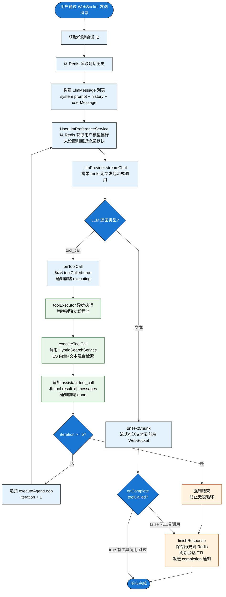
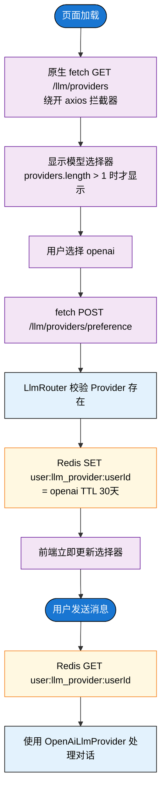
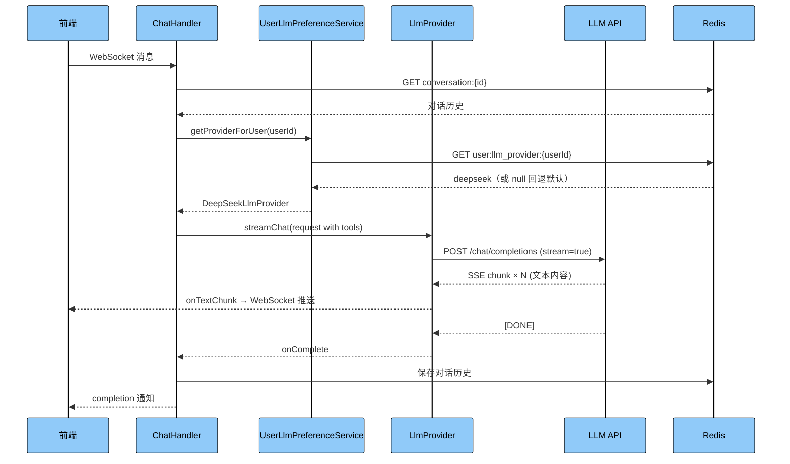
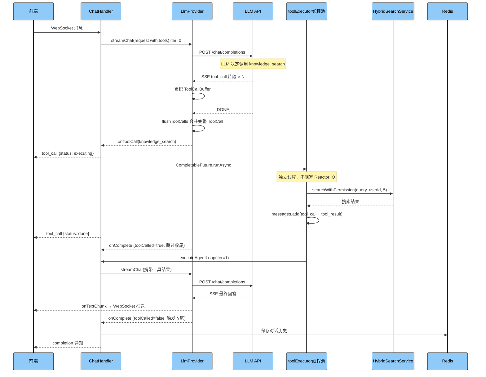
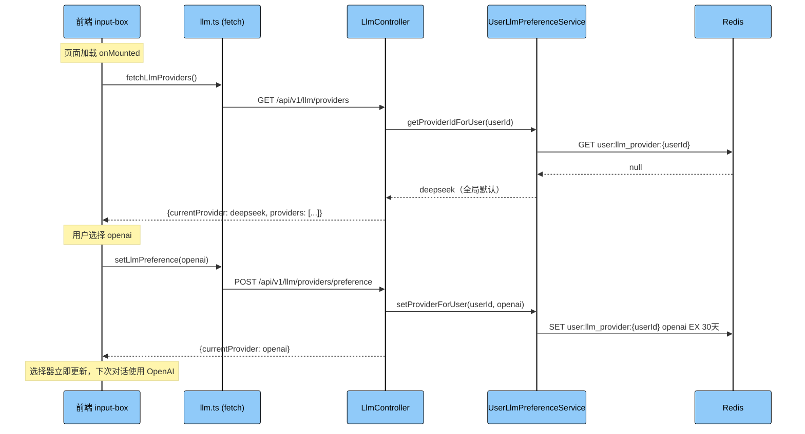
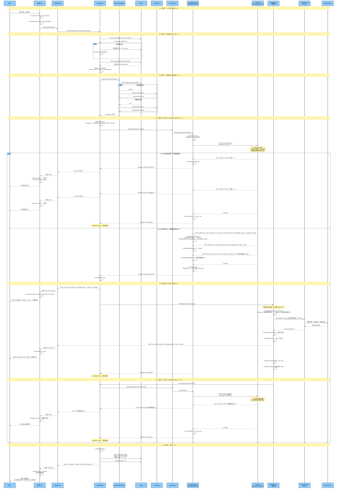
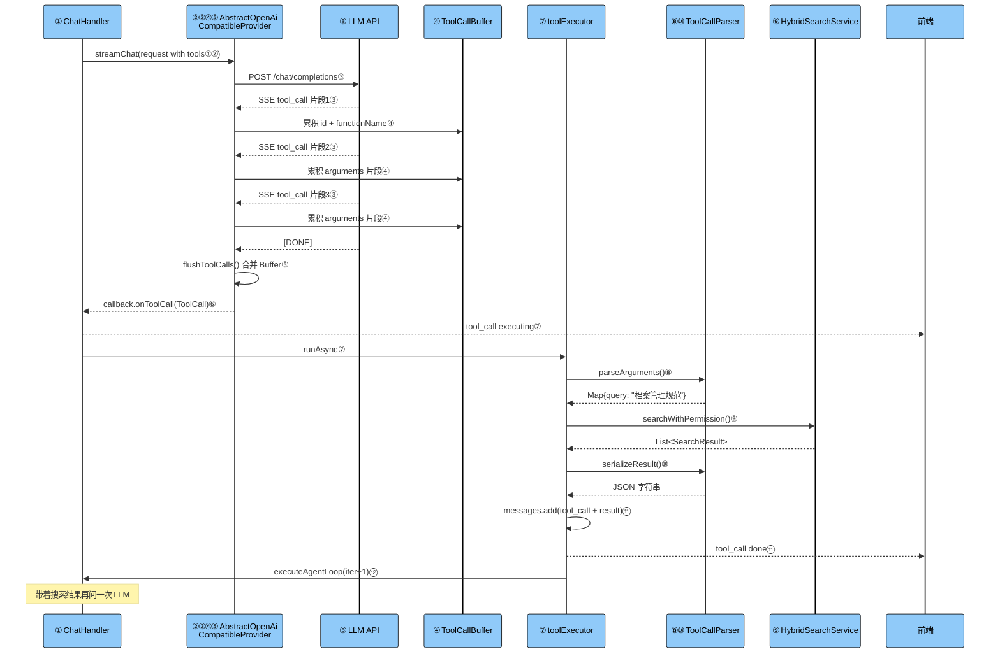

# 多 LLM 抽象层 + Function Calling 面试准备

## 简历描述

基于策略模式设计多 LLM 可插拔架构，支持 DeepSeek/OpenAI/Ollama/通义千问动态切换；引入 Function Calling + Agent 循环，LLM 自主决策是否检索知识库，按需搜索替代强制搜索。

---

## 完整交互流程图

### 用户发送消息的 Agent 决策流程



### 用户切换模型流程



---

## 时序图

### LLM 直接回答（无工具调用）



### LLM 调用工具（Function Calling）



### 用户切换模型



---

## 面试问答

### Q1：为什么要做这个改造？改造前有什么问题？

改造前有三个核心问题。第一，模型硬编码，ChatHandler 直接依赖 DeepSeekClient，想换模型就得改代码重新部署。第二，每次对话都强制执行 ES 检索，用户说"你好"也会触发向量搜索，浪费资源。第三，响应完成靠后台线程轮询检测（Thread.sleep 3 秒 + 循环检测），最长等 30 秒，逻辑复杂且不可靠。

---

### Q2：用了哪些设计模式？为什么选这些？

主要用了四个：

**策略模式**：LlmProvider 接口 + 四个实现类（DeepSeek/OpenAI/Ollama/Qwen），ChatHandler 不依赖具体实现，运行时通过 UserLlmPreferenceService 动态选择。选它是因为需要在运行时切换 LLM，策略模式天然适合。

**模板方法模式**：AbstractOpenAiCompatibleProvider 基类定义了 streamChat 的完整流程（构建请求→解析 SSE→累积 tool_call→触发回调），子类只需实现 getProviderId()。选它是因为四个 Provider 都用 OpenAI 兼容接口，流程完全一样，只是 URL 和 Key 不同，抽基类消除重复代码。

**注册表模式**：LlmRouter 利用 Spring 自动注入 List<LlmProvider>，启动时注册到 ConcurrentHashMap，按 ID 查找。选它是因为需要一个集中管理 Provider 的地方，新增 Provider 只需加 @Component 就自动注册。

**观察者模式**：LlmStreamCallback 接口定义四种事件（onTextChunk/onToolCall/onComplete/onError），Provider 作为事件源，ChatHandler 作为观察者。选它是因为流式响应天然是事件驱动的。

---

### Q3：Function Calling 是怎么实现的？具体流程是什么？

Function Calling 的核心是告诉 LLM "你有什么工具可以用"，LLM 自己决定要不要用。

具体流程：
1. 构建请求时，把 knowledge_search 工具的 JSON Schema（名称、描述、参数格式）放在 request.tools 里发给 LLM
2. LLM 分析用户问题，如果需要查资料，返回的不是文本而是 tool_call 指令：`{functionName: "knowledge_search", arguments: '{"query":"档案管理规范"}'}`
3. 后端收到 tool_call 后，解析参数，调用 HybridSearchService 执行 ES 检索
4. 把检索结果作为 tool 角色的消息追加到 messages 列表
5. 再次调用 LLM，这次 LLM 拿到了检索结果，基于结果生成最终回答

如果 LLM 判断不需要搜索（比如用户说"你好"），直接返回文本，不触发工具调用，省掉了不必要的 ES 检索。

---

### Q4：Agent 循环是什么？为什么最多 5 轮？

Agent 循环就是 LLM 和工具之间的多轮交互。每一轮 LLM 可以选择直接回答或调用工具，调用工具后系统执行工具、把结果喂回 LLM，LLM 再决定是继续调用工具还是给出最终回答。

设 5 轮上限是防止 LLM 陷入无限循环（比如 LLM 一直觉得信息不够，反复搜索）。5 轮足够覆盖绝大多数场景（通常 1-2 轮就够了），超过 5 轮说明问题本身可能无法通过检索解决，强制结束避免资源浪费。

---

### Q5：流式 tool_call 是怎么解析的？为什么需要累积？

LLM API 返回的 tool_call 是分片传输的（SSE 流式），一个完整的 tool_call 会被拆成多个 SSE 事件：

```
第1片: {id: "call_xxx", function: {name: "knowledge_search", arguments: ""}}
第2片: {function: {arguments: '{"qu'}}
第3片: {function: {arguments: 'ery":"档案管理"}'}}
```

arguments 是 JSON 字符串，被拆成了多个片段。所以需要 ToolCallBuffer 按 index 累积，流结束时（[DONE]）在 flushToolCalls 里合并成完整的 ToolCall 对象，再触发 onToolCall 回调。

---

### Q6：为什么工具调用要用独立线程池？不用会怎样？

因为 streamChat 底层用的是 Spring WebFlux 的 WebClient，回调（onToolCall）运行在 Reactor IO 线程上。Reactor IO 线程数量有限（通常等于 CPU 核数），是整个响应式管道的核心资源。

executeToolCall 里调用 HybridSearchService.searchWithPermission()，这是一个同步阻塞的 ES HTTP 请求，可能耗时几百毫秒。如果在 Reactor IO 线程上执行，这个线程就被占住了，其他所有请求都得排队等。高并发时所有 IO 线程都被阻塞，系统就卡死了。

所以引入了 toolExecutor（ScheduledExecutorService，4 线程），用 CompletableFuture.runAsync 把阻塞操作切到独立线程，Reactor IO 线程立即释放。

---

### Q7：ThreadLocal 在响应式上下文中为什么会失效？怎么解决的？

最初用 ThreadLocal 存 tool_call 的累积缓冲区。问题是 streamChat 在线程 A 调用 toolCallBuffers.set()，但 bodyToFlux 的回调（processStreamChunk、flushToolCalls）运行在 Reactor 的调度线程 B 上，线程 B 调用 toolCallBuffers.get() 拿到的是 null，因为 ThreadLocal 是线程绑定的。

解决方案是把 ThreadLocal 改成方法内局部变量 `Map<Integer, ToolCallBuffer> toolCallBuffers = new HashMap<>()`，通过 Java 闭包传递给所有回调。闭包捕获的是堆上的引用，不管在哪个线程执行都能访问到同一个 Map。

---

### Q8：onToolCall 和 onComplete 之间有什么竞态问题？怎么解决的？

flushToolCalls 在流结束时调用，它会先触发 onToolCall，然后触发 onComplete。onToolCall 里用 CompletableFuture.runAsync 异步执行工具调用，但 onComplete 紧接着就会被调用。

如果 onComplete 里直接调用 finishResponse()，就会在工具还没执行完的时候就结束响应，对话历史保存不完整。

解决方案是用 `final boolean[] toolCalled = {false}` 标志位。onToolCall 里设为 true，onComplete 里检查：如果 toolCalled 为 true，说明有工具调用在异步执行，跳过收尾；收尾由递归的 executeAgentLoop 在工具执行完成后负责。

---

### Q9：用户级模型偏好是怎么实现的？为什么用 Redis？

每个用户的模型偏好存在 Redis 里，Key 是 `user:llm_provider:{userId}`，Value 是 Provider ID（如 "openai"），TTL 30 天。

用 Redis 而不是数据库，因为：
1. 这是高频读取的热数据（每次对话都要读），Redis 读取延迟微秒级
2. 数据结构简单（一个 KV），不需要关系型存储
3. 自带 TTL，30 天不用自动过期，不需要手动清理
4. 项目本身已经用 Redis 存对话历史，不引入额外依赖

容错机制：如果用户保存的 Provider 被管理员禁用了（yml 里 enabled 改为 false），getProviderForUser 会捕获 IllegalArgumentException，自动删除 Redis 里的偏好，回退到全局默认 Provider。

---

### Q10：前端为什么用原生 fetch 而不是 axios？

项目的 axios 全局拦截器里有一段逻辑：HTTP 403 响应直接调用 authStore.resetStore() 登出。LLM 接口在某些边界情况下会返回 403（比如 Controller 路径配错、JWT 解析失败），触发登出导致用户"秒退"到登录页。

用原生 fetch 完全绕开 axios 拦截器，请求失败时静默忽略（返回 null），不影响主功能。模型选择器只是辅助功能，加载失败不应该影响核心的聊天体验。

---

### Q11：@ConditionalOnProperty 是怎么控制 Provider 注册的？

每个 Provider 类上都有 `@ConditionalOnProperty(prefix = "llm.providers.xxx", name = "enabled", havingValue = "true")`。Spring 启动时检查 yml 配置，只有 enabled=true 的 Provider 才会创建 Bean。

比如 yml 里 `ollama.enabled=false`，OllamaLlmProvider 的 Bean 就不会被创建，LlmRouter 的 List<LlmProvider> 里不会有它，前端选择器也不会显示。

好处是：未启用的 Provider 不占用任何资源（不创建 WebClient、不建立连接），而且新增 Provider 只需加配置 + 写一个继承基类的类，无需修改任何业务代码。

---

### Q12：如果要新增一个 Claude Provider，需要改哪些代码？

三步：

1. yml 里加配置块：
```yaml
llm:
  providers:
    claude:
      enabled: true
      api-url: https://api.anthropic.com/v1
      api-key: ${CLAUDE_API_KEY:}
      model: claude-3-5-sonnet
      supports-tool-calling: true
```

2. 写一个类（如果 API 兼容 OpenAI 格式，10 行代码）：
```java
@Component
@ConditionalOnProperty(prefix = "llm.providers.claude", name = "enabled", havingValue = "true")
public class ClaudeLlmProvider extends AbstractOpenAiCompatibleProvider {
    public ClaudeLlmProvider(LlmProperties p) { super("claude", p); }
    public String getProviderId() { return "claude"; }
}
```

3. 重启服务。不需要改 ChatHandler、LlmRouter、前端任何代码。

如果 API 不兼容 OpenAI 格式（比如 Anthropic 原生 API），就不继承基类，直接实现 LlmProvider 接口，自己写 streamChat 逻辑。

---

### Q13：WebSocket 消息协议是怎么设计的？

后端通过 WebSocket 向前端推送三种消息：

```json
// 1. 文本块（流式推送）
{ "chunk": "这是一段回答..." }

// 2. 工具调用状态通知
{ "type": "tool_call", "function": "knowledge_search", "status": "executing" }
{ "type": "tool_call", "function": "knowledge_search", "status": "done" }

// 3. 响应完成通知
{ "type": "completion", "status": "finished", "timestamp": 1234567890 }
```

前端 watch(wsData) 根据消息类型分发处理：chunk 追加到消息内容，tool_call 更新工具调用状态展示，completion 标记消息完成。

---

### Q14：改造前后性能有什么变化？

**检索开销**：改造前每次对话都执行 ES 检索（向量+文本），改造后 LLM 自主判断，闲聊类问题不触发检索，减少了大量无效 ES 查询。

**响应延迟**：改造前还有 QueryRewrite 环节（调用独立 LLM 改写查询），改造后去掉了这个环节，LLM 直接决策，少了一次 LLM 调用的延迟。

**完成检测**：改造前用轮询线程（Thread.sleep 3s + 2s + 循环），最长等 30 秒。改造后用回调驱动（onComplete），流结束立即触发，零等待。

**线程资源**：改造前每次对话创建一个裸线程做轮询。改造后用 ScheduledExecutorService 线程池（4 线程），复用线程，避免频繁创建销毁。

---

### Q15：如果 LLM 不支持 Function Calling 怎么办？

通过 `supportsToolCalling()` 方法判断。yml 里每个 Provider 有 `supports-tool-calling` 配置项，比如 Ollama 本地模型通常不支持，配置为 false。

ChatHandler 在构建请求时检查：
```java
LlmRequest request = LlmRequest.builder()
    .messages(messages)
    .tools(provider.supportsToolCalling() ? tools : null)  // 不支持就不传 tools
    .build();
```

不传 tools 参数时，LLM 只会返回文本，不会返回 tool_call，Agent 循环第一轮就直接结束。效果等同于改造前的直接调用，只是不再强制搜索了。

---

### Q16：消息列表（messages）在多轮工具调用中是怎么演变的？

初始：`[system, user]`

第一轮 LLM 返回 tool_call 后：`[system, user, assistant(tool_call), tool(result)]`

第二轮 LLM 基于结果回答：`[system, user, assistant(tool_call), tool(result), assistant(最终回答)]`

每轮追加两条消息（assistant 的 tool_call + tool 的执行结果），LLM 能看到完整的工具调用历史，基于所有信息做出最终回答。

---

### Q17：这个架构有什么不足？后续怎么优化？

**不足一**：工具定义硬编码在 ChatHandler 里，新增工具需要改代码。后续可以抽取 ToolRegistry，工具定义和执行逻辑解耦，支持动态注册。

**不足二**：目前只有一个工具（knowledge_search），Agent 能力有限。后续可以加更多工具（文件上传、联网搜索、代码执行等），让 LLM 具备更强的 Agent 能力。

**不足三**：用户偏好只存了 Provider ID，没有存模型名称。同一个 Provider 可能有多个模型（如 OpenAI 的 gpt-4o 和 gpt-4-turbo），后续可以支持用户选择具体模型。

**不足四**：没有 token 用量统计和限流。后续可以在 LlmStreamCallback 里统计 token 消耗，结合用户配额做限流。


---

## Function Calling + Agent 循环详解

### 什么是 Function Calling

Function Calling 是 OpenAI 提出的一种机制，让 LLM 不仅能输出文本，还能输出"我要调用某个函数"的结构化指令。本质上是把后端的能力（搜索、计算、查数据库等）包装成"工具"，告诉 LLM 有哪些工具可用，LLM 根据用户问题自主判断要不要用。

**类比理解：** 就像你问一个人问题，这个人手边有一本字典（工具）。如果问题他直接知道答案，就直接回答；如果不确定，他会说"等一下，我查一下字典"，查完再回答你。Function Calling 就是让 LLM 具备了"查字典"的能力。

### 在本项目中的具体实现

#### 第一步：定义工具（告诉 LLM 有什么工具）

在 `ChatHandler.buildToolDefinitions()` 中，用 JSON Schema 格式定义了 `knowledge_search` 工具：

```java
private static List<ToolDefinition> buildToolDefinitions() {
    Map<String, Object> parameters = new LinkedHashMap<>();
    parameters.put("type", "object");
    parameters.put("properties", Map.of(
            "query", Map.of(
                    "type", "string",
                    "description", "搜索关键词或问题"
            )
    ));
    parameters.put("required", List.of("query"));

    return List.of(ToolDefinition.builder()
            .name("knowledge_search")
            .description("搜索用户的私有知识库，返回相关文档片段。当需要查阅资料、回答具体问题时调用。")
            .parameters(parameters)
            .build());
}
```

这段代码会被转换成发给 LLM API 的 JSON：

```json
{
  "tools": [{
    "type": "function",
    "function": {
      "name": "knowledge_search",
      "description": "搜索用户的私有知识库，返回相关文档片段。当需要查阅资料、回答具体问题时调用。",
      "parameters": {
        "type": "object",
        "properties": {
          "query": { "type": "string", "description": "搜索关键词或问题" }
        },
        "required": ["query"]
      }
    }
  }]
}
```

LLM 看到这个定义后，就知道自己有一个叫 `knowledge_search` 的工具可以用，接受一个 `query` 字符串参数。

#### 第二步：LLM 决策（LLM 自己判断要不要用工具）

当用户问"档案管理有什么规范？"，LLM 分析后认为需要查资料，返回的不是文本，而是一个 tool_call 指令：

```json
{
  "choices": [{
    "delta": {
      "tool_calls": [{
        "index": 0,
        "id": "call_abc123",
        "function": {
          "name": "knowledge_search",
          "arguments": "{\"query\":\"档案管理规范\"}"
        }
      }]
    }
  }]
```

当用户问"你好"，LLM 判断不需要搜索，直接返回文本：

```json
{
  "choices": [{
    "delta": {
      "content": "你好！我是ArchiveMind知识助手..."
    }
  }]
}
```

**关键点：** 是否调用工具完全由 LLM 自主决定，后端不做任何判断逻辑。LLM 根据工具的 description 和用户问题的语义来决策。

#### 第三步：执行工具（后端执行实际操作）

`ChatHandler.executeToolCall()` 收到 tool_call 后，解析参数，调用对应的后端服务：

```java
private String executeToolCall(String userId, ToolCall toolCall) {
    Map<String, Object> args = toolCallParser.parseArguments(toolCall);

    if ("knowledge_search".equals(toolCall.getFunctionName())) {
        String query = (String) args.getOrDefault("query", "");
        List<SearchResult> results = searchService.searchWithPermission(query, userId, 5);
        return toolCallParser.serializeResult(formatSearchResults(results));
    }

    return objectMapper.writeValueAsString(Map.of("error", "未知工具"));
}
```

执行流程：
1. `ToolCallParser.parseArguments()` 把 `'{"query":"档案管理规范"}'` 解析成 `Map{query: "档案管理规范"}`
2. 调用 `HybridSearchService.searchWithPermission()` 执行 ES 向量+文本混合检索
3. `formatSearchResults()` 把搜索结果格式化为结构化列表
4. `ToolCallParser.serializeResult()` 序列化为 JSON 字符串返回

#### 第四步：喂回 LLM（把工具结果给 LLM 看）

工具执行完后，把结果追加到消息列表，再次调用 LLM：

```java
// 追加 assistant 的 tool_call 消息（告诉 LLM "你之前调用了这个工具"）
messages.add(LlmMessage.builder().role("assistant").toolCall(toolCall).build());

// 追加 tool 的结果消息（告诉 LLM "工具返回了这些结果"）
messages.add(LlmMessage.toolResult(toolCall.getId(), toolResult));

// 再次调用 LLM，这次 LLM 能看到搜索结果
executeAgentLoop(userId, userMessage, messages, tools, session,
        conversationId, responseFuture, iteration + 1);
```

LLM 第二次被调用时，messages 列表变成了：

```
[system]  你是ArchiveMind知识助手...
[user]    档案管理有什么规范？
[assistant] tool_calls: [{name: "knowledge_search", arguments: '{"query":"档案管理规范"}'}]
[tool]    [{"index":1,"file":"档案法.pdf","content":"第一条 为了加强档案管理..."}]
```

LLM 看到搜索结果后，基于结果生成最终回答："根据档案法第一条规定，档案管理需要遵守以下规范..."

---

### Agent 循环的完整实现

#### 核心方法：executeAgentLoop

```java
private void executeAgentLoop(String userId, String userMessage,
                              List<LlmMessage> messages, List<ToolDefinition> tools,
                              WebSocketSession session, String conversationId,
                              CompletableFuture<String> responseFuture, int iteration) {

    // 终止条件：最多 5 轮
    if (iteration >= MAX_TOOL_ITERATIONS) {
        finishResponse(session, conversationId, userId, userMessage, responseFuture);
        return;
    }

    // 获取用户选择的 Provider
    LlmProvider provider = preferenceService.getProviderForUser(userId);

    // 构建请求（支持 Function Calling 的 Provider 才传 tools）
    LlmRequest request = LlmRequest.builder()
            .messages(messages)
            .tools(provider.supportsToolCalling() ? tools : null)
            .build();

    // 标记本轮是否有工具调用
    final boolean[] toolCalled = {false};

    // 发起流式调用
    provider.streamChat(request, new LlmStreamCallback() {

        @Override
        public void onTextChunk(String chunk) {
            // 文本块：累积到 builder，同时推送到前端
            StringBuilder builder = responseBuilders.get(session.getId());
            if (builder != null) builder.append(chunk);
            sendResponseChunk(session, chunk);
        }

        @Override
        public void onToolCall(ToolCall toolCall) {
            toolCalled[0] = true;
            sendToolCallNotification(session, toolCall, "executing");

            // 切换到独立线程执行（避免阻塞 Reactor IO 线程）
            CompletableFuture.runAsync(() -> {
                // 1. 执行工具
                String toolResult = executeToolCall(userId, toolCall);
                sendToolCallNotification(session, toolCall, "done");

                // 2. 追加结果到消息列表
                messages.add(LlmMessage.builder().role("assistant").toolCall(toolCall).build());
                messages.add(LlmMessage.toolResult(toolCall.getId(), toolResult));

                // 3. 递归进入下一轮
                executeAgentLoop(userId, userMessage, messages, tools, session,
                        conversationId, responseFuture, iteration + 1);
            }, toolExecutor);
        }

        @Override
        public void onComplete() {
            // 只有没有工具调用时才收尾
            // 有工具调用时，由递归的 executeAgentLoop 负责收尾
            if (!toolCalled[0]) {
                finishResponse(session, conversationId, userId, userMessage, responseFuture);
            }
        }

        @Override
        public void onError(Throwable error) {
            handleError(session, error);
            responseFuture.completeExceptionally(error);
        }
    });
}
```

#### 循环的三种结束方式

**方式一：LLM 直接回答（最常见）**
```
iteration=0: LLM 调用 → 返回文本 → onTextChunk × N → onComplete → finishResponse
```
用户问"你好"，LLM 直接回答，一轮就结束。

**方式二：LLM 调用工具后回答（典型 RAG 场景）**
```
iteration=0: LLM 调用 → 返回 tool_call → onToolCall → 执行搜索 → 追加结果
iteration=1: LLM 调用（携带搜索结果）→ 返回文本 → onComplete → finishResponse
```
用户问"档案管理规范"，LLM 先搜索再回答，两轮结束。

**方式三：达到上限强制结束（极少见）**
```
iteration=0~4: LLM 每轮都返回 tool_call → 执行搜索 → 追加结果
iteration=5: 达到 MAX_TOOL_ITERATIONS → 强制 finishResponse
```
LLM 反复搜索但始终不满意，5 轮后强制结束，防止无限循环。

#### 消息列表的完整演变过程

**用户问："档案管理有什么规范？"**

**初始状态（iteration=0 发送给 LLM）：**
```json
[
  {"role": "system", "content": "你是ArchiveMind知识助手，须遵守：\n1. 仅用简体中文作答...\n5. 你有一个工具 knowledge_search..."},
  {"role": "user", "content": "档案管理有什么规范？"}
]
```

**LLM 返回 tool_call，追加后（iteration=1 发送给 LLM）：**
```json
[
  {"role": "system", "content": "..."},
  {"role": "user", "content": "档案管理有什么规范？"},
  {"role": "assistant", "tool_calls": [{"id": "call_abc", "function": {"name": "knowledge_search", "arguments": "{\"query\":\"档案管理规范\"}"}}]},
  {"role": "tool", "tool_call_id": "call_abc", "content": "[{\"index\":1,\"file\":\"档案法.pdf\",\"content\":\"第一条 为了加强档案管理...\"}]"}
]
```

**LLM 基于结果回答（最终输出）：**
```
根据档案法第一条规定，档案管理需要遵守以下规范：
1. 有效保护和利用档案 (来源#1: 档案法.pdf)
2. ...
```

#### 线程模型详解

```
用户请求线程（Tomcat/Netty）
    │
    └── ChatHandler.processMessage()
            │
            └── executeAgentLoop(iter=0)
                    │
                    └── provider.streamChat()  ← 非阻塞，立即返回
                            │
                            └── Reactor IO 线程（WebClient 内部）
                                    │
                                    ├── processStreamChunk()  ← 解析 SSE，纯 CPU
                                    ├── onTextChunk()         ← WebSocket 推送，快速
                                    ├── onToolCall()          ← 触发异步，立即返回
                                    │       │
                                    │       └── toolExecutor 线程池（4线程）
                                    │               │
                                    │               ├── executeToolCall()  ← ES 阻塞查询
                                    │               ├── messages.add()    ← 串行操作
                                    │               └── executeAgentLoop(iter=1)
                                    │                       │
                                    │                       └── provider.streamChat()  ← 第二轮
                                    │
                                    └── onComplete()  ← toolCalled=true，跳过
```

**为什么这样设计：**
- Reactor IO 线程不能阻塞（数量有限，阻塞会卡死整个系统）
- ES 查询是同步阻塞操作（底层 Apache HttpClient）
- 所以用 toolExecutor 独立线程池承接阻塞操作
- 递归调用也在 toolExecutor 里发起，保证串行执行，避免并发修改 messages

---

### 整个需求的实现步骤详解

#### 步骤一：定义 LLM 抽象层（接口 + DTO）

首先定义统一接口和数据结构，让所有 LLM 实现遵循同一契约：

```
LlmProvider（接口）
    ├── getProviderId()        → 返回 "deepseek"/"openai" 等
    ├── supportsToolCalling()  → 是否支持 Function Calling
    └── streamChat(request, callback)  → 流式调用

LlmRequest（请求 DTO）
    ├── model      → 模型名称（可选）
    ├── messages   → 消息列表
    ├── tools      → 工具定义列表（可选）
    └── params     → 生成参数

LlmMessage（消息 DTO）
    ├── role       → system/user/assistant/tool
    ├── content    → 文本内容
    ├── toolCall   → 工具调用信息（assistant 角色）
    └── toolCallId → 工具调用 ID（tool 角色）

LlmStreamCallback（回调接口）
    ├── onTextChunk(chunk)     → 文本片段
    ├── onToolCall(toolCall)   → 工具调用指令
    ├── onComplete()           → 流结束
    └── onError(error)         → 错误
```

#### 步骤二：实现 OpenAI 兼容基类

DeepSeek、OpenAI、Ollama、通义千问都使用 OpenAI 兼容的 API 格式，抽取公共基类 `AbstractOpenAiCompatibleProvider`：

核心逻辑：
1. `buildApiRequest()` — 将 LlmRequest 转换为 OpenAI API 格式的 JSON，包含 messages、tools、stream=true
2. `processStreamChunk()` — 解析每个 SSE 事件，分离 content（文本）和 tool_calls（工具调用片段）
3. `flushToolCalls()` — 流结束时，将累积的 tool_call 片段合并成完整的 ToolCall 对象

**流式 tool_call 累积机制：**

LLM API 的 tool_call 是分片传输的，arguments 字段被拆成多个 SSE 事件。用 `ToolCallBuffer` 按 index 累积：

```java
private static class ToolCallBuffer {
    String id;                              // 第一片传来
    String functionName;                    // 第一片传来
    final StringBuilder argumentsBuilder;   // 多片累积拼接
}
```

每收到一个 SSE 事件，检查 delta.tool_calls 数组，按 index 找到对应的 Buffer，累积 id、functionName、arguments。流结束时 flushToolCalls 遍历所有 Buffer，构建完整的 ToolCall 对象。

#### 步骤三：实现 Provider 注册与路由

`LlmRouter` 利用 Spring 依赖注入自动收集所有 LlmProvider Bean：

```java
public LlmRouter(List<LlmProvider> providerList, LlmProperties llmProperties) {
    for (LlmProvider provider : providerList) {
        providers.put(provider.getProviderId(), provider);
    }
    this.defaultProviderId = llmProperties.getDefaultProvider();
}
```

每个 Provider 用 `@ConditionalOnProperty` 控制是否注册：
- `deepseek.enabled=true` → DeepSeekLlmProvider Bean 创建 → 注册到 Router
- `openai.enabled=false` → OpenAiLlmProvider Bean 不创建 → Router 里没有

#### 步骤四：实现用户级模型偏好

`UserLlmPreferenceService` 用 Redis 存储每个用户的选择：

```java
// 设置偏好
public void setProviderForUser(String userId, String providerId) {
    llmRouter.getProvider(providerId);  // 校验存在
    redisTemplate.opsForValue().set("user:llm_provider:" + userId, providerId, Duration.ofDays(30));
}

// 获取偏好（带容错）
public LlmProvider getProviderForUser(String userId) {
    String providerId = redisTemplate.opsForValue().get("user:llm_provider:" + userId);
    if (providerId != null) {
        try {
            return llmRouter.getProvider(providerId);
        } catch (IllegalArgumentException e) {
            // Provider 被禁用，清除偏好，回退默认
            redisTemplate.delete("user:llm_provider:" + userId);
        }
    }
    return llmRouter.getDefaultProvider();
}
```

#### 步骤五：重构 ChatHandler 为 Agent 循环

将原来的硬编码链路：
```
改写查询 → 强制搜索 → 拼接上下文 → 调用 DeepSeek → 轮询等待
```

重构为：
```
构建消息 → 获取用户 Provider → Agent 循环（LLM 自主决策是否搜索）→ 回调驱动完成
```

核心改动：
1. 移除 `QueryRewriteService` 和 `DeepSeekClient` 依赖
2. 新增 `LlmRouter`、`ToolCallParser`、`UserLlmPreferenceService` 依赖
3. `processMessage()` 不再直接搜索，而是调用 `executeAgentLoop()`
4. 响应完成从轮询线程改为 `onComplete` 回调驱动
5. 工具调用在 `toolExecutor` 独立线程池执行

#### 步骤六：前端适配

1. `api.d.ts` 新增 `ToolCallStatus` 类型和 `Api.Llm` 命名空间
2. `input-box.vue` 新增模型选择器（NSelect 组件）和 tool_call 消息处理分支
3. `chat-message.vue` 新增工具调用状态展示（执行中转圈/完成打勾）
4. `llm.ts` 用原生 fetch 封装 LLM API 调用（绕开 axios 全局拦截器）

#### 步骤七：配置整合

将原来分散的配置：
```yaml
deepseek:
  api:
    url: ...
    key: ...
    model: ...
ai:
  prompt: ...
  generation: ...
```

整合为统一的多 Provider 配置：
```yaml
llm:
  default-provider: deepseek
  providers:
    deepseek:
      enabled: true
      api-url: ...
      api-key: ...
      model: ...
      supports-tool-calling: true
    openai: ...
    ollama: ...
  generation: ...
```

删除 `deepseek.api.*`、`ai.prompt.*`、`ai.generation.*`，删除 `DeepSeekClient.java`，清理 `AiProperties` 中不再使用的 Prompt 和 Generation 内部类。


---

## LLM 自主决策的原理详解

### 决策不是我们写的代码，是模型本身的能力

很多人第一反应是"后端用 if-else 判断用户问题是否需要搜索"，但实际上不是。决策完全发生在 LLM 模型内部，我们的代码只做了三件事：

1. 把工具定义（JSON Schema）放在 API 请求的 `tools` 参数里发给 LLM
2. 在 system prompt 里引导 LLM 的决策倾向
3. 解析 LLM 返回的结果，判断是文本还是 tool_call

### LLM 看到的完整输入

每次调用 LLM API 时，发送的请求体是这样的：

```json
{
  "model": "deepseek-chat",
  "stream": true,
  "messages": [
    {
      "role": "system",
      "content": "你是ArchiveMind知识助手，须遵守：\n1. 仅用简体中文作答。\n2. 回答需先给结论，再给论据。\n3. 如引用参考信息，请在句末加 (来源#编号: 文件名)。\n4. 若无足够信息，请回答\"暂无相关信息\"并说明原因。\n5. 你有一个工具 knowledge_search，可以搜索用户的知识库。当问题需要查阅资料时，请主动调用该工具。"
    },
    {
      "role": "user",
      "content": "档案管理有什么规范？"
    }
  ],
  "tools": [
    {
      "type": "function",
      "function": {
        "name": "knowledge_search",
        "description": "搜索用户的私有知识库，返回相关文档片段。当需要查阅资料、回答具体问题时调用。",
        "parameters": {
          "type": "object",
          "properties": {
            "query": {
              "type": "string",
              "description": "搜索关键词或问题"
            }
          },
          "required": ["query"]
        }
      }
    }
  ],
  "temperature": 0.3,
  "max_tokens": 2000
}
```

LLM 模型同时看到了三样东西：
- **system prompt**：告诉它身份、规则、以及"你有一个工具可以用"
- **用户消息**：用户实际问的问题
- **tools 定义**：工具的名称、描述、参数格式

### LLM 内部的决策过程

LLM 的决策能力是在模型训练阶段学会的。DeepSeek、GPT-4、通义千问等支持 Function Calling 的模型，都经过了专门的训练数据微调，让模型学会：

**场景一：需要调用工具**

用户问："档案管理有什么规范？"

LLM 内部推理（我们看不到，这是神经网络的推理过程）：
- 这是一个关于档案管理规范的专业问题
- 我的训练数据里可能没有这个用户知识库的具体内容
- 我手上有 knowledge_search 工具，description 说"搜索用户的私有知识库"
- system prompt 说"当问题需要查阅资料时，请主动调用该工具"
- → 决定调用工具

LLM 输出（不是文本，而是结构化的 tool_call）：
```json
{
  "choices": [{
    "delta": {
      "tool_calls": [{
        "id": "call_abc123",
        "function": {
          "name": "knowledge_search",
          "arguments": "{\"query\":\"档案管理规范\"}"
        }
      }]
    }
  }]
}
```

**场景二：不需要调用工具**

用户问："你好"

LLM 内部推理：
- 这是一个打招呼的问题
- 不需要查阅任何资料
- 我可以直接回答
- → 决定直接输出文本

LLM 输出（普通文本）：
```json
{
  "choices": [{
    "delta": {
      "content": "你好！我是ArchiveMind知识助手..."
    }
  }]
}
```

**场景三：边界情况**

用户问："1+1等于几？"

LLM 内部推理：
- 这是一个简单的数学问题
- 不需要搜索知识库
- → 直接回答 "1+1=2"

用户问："我们公司的报销流程是什么？"

LLM 内部推理：
- 这是关于特定公司的内部流程
- 我的训练数据里不会有这个信息
- 需要搜索用户的知识库
- → 调用 knowledge_search({query: "公司报销流程"})

### 影响决策的三个因素

**因素一：工具的 description**

```java
.description("搜索用户的私有知识库，返回相关文档片段。当需要查阅资料、回答具体问题时调用。")
```

这段描述非常关键。LLM 根据 description 理解工具的用途，判断当前问题是否匹配。如果 description 写得不好（比如写成"一个搜索工具"），LLM 可能在不该调用时调用，或者该调用时不调用。

**因素二：system prompt 的引导**

```
5. 你有一个工具 knowledge_search，可以搜索用户的知识库。当问题需要查阅资料时，请主动调用该工具。
```

这句话在引导 LLM 的决策倾向。如果不写这句，LLM 可能更倾向于直接回答（即使回答不准确）。加了这句后，LLM 在不确定时会更倾向于先搜索再回答。

**因素三：模型本身的能力**

不同模型的 Function Calling 能力不同：
- DeepSeek-chat、GPT-4o、通义千问-plus：经过专门训练，决策准确率高
- 小模型（如 Ollama 本地 7B 模型）：可能不支持或决策不准确，所以配置里 `supports-tool-calling: false`，直接不传 tools 参数

### 后端代码做了什么

后端代码不参与决策，只负责：

```java
// 1. 把工具定义放进请求（告诉 LLM 有什么工具）
LlmRequest request = LlmRequest.builder()
    .messages(messages)
    .tools(provider.supportsToolCalling() ? TOOL_DEFINITIONS : null)
    .build();

// 2. 发起调用，通过回调接收结果
provider.streamChat(request, new LlmStreamCallback() {
    @Override
    public void onTextChunk(String chunk) {
        // LLM 决定直接回答 → 收到文本块 → 推送前端
    }

    @Override
    public void onToolCall(ToolCall toolCall) {
        // LLM 决定调用工具 → 收到 tool_call 指令 → 执行工具 → 把结果喂回 LLM
    }
});
```

整个决策链路：
```
我们定义工具 → 发给 LLM → LLM 自己决定 → 返回文本或 tool_call → 我们根据返回类型做不同处理
```

我们写的是"基础设施"（定义工具、解析响应、执行工具、喂回结果），LLM 写的是"决策逻辑"。

---

## 需求实现总结（口述版）

这个需求的核心是把原来硬编码的单模型对话系统改造成可插拔的多模型 Agent 架构。

原来的问题是 ChatHandler 直接依赖 DeepSeekClient，每次对话都强制执行 ES 检索，不管用户问的是什么。而且响应完成靠后台线程轮询检测，逻辑复杂。

我的实现分三个层面：

第一层是多 LLM 抽象。定义了 LlmProvider 接口作为统一契约，用策略模式让 ChatHandler 与具体 LLM 解耦。因为 DeepSeek、OpenAI、Ollama、通义千问都用 OpenAI 兼容接口，所以用模板方法模式抽了一个 AbstractOpenAiCompatibleProvider 基类，四个 Provider 继承它只需实现 getProviderId()，消除了大量重复代码。LlmRouter 用注册表模式在 Spring 启动时自动发现所有 Provider，配合 @ConditionalOnProperty 实现配置驱动的条件装配。用户级模型偏好存在 Redis 里，每个用户独立选择互不影响。

第二层是 Function Calling。把原来的 ES 检索包装成 knowledge_search 工具，用 JSON Schema 定义工具的名称、描述和参数格式，随 API 请求发给 LLM。LLM 模型本身经过 Function Calling 训练，能根据用户问题和工具描述自主判断是否需要调用。需要时返回 tool_call 指令而不是文本，后端解析指令执行搜索，把结果喂回 LLM 生成最终回答。不需要时直接返回文本，省掉了不必要的检索。

第三层是 Agent 循环。executeAgentLoop 方法实现了 LLM 和工具之间的多轮交互，每轮 LLM 可以选择直接回答或调用工具，最多 5 轮防止无限循环。流式响应通过 LlmStreamCallback 观察者模式处理四种事件。工具调用在独立线程池 toolExecutor 里异步执行，避免阻塞 Reactor IO 线程。用 toolCalled 标志位解决 onToolCall 和 onComplete 之间的竞态问题。

过程中解决了几个关键问题：ThreadLocal 在响应式上下文中失效改为闭包传递局部变量；前端 LLM 接口用原生 fetch 绕开 axios 全局拦截器避免 403 触发登出；Controller 路径与 vite 代理不匹配导致 404 等。


---

## 完整端到端流程图（包含所有分支）

```mermaid
%%{init: {'flowchart': {'curve': 'linear'}}}%%
flowchart TB
    classDef startEnd fill:#1976d2,stroke:#000,stroke-width:1px,color:#fff
    classDef process fill:#e3f2fd,stroke:#000,stroke-width:1px,color:#000
    classDef decision fill:#1976d2,stroke:#000,stroke-width:1px,color:#fff
    classDef async fill:#e8f5e9,stroke:#2e7d32,stroke-width:1px,color:#000
    classDef llm fill:#fff3e0,stroke:#e65100,stroke-width:1px,color:#000
    classDef ws fill:#f3e5f5,stroke:#6a1b9a,stroke-width:1px,color:#000
    classDef redis fill:#fff8e1,stroke:#f57f17,stroke-width:1px,color:#000
    classDef finish fill:#ffebee,stroke:#c62828,stroke-width:1px,color:#000

    Start([用户在前端输入消息\n点击发送]):::startEnd

    subgraph 前端处理
        WsPush[WebSocket 发送消息\nwsSend userMessage]:::ws
        AddUser[list.push user 消息\n显示在聊天界面]:::ws
        AddAssistant[list.push assistant 消息\nstatus=pending 显示加载动画]:::ws
    end

    subgraph 后端 ChatHandler
        Receive[ChatWebSocketHandler\n接收 WebSocket 消息\n提取 userId]:::process
        GetSession[getOrCreateConversationId\n从 Redis 获取活跃会话 ID\n无则自动创建新会话]:::process
        CheckFirst{首条消息?}:::decision
        AutoTitle[autoGenerateTitle\n异步生成会话标题]:::process
        GetHistory[getConversationHistory\nRedis GET conversation:id\n反序列化为 List]:::redis
        BuildMsg[buildLlmMessages\n构建消息列表:\n① system prompt 含规则+工具说明\n② 历史消息 user/assistant\n③ 当前 userMessage]:::process
    end

    subgraph Agent 循环 executeAgentLoop
        CheckLimit{iteration >= 5?}:::decision
        ForceFinish[强制结束\n防止无限循环]:::finish
        GetProvider[UserLlmPreferenceService\nRedis GET user:llm_provider:userId\n有偏好 → 对应 Provider\n无偏好 → 全局默认 deepseek]:::redis
        CheckSupport{Provider 支持\nFunction Calling?}:::decision
        BuildReqWithTools[构建 LlmRequest\nmessages + tools 定义\n含 knowledge_search JSON Schema]:::process
        BuildReqNoTools[构建 LlmRequest\n仅 messages 无 tools]:::process
        StreamChat[LlmProvider.streamChat\nWebClient POST /chat/completions\nstream=true 流式调用]:::llm
    end

    subgraph SSE 流式解析 AbstractOpenAiCompatibleProvider
        ReceiveSSE[接收 SSE 数据块]:::llm
        CheckDone{chunk == DONE?}:::decision
        ParseJSON[objectMapper.readTree\n解析 JSON]:::process
        CheckContent{delta 有\ncontent 字段?}:::decision
        ExtractText[提取文本内容]:::process
        CallbackText[callback.onTextChunk\n推送文本片段]:::process
        CheckToolCalls{delta 有\ntool_calls 数组?}:::decision
        AccumBuffer[ToolCallBuffer 累积\n按 index 拼接:\nid + functionName + arguments 片段]:::process
        NextSSE[等待下一个 SSE 块]:::process
        FlushTC[flushToolCalls\n遍历所有 Buffer\n合并为完整 ToolCall 对象]:::process
        HasTC{有累积的\ntool_call?}:::decision
        FireToolCall[callback.onToolCall\n触发工具调用回调]:::process
        FireComplete[callback.onComplete\n触发完成回调]:::process
    end

    subgraph ChatHandler 回调处理
        OnText[onTextChunk 处理:\n① 检查 stopFlags 是否停止\n② responseBuilder.append 累积\n③ WebSocket 推送 chunk JSON]:::ws
        OnToolCall[onToolCall 处理:\n① toolCalled = true\n② WebSocket 推送 tool_call executing]:::process
        AsyncExec[CompletableFuture.runAsync\n切换到 toolExecutor 线程池\n4线程 不阻塞 Reactor IO]:::async
        ExecTool[executeToolCall:\n① ToolCallParser.parseArguments\n   解析 arguments JSON → Map\n② 匹配工具名 knowledge_search\n③ HybridSearchService\n   .searchWithPermission\n   ES 向量+文本混合检索\n④ formatSearchResults 格式化\n⑤ serializeResult 序列化为 JSON]:::async
        NotifyDone[WebSocket 推送\ntool_call done]:::ws
        AppendMsg[messages 追加两条:\n① assistant role + tool_call\n② tool role + 搜索结果 JSON]:::async
        OnCompleteCheck{onComplete:\ntoolCalled?}:::decision
        SkipFinish[跳过收尾\n由递归负责]:::process
    end

    subgraph 收尾 finishResponse
        RemoveBuilder[移除 responseBuilder\n和 responseFuture]:::process
        CheckEmpty{响应内容\n非空?}:::decision
        SaveHistory[updateConversationHistory:\n① 追加 user + assistant 消息\n② 限制最多 20 条\n③ Redis SET conversation:id\n   TTL 7天]:::redis
        RefreshTTL[refreshSessionTTL\n刷新会话过期时间]:::process
        SendCompletion[WebSocket 推送\ncompletion finished 通知]:::ws
        CompleteFuture[responseFuture.complete\n标记异步完成]:::process
    end

    subgraph 前端接收处理
        WsReceive[watch wsData\n解析 JSON 消息]:::ws
        CheckMsgType{消息类型?}:::decision
        HandleChunk[data.chunk:\nassistant.status = loading\nassistant.content += chunk\n实时显示文本]:::ws
        HandleTC[data.type == tool_call:\n记录到 assistant.toolCalls\nexecuting → 显示转圈\ndone → 显示绿色对勾]:::ws
        HandleDone[data.type == completion:\nassistant.status = finished\n停止加载动画]:::ws
    end

    End([对话完成\n用户看到完整回答]):::startEnd

    Start --> WsPush --> AddUser --> AddAssistant --> Receive
    Receive --> GetSession --> CheckFirst
    CheckFirst -->|是| AutoTitle --> GetHistory
    CheckFirst -->|否| GetHistory
    GetHistory --> BuildMsg --> CheckLimit
    CheckLimit -->|是| ForceFinish --> RemoveBuilder
    CheckLimit -->|否| GetProvider --> CheckSupport
    CheckSupport -->|是| BuildReqWithTools --> StreamChat
    CheckSupport -->|否| BuildReqNoTools --> StreamChat
    StreamChat --> ReceiveSSE --> CheckDone
    CheckDone -->|否| ParseJSON --> CheckContent
    CheckContent -->|是| ExtractText --> CallbackText --> OnText --> WsReceive
    CheckContent -->|否| CheckToolCalls
    CallbackText --> CheckToolCalls
    CheckToolCalls -->|是| AccumBuffer --> NextSSE --> ReceiveSSE
    CheckToolCalls -->|否| NextSSE
    CheckDone -->|是| FlushTC --> HasTC
    HasTC -->|是| FireToolCall --> OnToolCall --> AsyncExec --> ExecTool --> NotifyDone --> AppendMsg --> CheckLimit
    HasTC -->|否| FireComplete --> OnCompleteCheck
    OnCompleteCheck -->|false 无工具调用| RemoveBuilder
    OnCompleteCheck -->|true 有工具调用| SkipFinish
    RemoveBuilder --> CheckEmpty
    CheckEmpty -->|是| SaveHistory --> RefreshTTL --> SendCompletion --> CompleteFuture
    CheckEmpty -->|否| RefreshTTL
    SendCompletion --> HandleDone --> End
    WsReceive --> CheckMsgType
    CheckMsgType -->|chunk| HandleChunk
    CheckMsgType -->|tool_call| HandleTC
    CheckMsgType -->|completion| HandleDone
    OnText --> CheckMsgType
    NotifyDone --> CheckMsgType
```



---

## 完整端到端时序图（包含所有交互）




---

## Agent 循环通俗理解 + 代码逐行分析

### 为什么需要循环？LLM 什么时候会"不满意"？

LLM 看到工具返回的搜索结果后，会自己判断信息够不够回答用户的问题。如果不够，它会再次调用工具。常见场景：

**场景一：信息不完整**
用户问"公司去年的营收和今年的对比情况"，LLM 第一次搜索"公司营收"只找到了去年的数据，发现还缺今年的，就会再发一次 tool_call 搜索"公司今年营收"。

**场景二：关键词不精准**
LLM 第一次用"档案规范"搜索，返回的结果不太相关，它会换个关键词"档案管理法律法规"再搜一次。

**场景三：需要多维度信息**
用户问"A 方案和 B 方案的优缺点对比"，LLM 可能先搜"A 方案优缺点"，再搜"B 方案优缺点"，两次搜索结果合在一起才能回答。

实际场景中大多数问题一次搜索就够了，多轮的情况比较少见。5 轮上限是兜底防止死循环（比如知识库里确实没有相关内容，LLM 反复搜也搜不到）。

### 一次循环 = 什么？

```
一次循环 = 调用 LLM → LLM 返回结果 → 判断是文本还是 tool_call
    ├── 文本 → 循环结束，给用户看
    └── tool_call → 执行工具 → 把结果追加到消息 → 进入下一次循环
```

### 多轮循环的真实例子

```
用户问："公司去年和今年的营收对比"

第1轮：
  → 调用 LLM（messages: [system, user]）
  ← LLM 返回 tool_call: knowledge_search({query: "公司营收"})
  → 执行 ES 搜索，找到去年营收数据
  → messages 追加 [assistant:tool_call, tool:去年营收数据]

第2轮：
  → 调用 LLM（messages: [system, user, assistant:tool_call, tool:去年数据]）
  ← LLM 看到只有去年的，返回 tool_call: knowledge_search({query: "公司今年营收"})
  → 执行 ES 搜索，找到今年营收数据
  → messages 追加 [assistant:tool_call, tool:今年营收数据]

第3轮：
  → 调用 LLM（messages: [system, user, ..., tool:去年数据, ..., tool:今年数据]）
  ← LLM 两年数据都有了，返回文本："去年营收 X 万，今年营收 Y 万，同比增长 Z%..."
  → 循环结束，推送给用户
```

### Agent 循环代码逐行分析

```java
private void executeAgentLoop(
        String userId,                          // 当前用户 ID
        String userMessage,                     // 用户原始消息（用于最后保存历史）
        List<LlmMessage> messages,              // 消息列表（每轮追加，越来越长）
        List<ToolDefinition> tools,             // 工具定义（固定不变）
        WebSocketSession session,               // WebSocket 会话（推送消息用）
        String conversationId,                  // 对话 ID（保存历史用）
        CompletableFuture<String> responseFuture, // 异步完成标记
        int iteration                           // 当前是第几轮（从 0 开始）
) {
```
方法签名：8 个参数，其中 `messages` 是核心，每轮工具调用后会追加新消息，`iteration` 控制循环次数。

```java
    // ① 终止条件：最多 5 轮，防止 LLM 无限调用工具
    if (iteration >= MAX_TOOL_ITERATIONS) {
        logger.warn("工具调用循环达到上限 {}，强制结束", MAX_TOOL_ITERATIONS);
        finishResponse(session, conversationId, userId, userMessage, responseFuture);
        return;
    }
```
第一行就是安全阀。如果 LLM 连续 5 轮都返回 tool_call，强制结束，把已有的文本（如果有的话）作为最终回答。

```java
    // ② 获取用户选择的 Provider（每轮都获取，理论上用户可以中途切换）
    LlmProvider provider = preferenceService.getProviderForUser(userId);
```
从 Redis 读取用户偏好，返回对应的 Provider 实例。如果用户没设置，返回全局默认（deepseek）。

```java
    // ③ 构建请求：如果 Provider 支持 Function Calling，带上工具定义
    LlmRequest request = LlmRequest.builder()
            .messages(messages)
            .tools(provider.supportsToolCalling() ? tools : null)
            // tools 为 null 时，LLM 只会返回文本，不会返回 tool_call
            .build();
```
关键判断：Ollama 本地模型不支持 Function Calling（`supportsToolCalling()=false`），就不传 tools，LLM 只能直接回答。

```java
    // ④ 标志位：标记本轮是否触发了工具调用
    // 用数组包装是因为 Java lambda 不能修改外部局部变量，但可以修改数组元素
    final boolean[] toolCalled = {false};
```
这个标志位解决 onToolCall 和 onComplete 的竞态问题。

```java
    // ⑤ 发起流式调用，通过回调处理四种事件
    provider.streamChat(request, new LlmStreamCallback() {
```
非阻塞调用，立即返回。后续所有逻辑都在回调里执行。

```java
        @Override
        public void onTextChunk(String chunk) {
            // ⑥ 收到文本片段：检查是否被用户停止，累积到 builder，推送到前端
            if (Boolean.TRUE.equals(stopFlags.get(session.getId()))) return;
            StringBuilder builder = responseBuilders.get(session.getId());
            if (builder != null) builder.append(chunk);
            sendResponseChunk(session, chunk);
            // 前端收到后：assistant.content += chunk，实时显示
        }
```
每收到一个文本片段就立即推送，用户看到的是逐字出现的效果。

```java
        @Override
        public void onToolCall(ToolCall toolCall) {
            // ⑦ 收到工具调用指令：LLM 决定要搜索
            toolCalled[0] = true;  // 标记本轮有工具调用
            logger.info("LLM 请求调用工具: {}, 参数: {}",
                    toolCall.getFunctionName(), toolCall.getArguments());
            sendToolCallNotification(session, toolCall, "executing");
            // 前端收到后：显示"正在调用 knowledge_search" + 转圈动画
```
`toolCalled[0] = true` 是关键，告诉后面的 onComplete 不要收尾。

```java
            // ⑧ 切换到独立线程执行工具（ES 查询是阻塞操作，不能在 Reactor IO 线程执行）
            CompletableFuture.runAsync(() -> {
                // 在 toolExecutor 线程池里执行（4 线程）
                String toolResult = executeToolCall(userId, toolCall);
                // executeToolCall 内部：
                //   ToolCallParser.parseArguments() 解析 JSON 参数
                //   HybridSearchService.searchWithPermission() ES 检索
                //   formatSearchResults() 格式化
                //   serializeResult() 序列化为 JSON

                sendToolCallNotification(session, toolCall, "done");
                // 前端收到后：显示"knowledge_search 完成" + 绿色对勾
```
工具执行在独立线程，不阻塞 Reactor IO 线程。

```java
                // ⑨ 追加两条消息到 messages 列表
                // 第一条：告诉 LLM "你之前调用了这个工具"
                messages.add(LlmMessage.builder()
                        .role("assistant").toolCall(toolCall).build());
                // 第二条：告诉 LLM "工具返回了这些结果"
                messages.add(LlmMessage.toolResult(
                        toolCall.getId(), toolResult));
```
这两条消息是 OpenAI Function Calling 协议要求的格式，LLM 下一轮调用时能看到完整的工具调用历史。

```java
                // ⑩ 递归！进入下一轮循环，iteration + 1
                executeAgentLoop(userId, userMessage, messages, tools,
                        session, conversationId, responseFuture,
                        iteration + 1);
                // 下一轮 LLM 会看到搜索结果，决定是继续搜索还是给出最终回答
            }, toolExecutor).exceptionally(ex -> {
                // 工具执行异常处理
                logger.error("工具调用异步执行失败: {}", ex.getMessage(), ex);
                handleError(session, ex);
                responseFuture.completeExceptionally(ex);
                return null;
            });
        }
```
递归调用是 Agent 循环的核心。`iteration + 1` 保证最终会触发终止条件。

```java
        @Override
        public void onComplete() {
            // ⑪ 流结束：判断本轮是否有工具调用
            if (!toolCalled[0]) {
                // 没有工具调用 → LLM 直接给出了文本回答 → 收尾
                finishResponse(session, conversationId, userId,
                        userMessage, responseFuture);
                // finishResponse 内部：
                //   保存对话历史到 Redis
                //   刷新会话 TTL
                //   发送 completion 通知到前端
            }
            // 有工具调用 → 什么都不做
            // 收尾由 ⑩ 的递归 executeAgentLoop 在工具执行完后负责
        }
```
这是竞态问题的解决方案。onToolCall 先于 onComplete 触发，设置了 `toolCalled[0]=true`，所以 onComplete 里检查到 true 就跳过。真正的收尾在递归的最后一轮（LLM 返回文本时）的 onComplete 里触发。

```java
        @Override
        public void onError(Throwable error) {
            // ⑫ 错误处理：通知前端，标记异步失败，清理资源
            handleError(session, error);
            responseFuture.completeExceptionally(error);
            responseBuilders.remove(session.getId());
            responseFutures.remove(session.getId());
        }
    });
}
```
任何环节出错都会走到这里，给前端发错误消息，清理状态。

### 代码执行路径总结

**路径 A：LLM 直接回答（1 轮）**
```
executeAgentLoop(iter=0)
  → streamChat()
  → onTextChunk × N（流式推送文本）
  → onComplete（toolCalled=false → finishResponse）
```

**路径 B：LLM 调用工具后回答（2 轮）**
```
executeAgentLoop(iter=0)
  → streamChat()
  → onToolCall（toolCalled=true → toolExecutor 异步执行工具）
  → onComplete（toolCalled=true → 跳过）
  → [toolExecutor] 执行搜索 → 追加结果 → executeAgentLoop(iter=1)
      → streamChat()
      → onTextChunk × N（流式推送文本）
      → onComplete（toolCalled=false → finishResponse）
```

**路径 C：LLM 多次调用工具（3+ 轮）**
```
executeAgentLoop(iter=0)
  → onToolCall → 搜索 → executeAgentLoop(iter=1)
      → onToolCall → 再搜索 → executeAgentLoop(iter=2)
          → onTextChunk × N → onComplete → finishResponse
```

**路径 D：达到上限（5 轮）**
```
executeAgentLoop(iter=0) → onToolCall → iter=1 → onToolCall → iter=2
  → onToolCall → iter=3 → onToolCall → iter=4 → onToolCall → iter=5
      → iteration >= MAX_TOOL_ITERATIONS → 强制 finishResponse
```


---

## tool_call 与工具调用的完整流转链路

### 12 步流转详解

```
① ChatHandler.buildToolDefinitions()
   定义 knowledge_search 工具的 JSON Schema（名称、描述、参数格式）
   静态常量，类加载时构建一次，所有请求复用
        ↓
② 放进 LlmRequest.tools 发给 LLM API
   AbstractOpenAiCompatibleProvider.buildApiRequest() 将 ToolDefinition 转换为 OpenAI API 格式
   POST /chat/completions 请求体里包含 tools 数组
        ↓
③ LLM API 返回 SSE 流
   LLM 模型内部决策后，返回 tool_calls 片段（分片传输，arguments 被拆成多个 SSE 事件）
        ↓
④ AbstractOpenAiCompatibleProvider.processStreamChunk()
   逐片解析 SSE JSON，按 index 累积到 ToolCallBuffer
   buffer.id = "call_xxx"
   buffer.functionName = "knowledge_search"
   buffer.argumentsBuilder.append("{\"qu") → append("ery\":\"档案管理\"}")
        ↓
⑤ SSE 流结束 [DONE]
   flushToolCalls() 遍历所有 ToolCallBuffer
   合并为完整的 ToolCall 对象：{id, functionName, arguments 完整 JSON 字符串}
        ↓
⑥ 触发 callback.onToolCall(toolCall)
   从 AbstractOpenAiCompatibleProvider 进入 ChatHandler 的匿名回调
        ↓
⑦ ChatHandler.onToolCall() 回调处理
   设置 toolCalled[0] = true（防止 onComplete 提前收尾）
   通过 WebSocket 通知前端 {type: "tool_call", status: "executing"}
   提交到 toolExecutor 线程池（CompletableFuture.runAsync）
        ↓
⑧ ToolCallParser.parseArguments(toolCall)
   将 arguments JSON 字符串 '{"query":"档案管理规范"}' 解析为 Map<String, Object>
   提取出 query = "档案管理规范"
        ↓
⑨ 匹配工具名，执行对应后端服务
   if ("knowledge_search".equals(toolCall.getFunctionName()))
   调用 searchService.searchWithPermission(query, userId, 5)
   底层执行 ES 向量+文本混合检索，带权限过滤
        ↓
⑩ 格式化 + 序列化搜索结果
   formatSearchResults() 将 List<SearchResult> 转为结构化列表
   ToolCallParser.serializeResult() 序列化为 JSON 字符串
        ↓
⑪ 追加两条消息到 messages 列表
   messages.add(LlmMessage{role:"assistant", toolCall:{id,name,args}})  ← 告诉 LLM "你调用了这个工具"
   messages.add(LlmMessage{role:"tool", toolCallId:"call_xxx", content:"[搜索结果JSON]"})  ← 告诉 LLM "工具返回了这些"
   通过 WebSocket 通知前端 {type: "tool_call", status: "done"}
        ↓
⑫ 递归调用 executeAgentLoop(iteration + 1)
   带着追加了搜索结果的 messages 再问一次 LLM
   LLM 看到搜索结果后，决定直接回答（返回文本）或继续搜索（返回 tool_call）
```

### 涉及的类和职责

| 步骤 | 类 | 方法 | 职责 |
|------|-----|------|------|
| ①② | ChatHandler | buildToolDefinitions() | 定义工具 JSON Schema |
| ②③ | AbstractOpenAiCompatibleProvider | buildApiRequest() + streamChat() | 构建 API 请求，发起 HTTP 调用 |
| ④⑤ | AbstractOpenAiCompatibleProvider | processStreamChunk() + flushToolCalls() | 解析 SSE 流，累积合并 tool_call 片段 |
| ⑥⑦ | ChatHandler | onToolCall() 回调 | 标记状态，通知前端，提交异步任务 |
| ⑧⑩ | ToolCallParser | parseArguments() + serializeResult() | 参数解析 + 结果序列化 |
| ⑨ | HybridSearchService | searchWithPermission() | 执行 ES 检索（实际的工具逻辑） |
| ⑪⑫ | ChatHandler | onToolCall() 回调内 | 追加消息，递归进入下一轮 |

### tool_call 流转时序图



---

## Agent 循环的本质理解

### 循环不是 for/while，是递归

传统循环用 `for` 或 `while`，但 `streamChat` 是异步的（回调驱动），没法在循环体里等它返回。所以用递归实现：

```
executeAgentLoop(iter=0)
    └── streamChat() 异步调用
            └── onToolCall() 回调触发
                    └── toolExecutor 异步执行工具
                            └── executeAgentLoop(iter=1)  ← 递归 = 循环
                                    └── streamChat() 异步调用
                                            └── onComplete() → 结束
```

### 循环的控制权在 LLM 手里

我们的代码不判断"要不要再循环一次"。规则很简单：
- LLM 返回 tool_call → 我们无条件执行工具 + 递归（继续循环）
- LLM 返回文本 → onComplete 触发 finishResponse（结束循环）

LLM 自己决定什么时候返回 tool_call、什么时候返回文本。我们只是忠实执行它的指令。

### 为什么 LLM 会多次调用工具

LLM 看到工具返回的搜索结果后，会自己判断信息够不够回答用户的问题：

**信息不完整：** 用户问"公司去年和今年的营收对比"，第一次搜索只找到去年数据，LLM 发现缺今年的，再发一次 tool_call 搜"公司今年营收"。

**关键词不精准：** 第一次用"档案规范"搜索结果不相关，LLM 换个关键词"档案管理法律法规"再搜一次。

**需要多维度信息：** 用户问"A 方案和 B 方案的优缺点对比"，LLM 先搜"A 方案"，再搜"B 方案"，两次结果合在一起才能回答。

实际场景中大多数问题一次搜索就够了，多轮很少见。5 轮上限是兜底防止死循环。

---

## 工具扩展性分析

### 当前设计（Phase 1）

工具定义和执行逻辑都硬编码在 ChatHandler 里：

```java
// 定义：写死在 buildToolDefinitions()
private static List<ToolDefinition> buildToolDefinitions() {
    return List.of(ToolDefinition.builder()
            .name("knowledge_search")
            .description("搜索用户的私有知识库...")
            .parameters(...)
            .build());
}

// 执行：写死在 executeToolCall() 的 if-else 里
private String executeToolCall(String userId, ToolCall toolCall) {
    if ("knowledge_search".equals(toolCall.getFunctionName())) {
        // ES 检索
    }
    // 新增工具就要加 else if
}
```

Phase 1 只有一个工具，这样写最简单直接。

### 后续扩展方案

如果需要多工具，可以参考 LlmProvider 的设计思路，抽一个 ToolExecutor 接口 + 注册表：

```java
// 工具接口
public interface ToolExecutor {
    String getName();                                    // 工具名称
    ToolDefinition getDefinition();                      // JSON Schema 定义
    String execute(String userId, Map<String, Object> args);  // 执行逻辑
}

// 知识库搜索工具
@Component
public class KnowledgeSearchTool implements ToolExecutor {
    public String getName() { return "knowledge_search"; }
    public ToolDefinition getDefinition() { /* JSON Schema */ }
    public String execute(String userId, Map<String, Object> args) {
        return searchService.searchWithPermission(args.get("query"), userId, 5);
    }
}

// 联网搜索工具
@Component
public class WebSearchTool implements ToolExecutor {
    public String getName() { return "web_search"; }
    // ...
}

// 工具注册表（类似 LlmRouter）
@Component
public class ToolRegistry {
    private final Map<String, ToolExecutor> tools;
    public ToolRegistry(List<ToolExecutor> toolList) {
        // Spring 自动注入所有 ToolExecutor Bean，注册到 Map
    }
    public List<ToolDefinition> getAllDefinitions() { /* 收集所有工具定义 */ }
    public String execute(String name, String userId, Map<String, Object> args) { /* 按名称路由执行 */ }
}
```

这样新增工具只需实现 ToolExecutor 接口 + 加 @Component，不用改 ChatHandler。但 Phase 1 只有一个工具，过度设计反而增加复杂度，等真正需要第二个工具时再重构也不迟。
